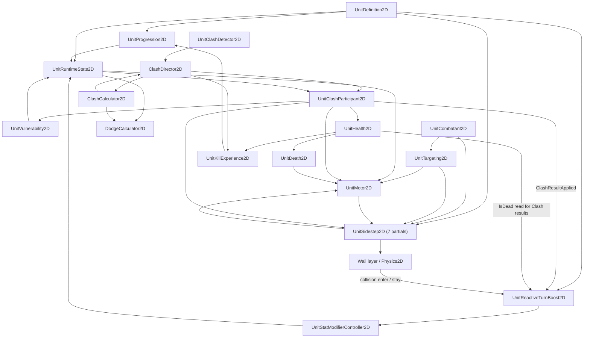

# Unit Combat System Architecture Map

This is a top-down 2D army combat game where many autonomous units from different factions seek enemies, move toward them, and resolve close-range fights through a Clash system based on stats, movement, positioning, level, and temporary effects.

Units can take damage, Dodge incoming Clash damage and new Vulnerable application, be knocked back or made vulnerable, die, gain XP from kills, level up, and have their combat/movement stats modified over time.

Eligible units can also enter a Sidestep locomotion session: they commit to a Wall-cleared, snapshotted half-circle path while continuing to face their live target, then finish or cancel through a unit-wide retry cooldown.

## Scope

This document maps an inventory of 28 source files and 22 logical script entries: the baseline inventory of 27 files / 21 entries plus the verified addition of `DodgeCalculator2D.cs`. These are mapped-inventory counts, not counts of attachments inspected for this update or of all C# types in the project. Seven source files are partial declarations that compile into the single `UnitSidestep2D` type and represent one attachable Unity component. The document records existing ownership, dependencies, communication contracts, events, and runtime pipelines. It does not propose future systems or architectural changes.

**Evidence and verification scope**

The Dodge update is grounded in eight final scripts: `DodgeCalculator2D`, `UnitDefinition2D`, `UnitRuntimeStats2D`, `CombatModifierTypes2D`, `CombatTypes2D`, `ClashCalculator2D`, `ClashDirector2D`, and `UnitClashParticipant2D`. Their current code takes precedence over summaries. Unrelated sections retain baseline implementation findings; references below to supplied scripts, verified behavior, and code-visible invariants in those sections refer to that baseline inspection, not a new inspection of unattached dependencies.

The supplied Part 5/6 reviews provide prior static-inspection evidence for controller expiration/stacking and integrations whose implementations are not attached here. Current caller code verifies delegation and ordering, not internal callback safety of the controller, motor, health, Sidestep, progression, or kill-XP components. Snapshots are sequential, not atomic or callback-free. Compilation, numerical execution and the reported 20 gameplay checks remain pending; no Unity checks were executed for this documentation update. Attached constructor sites and the director calculator call were inspected; whole-project callers remain unaudited. No C# code was changed.

## 1. System Overview

### Authoritative ownership

| Runtime concern | Authoritative owner |
| --- | --- |
| Faction identity | `UnitCombatant2D` |
| Current health and direct health mutation | `UnitHealth2D` |
| Death lifecycle and cleanup | `UnitDeath2D` |
| Vulnerable expiration | `UnitVulnerability2D` |
| Major movement state | `UnitMotor2D` |
| Physical movement and Knockback | `UnitMotor2D` |
| Applied Sidestep speed-bonus channel and Rigidbody execution | `UnitMotor2D` |
| Current target and target-search timing | `UnitTargeting2D` |
| Sidestep observed-target band history and retry cooldown | `UnitSidestep2D.Eligibility.cs` within the single `UnitSidestep2D` type |
| Sidestep lifecycle and speed-bonus bookkeeping | `UnitSidestep2D.Lifecycle.cs` within the single `UnitSidestep2D` type |
| Sidestep path snapshots, geometry, progress, and movement intent | `UnitSidestep2D.Path.cs` within the single `UnitSidestep2D` type |
| Sidestep Wall-query state and collision classification | `UnitSidestep2D.WallClearance.cs` within the single `UnitSidestep2D` type |
| Current level, XP, XP requirement, and XP bounty | `UnitProgression2D` |
| Reactive Clash-loss and Wall-contact triggers, subscription, Wall-layer cache, and source-specific handles | `UnitReactiveTurnBoost2D` |
| Active runtime stat modifiers | `UnitStatModifierController2D` |
| Effective runtime stat calculation | `UnitRuntimeStats2D` |
| Unit-side Clash cooldown, snapshot creation, and result orchestration | `UnitClashParticipant2D` |
| Clash request batching, pair deduplication, and transaction order | `ClashDirector2D` |
| Accepted-Clash pre-snapshot preparation ordering | `ClashDirector2D`, delegated through `UnitClashParticipant2D` to `UnitSidestep2D` |
| Clash numerical calculation | `ClashCalculator2D` |
| Shared Dodge cap and pure probability arithmetic | Static `DodgeCalculator2D` helper |
| Two per-Clash random samples | `ClashDirector2D` |
| Raw level-scaled Base Dodge Chance and its authored settings | `UnitDefinition2D` |
| Per-victim kill-XP attribution and pending award | `UnitKillExperience2D` |
| Base unit configuration | `UnitDefinition2D` |
| Authored Sidestep enablement, chance, distance band, retry cooldown, and turn multiplier | `UnitDefinition2D` |
| Authored Clash-loss and Wall-contact additive turn-speed amounts and durations | `UnitDefinition2D` |
| Shared Clash configuration | `ClashRules2D` |

### High-level component flow

The arrows summarize current-code reads/calls and retained baseline runtime data flow. They do not imply that the destination transfers ownership back to the caller.

## 2. Runtime Pipelines

### 2.1 Unit initialization and derived stats

1. `UnitProgression2D` initializes its level from `UnitDefinition2D.StartingUnitLevel` and calculates the current XP requirement and XP bounty.
2. `UnitRuntimeStats2D` derives effective values from `UnitDefinition2D`, the current level, Vulnerable state, and active stat modifiers.
3. `UnitHealth2D` initializes current health to the effective maximum health supplied by `UnitRuntimeStats2D`.
4. `UnitMotor2D` initializes forward speed from `UnitDefinition2D.InitialForwardSpeed`, clamped by effective maximum movement speed.
5. `UnitTargeting2D` allocates its reusable query array using `UnitDefinition2D.TargetQueryBufferCapacity`.
6. `UnitSidestep2D` resolves its same-root targeting, motor, and body-collider references; validates Sidestep configuration, collider geometry, and root scale; resolves the exact `Wall` layer; and allocates its reusable Wall-query arrays.
7. `UnitReactiveTurnBoost2D` resolves missing same-root participant, health, and modifier-controller references; caches `LayerMask.NameToLayer("Wall")` once in `Awake`; validates its definition, required references, and Wall layer; and disables itself if initialization fails. After successful initialization it subscribes to participant results while enabled.

`UnitRuntimeStats2D` calculates values when queried. It does not cache a second authoritative copy of level, Vulnerable, or modifier state.

### 2.2 Target selection and movement

1. `UnitTargeting2D` queries colliders within `UnitDefinition2D.EnemySearchRadius` using its configured layer mask and reusable buffer.
2. Each collider is resolved to a `UnitCombatant2D` directly or through its parent.
3. A candidate must be targetable and an enemy according to `UnitCombatant2D`.
4. The nearest valid candidate becomes `CurrentTarget`.
5. `UnitMotor2D` reads `CurrentTarget` and turns toward its world position. Without consumed Sidestep intent it applies ordinary forward velocity; with Sidestep intent it uses the same live target for facing while applying path-derived velocity.
6. During Knockback, targeting continues, but the motor suppresses normal steering and combines forward velocity with Knockback velocity.

Target searches are staggered on enable. Normal searches use `ClashRules2D.TargetSearchInterval`; an assigned target becoming invalid causes an immediate replacement search.

#### Sidestep branch inside Seeking movement

1. `UnitTargeting2D` executes before `UnitSidestep2D`, so Sidestep eligibility reconciles the current target after that fixed step's targeting work.
2. `UnitSidestep2D` compares squared target distance against the inclusive squared minimum and maximum configured by `UnitDefinition2D`.
3. A newly observed target starts with outside-band history. One outside-to-inside crossing is consumed before the remaining gates are evaluated; leaving the band rearms that crossing.
4. When Sidestepping is enabled, the unit-wide retry cooldown has expired, the motor is in `Seeking`, the target remains valid, and the chance roll succeeds, `UnitSidestep2D` snapshots the unit start and target endpoint to construct a fixed half-circle.
5. It randomly prefers clockwise or counterclockwise, validates that candidate against the `Wall` layer, and tries the opposite direction when the preferred arc is blocked.
6. Once a path is ready, it reads the motor's clean `ForwardSpeed` and requests a fixed bonus equal to `clean forward speed × 0.5 + 5` through `UnitMotor2D.TryApplySidestepSpeedBonus(...)`.
7. `UnitMotor2D` executes after `UnitSidestep2D`. It rebuilds clean forward momentum, then passes `forwardSpeed + sidestepSpeedBonus` and `Time.fixedDeltaTime` into `TryConsumeSidestepMovementIntent(...)` before ordinary Seeking movement.
8. `UnitSidestep2D` advances normalized progress from that supplied speed and returns path velocity plus the configured turn-rate multiplier.
9. The motor multiplies `UnitRuntimeStats2D.EffectiveTurnSpeed` by the returned multiplier, faces the live `CurrentTarget`, and writes the returned velocity to the Rigidbody.
10. The final nominal path interval is delivered once. Completion or cancellation removes the applied bonus, invalidates path state, and begins the unit-wide retry cooldown.

Reactive additive `TurnSpeed` effects enter `UnitRuntimeStats2D.EffectiveTurnSpeed` through the existing modifier evaluation. `UnitMotor2D` uses that effective turn speed for ordinary turning and multiplies it by the existing returned turn-rate multiplier during Sidestepping.

Runtime movement and turn modifiers reach Sidestepping through `UnitMotor2D`; `UnitSidestep2D` has no direct dependency on `UnitRuntimeStats2D` or `UnitStatModifierController2D`. Path progress is based on the fixed reference arc and supplied speed rather than the Rigidbody's realized position, so physical displacement does not steer the unit back onto the original arc.

### 2.3 Runtime stat modifier evaluation

1. A caller supplies `UnitStatModifier2D` to `UnitStatModifierController2D` as timed or permanent.
2. The controller assigns a controller-scoped `UnitStatModifierHandle2D` and stores the active modifier.
3. `UnitRuntimeStats2D` requests the combined result for a particular `UnitStatTarget2D` when an effective value is queried.
4. The controller sums additive modifiers and multiplies multiplicative modifiers.
5. Evaluation is `(base value + additive total) × multiplicative total`.
6. Timed modifiers are removed after expiration by `Update()` or by a later query/API call that processes expirations.

`UnitReactiveTurnBoost2D` is a supplied caller that adds timed additive `UnitStatTarget2D.TurnSpeed` modifiers. It owns separate Clash-loss and Wall-contact handles, while the controller owns the active entries and their expiration timestamps.

For `DodgeChance`, `EffectiveBaseDodgeChance` obtains the raw definition-owned value, delegates modifier application to the controller, then calls `DodgeCalculator2D.ClampChance`. The aggregate contract applies `(raw base + additive total) × multiplicative total`; the final effective probability is in `0–0.95`, with non-finite results becoming zero. No early cap is applied to the raw base.

A missing definition returns zero. Level uses `CurrentLevel` when at least 1, otherwise configured `StartingUnitLevel` clamped to at least 1. A missing controller returns the pre-modifier value; a present controller is called even when disabled. Controller aggregation, expiration and disabled-controller internals are retained prior-review/baseline findings. Expiration processing can emit `ModifiersChanged` synchronously during a stat query; getters and snapshots must not be described as callback-free.

#### Reactive turn-speed addition and refresh

1. A qualifying Clash result or Wall callback selects that source's amount, duration, and retained handle.
2. If either amount or duration is zero, the source does not add or refresh an effect. An already-active effect is not removed by this check.
3. The reactive component calls `TryRefreshModifierDuration(handle, duration)` first.
4. If refresh succeeds, the existing modifier and handle are retained. If it fails, the component creates a `TurnSpeed` / `Add` modifier, calls `AddModifier(modifier, duration, this)`, and stores the returned handle.
5. Each source therefore maintains at most one active effect through this flow. Repeated triggers from that source refresh duration rather than stack additional entries.
6. The two sources use independent handles and coexist. With defaults, they contribute a combined `+360°/s` to the additive total before any multiplicative modifiers are applied.

Refresh replaces expiration with `Time.timeAsDouble + duration`; it does not add time to the old expiration or change the stored amount. The controller processes overdue expirations before looking up an otherwise valid refresh request. A duration-only refresh changes no aggregate contribution and emits no `ModifiersChanged` event; overdue removals processed during that call can emit the event.

#### Wall collision enter/stay

1. `OnCollisionEnter2D` and `OnCollisionStay2D` both delegate to `ApplyWallContactBoost(...)`.
2. Processing requires successful initialization, an active/enabled reactive component, and a non-null collision.
3. The contacted `collision.collider` must exist and its own GameObject layer must equal the cached exact `Wall` layer index.
4. The component refreshes or replaces its single Wall-contact handle using the Wall amount and duration from `UnitDefinition2D`.

Continued contact, simultaneous Walls, and re-entry use that same Wall handle. There is no collision-exit handler or early removal on exit. After callbacks stop, the effect expires naturally from the last successful addition or refresh, with removal performed by the controller's expiration processing. The Wall callback has no `IsDead` check, contact collection, physics query, or per-callback layer lookup.

### 2.4 Clash detection, calculation, and result application

1. `UnitClashDetector2D` receives trigger enter/stay callbacks from its Clash Range collider.
2. It filters by the configured Clash Range layers and resolves another `UnitClashDetector2D`.
3. It obtains both `UnitClashParticipant2D` owners and constructs a canonical `ClashRequest`.
4. `ClashDirector2D.SubmitRequest(...)` stores the request with the currently collecting physics-step ID.
5. At the next batch close, the director swaps its reusable buffers and processes the closed physics-step batch.
6. `ClashPairKey` prevents A–B and B–A reports from producing two transactions in the same batch.
7. Both participants must be distinct enemies, active, targetable, outside global Clash cooldown, and have active kill-XP components.
8. The director retains both `UnitKillExperience2D` references, prepares the first participant, rechecks pair eligibility, then prepares the second and rechecks again. Both preparations precede either snapshot when processing continues.
9. It calls `TryCaptureClashSnapshot(currentTime, out input)` for the first participant, rechecks eligibility, then captures the second and performs the final eligibility check. Failed capture or failed eligibility returns before samples, cooldowns, or results. The pair remains deduplicated; completed preparation is not rolled back.
10. The director draws `UnityEngine.Random.value` twice, first then second, including when either chance will be zero. It passes both samples and snapshots to `ClashCalculator2D.Calculate(...)`, which completes both Dodge decisions and the entire resolution before damage application.
11. The director starts the global Clash cooldown on both participants before applying either result.
12. It applies the first result, then attempts the original second result if that receiver still exists. The participant's entry guards decide whether it processes the result. Source death alone does not reject the second attempt; a destroyed source is handled as a null source identity.
13. After result attempts, it calls `FinalizePendingKillExperienceAward()` on each retained XP component that still exists, first then second. The second reference is checked after the first finalizer's callbacks. These calls do not require the retained XP components to remain enabled; their internal award validation remains their responsibility.

`OnDisable()` during batch processing requests stopping before the next request and clears queued writes. It does not insert a cancellation boundary between the current result attempts or XP finalizers. Receiver destruction and existing entry guards can still skip an application. This is synchronous guarded ordering, not a guarantee of completion after arbitrary exceptions.

`UnitClashParticipant2D.PrepareForAcceptedClash()` delegates to its required same-root `UnitSidestep2D`. An active Sidestep synchronously cancels through its normal lifecycle, removes the applied speed bonus, invalidates path intent, starts retry cooldown, and calls `UnitMotor2D.RebuildCleanForwardVelocityFromCurrentFacing()`. Both participants complete this preparation before the first snapshot is captured. An inactive Sidestep makes the preparation call a no-op.

#### Clash snapshot contents

`UnitClashParticipant2D` builds each `ClashParticipantInput` from:

- position, facing direction, linear velocity, and forward speed from `UnitMotor2D`;
- weapon rating and base Clash damage from `UnitDefinition2D`;
- effective unit size, effective Clash strength multiplier, and `EffectiveBaseDodgeChance` from `UnitRuntimeStats2D`;
- current level from `UnitProgression2D`;
- Vulnerable state at the supplied transaction time from `UnitVulnerability2D`.

When the participant was Sidestepping at accepted-Clash preparation, the movement values above are captured after path velocity and the temporary bonus have been removed: `CurrentVelocity` has been rebuilt along current facing from the clean `ForwardSpeed`, and `ForwardSpeed` itself excludes the separate Sidestep bonus channel.

`TryCaptureClashSnapshot(float currentTime, out ClashParticipantInput input)` replaces the former `CaptureClashSnapshot(float)` API and returns `false` with a default output if capture is invalid. It checks required capture references and `CanClashAt(currentTime)` before reading and after each of `EffectiveUnitSize`, `EffectiveClashStrengthMultiplier`, and `EffectiveBaseDodgeChance`. These checks do not verify callback safety inside an invoked getter.

Read order is motor position/facing/velocity/forward speed, definition weapon rating, effective size, progression level, base Clash damage, Vulnerable state, strength multiplier, then effective Dodge chance. Reads within a snapshot and between the two snapshots are sequential. Expiration callbacks may change later values without revising values already captured. Later processed pairs obtain fresh snapshots and can observe earlier effects, modifier changes and finalized progression changes.

#### Clash calculation

For each participant:

`Martial Might = (Weapon Rating + Unit Size) × ((Unit Level × 0.5) + 0.5)`

The calculator then:

- projects linear velocity toward the opponent to calculate relative momentum;
- interpolates engagement-angle contribution from facing alignment;
- adds Martial Might, relative momentum, and engagement angle;
- applies the Vulnerable strength multiplier when appropriate;
- applies the participant’s effective Clash strength multiplier;
- compares first strength against second strength;
- normalizes the disparity using the configured minimum reference strength or the average positive Martial Might;
- classifies the first outcome and mirrors it for the second participant.

Each participant's final Dodge chance is `ClampChance(effective base chance × outcome factor × strength factor)`. The outcome factor is `0.5` only for `OverwhelmingLoss`, otherwise `1`. The strength factor is `Clamp01(own TotalStrength / opponent TotalStrength)` when opponent strength is positive, otherwise `1`. These strengths already include Vulnerable and the effective Clash strength multiplier. Non-finite chance or strength inputs produce zero chance.

A finite sample in `[0,1]` succeeds only when `sample < ClampChance(finalDodgeChance)`; equality, non-finite samples and out-of-range samples fail. Both calculators access no random state.

On failed Dodge, requested incoming damage is the opponent's base Clash damage multiplied by the effect settings for the receiver's outcome. Successful Dodge sets it to zero and suppresses new Vulnerable application. Each side's outgoing damage remains independent of its own Dodge result. Outcome, momentum multiplier, Knockback velocity/duration and Vulnerable duration fields are preserved. Knockback points away from the opponent.

#### Participant-side result application

1. `ApplyClashResult` rejects entry without an event when health is missing, inactive/disabled or already dead, or the motor is missing. It does not add a participant-enable or source-alive requirement.
2. On successful Dodge, it skips `UnitHealth2D.ApplyDamage` entirely. Otherwise it supplies requested damage in a `DamageContext2D` with Clash origin and both damage-effect and kill-XP permission flags true. Zero or rejected requested damage is not reinterpreted as Dodge.
3. After damage returns, `CausedDeath`, missing health or current `IsDead` causes one `ClashResultApplied` notification and skips surviving effects.
4. Survivor continuation requires the participant, health and motor to exist and health not to be dead. It applies the forward-momentum multiplier through the motor, then rechecks these conditions because stat queries may invoke callbacks.
5. If not dodged and requested by the result, it applies/extends Vulnerable when that component exists. Dodge never clears or shortens existing Vulnerable expiration.
6. It rechecks survivor continuation after possible Vulnerable callbacks, then begins Knockback when its duration and velocity are positive/nonzero.
7. It invokes `ClashResultApplied` once after processed survivor effects, including when continuation guards stopped remaining effects. These continuation guards do not repeat active/enabled checks. Health acceptance or positive health loss is not required for failed-Dodge survivor effects.

An initialized, enabled `UnitReactiveTurnBoost2D` subscribes to `ClashResultApplied`. Its handler accepts only `ClashOutcome.Loss` and `ClashOutcome.OverwhelmingLoss`, then checks `UnitHealth2D.IsDead`. Because the event follows result/death processing, lethal losses neither create nor refresh the Clash-loss turn-speed effect. A surviving accepted outcome refreshes or replaces the separate Clash-loss handle using its authored amount and duration. The participant continues to own result ordering; the subscriber owns reactive trigger handling. Dodge preserves the outcome and notification, so surviving dodged losses retain this eligibility. Subscriber filtering and handle behavior are retained baseline/prior-review findings; its implementation was not reattached.

### 2.5 Generalized damage and death

1. A damage producer supplies a finalized requested amount and metadata in `DamageContext2D`.
2. `UnitHealth2D` rejects the request unless health is active, the unit is alive, death has not executed, and requested damage is positive and finite.
3. Maximum-health state is refreshed before damage is applied.
4. Current health is reduced and clamped to the range from zero to effective maximum health.
5. `UnitHealth2D` creates the authoritative `DamageResult2D`.
6. On lethal damage, `LethalDamageAccepted` is emitted before death execution.
7. `UnitDeath2D.ExecuteDeathFromHealth()` executes the death lifecycle once.
8. Successful damage then emits `DamageReceived` on the target health component.
9. If an attributed source has a health component, the source health component emits `DamageDealt` with the same result.

`UnitHealth2D` also polls effective maximum health during `FixedUpdate()`. If maximum health falls below current health, current health is clamped and `HealthChanged` is emitted. Reaching zero through that clamp executes death but is not represented as attributed damage.

For forced non-damage death, `UnitDeath2D.ForceDeath()` asks `UnitHealth2D` to set health to zero, then performs the same one-time death transition.

When `UnitMotor2D` changes to `Knockback`, `Disabled`, or `Dead`, it emits `StateChanged`. An enabled `UnitSidestep2D` subscribes to that event and requests cancellation of any active Sidestep. The Sidestep component does not subscribe directly to health or death events.

### 2.6 Kill-XP attribution and mutual-kill handling

1. `UnitKillExperience2D` subscribes to its health component’s internal `LethalDamageAccepted` event.
2. On the first lethal transition, it permanently resolves attribution for that victim.
3. Eligible attribution requires a non-null, different, enemy source and `CanAwardKillExperience == true`.
4. The killer’s `UnitProgression2D` is resolved even if the killer has already died.
5. The victim’s current XP bounty is captured at lethal-transition time.
6. The award remains pending until the transaction owner calls `FinalizePendingKillExperienceAward()`.
7. Finalization clears pending state before calling the killer’s `GainExperience(...)`.

For a Clash, `ClashDirector2D` performs the guarded result attempts before finalizing either retained participant’s pending award. For processed lethal results, the retained baseline attribution pipeline captures each lethal source and victim bounty before these deferred XP awards can change progression state. Current director code verifies finalization order; source-death acceptance, once-only attribution, bounty capture and pending-award validation inside the XP/health components remain baseline/prior-review evidence.

Within the supplied scripts, `ClashDirector2D` is the only caller of `FinalizePendingKillExperienceAward()`. Other damage origins can create eligible lethal results and prepare attribution, but no non-Clash transaction finalizer is present in this supplied set.

## 3. Script-by-Script Architecture

### `UnitDefinition2D`

**Role**

Shared `ScriptableObject` containing base unit configuration and level-scaling formulas.

**Owns**

- Base weapon rating and unit size.
- Starting unit level.
- Base maximum health and base Clash damage.
- Base XP bounty and XP-bounty scaling.
- Base XP requirement and requirement scaling.
- Maximum-health and maximum-movement-speed level scaling.
- Raw Base Dodge Chance and additive per-level Dodge chance scaling.
- Initial speed, acceleration, maximum speed, turn speed, and Knockback decay configuration.
- Clash-loss and Wall-contact additive turn-speed amounts and durations.
- Sidestep enablement, chance, minimum/maximum distance, retry cooldown, and turn-rate multiplier.
- Enemy search radius and query-buffer capacity.

**Important inputs**

- Inspector-authored configuration.
- Level arguments supplied to its scaling functions.

**Important outputs / API**

- `GetExperienceBountyForLevel(int)`
- `GetExperienceRequirementForLevel(int)`
- `GetMaximumHealthForLevel(int)`
- `GetMaximumMovementSpeedForLevel(int)`
- `GetBaseDodgeChanceForLevel(int)`
- `SidesteppingEnabled`
- `SidestepChance`
- `MinimumSidestepDistance`
- `MaximumSidestepDistance`
- `SidestepRetryCooldown`
- `SidestepTurnRateMultiplier`
- Read-only base-value properties.

**Dodge configuration**

| Serialized field | Meaning | Default |
| --- | --- | --- |
| `baseDodgechance` | Raw chance at level 1 | `0.1f` (10%) |
| `dodgeChanceScaling` | Additive chance per level above 1 | `0.1f` (10 percentage points) |

Both fields have `[SerializeField, Min(0f)]`; neither has a separate public getter. `GetBaseDodgeChanceForLevel(int level)` clamps level to at least 1 and returns `baseDodgechance + ((level - 1) * dodgeChanceScaling)`. This raw value is not capped; modifiers precede capping in runtime stats. `OnValidate()` converts negative or non-finite values in either field to zero. Declared defaults do not establish the values saved in existing definition assets.

**Reactive Turn Boosts configuration**

| Serialized field | Read-only public property | Default |
| --- | --- | --- |
| `clashLossAdditiveTurnSpeedDegreesPerSecond` | `ClashLossAdditiveTurnSpeedDegreesPerSecond` | `180f` degrees/second |
| `clashLossTurnSpeedBoostDurationSeconds` | `ClashLossTurnSpeedBoostDurationSeconds` | `0.5f` seconds |
| `wallContactAdditiveTurnSpeedDegreesPerSecond` | `WallContactAdditiveTurnSpeedDegreesPerSecond` | `180f` degrees/second |
| `wallContactTurnSpeedBoostDurationSeconds` | `WallContactTurnSpeedBoostDurationSeconds` | `0.5f` seconds |

All four fields use `[SerializeField, Min(0f)]` under the `Reactive Turn Boosts` Inspector header. Zero in either setting for a source prevents subsequent additions and refreshes from that source; it does not immediately remove an already-active modifier.

**Read by**

- `UnitProgression2D`
- `UnitRuntimeStats2D`
- `UnitMotor2D`
- `UnitTargeting2D`
- `UnitClashParticipant2D`
- `UnitSidestep2D`
- `UnitReactiveTurnBoost2D`

**Invariants visible in code**

- Starting level is at least 1.
- XP requirement is at least `0.01`.
- Initial forward speed is clamped between zero and configured maximum forward speed.
- `OnValidate()` applies `ClampNonNegativeFinite(...)` to all four reactive settings: negative values, NaN, and either infinity become zero; finite non-negative values are preserved.
- Sidestep chance is clamped from zero to one.
- Sidestep minimum distance and retry cooldown are non-negative.
- Sidestep maximum distance cannot be below the minimum.
- Sidestep turn-rate multiplier is non-negative.
- Target query capacity is at least 1.
- Per-level scaling treats levels below 1 as having zero levels above the base.

**Does not own**

- Runtime level or XP.
- Current health.
- Effective runtime stats.
- Movement state or execution.
- Runtime Sidestep eligibility, lifecycle, path, cooldown expiration, or applied motor bonus.
- Reactive modifier handles, active entries, or expiration timestamps.
- Clash transaction state.

### `ClashRules2D`

**Role**

Shared `ScriptableObject` containing targeting timing, Clash timing, calculation parameters, Vulnerable multipliers, and per-outcome effects.

**Owns**

- Target-search interval.
- Global Clash cooldown duration.
- Momentum and engagement-angle calculation parameters.
- Outcome ratio thresholds and minimum reference strength.
- Vulnerable Clash-strength and movement-speed multipliers.
- Effect settings for all five `ClashOutcome` values.

**Important outputs / API**

- `TargetSearchInterval`
- `GlobalClashCooldown`
- `VulnerableMovementSpeedMultiplier`
- `CreateCalculationSettings()`

**Read by**

- `UnitTargeting2D`
- `UnitRuntimeStats2D`
- `ClashDirector2D`

**Shared contracts**

- Stores `ClashOutcomeEffectSettings`.
- Produces `ClashCalculationSettings`.

**Invariants visible in code**

- Target interval and calculation denominators remain positive.
- Cooldown and positive momentum contributions are non-negative.
- Negative momentum contribution is non-positive.
- Maximum engagement contribution cannot be below the minimum.
- Overwhelming threshold cannot be below the normal victory threshold.
- Vulnerable multipliers are clamped from zero to one.

**Does not own**

- Any unit’s current cooldown or Vulnerable expiration.
- Target selection.
- Clash request processing or result calculation.

### `CombatTypes2D`

**Role**

Defines general faction, movement-state, and Clash communication contracts.

**Defines**

- `FactionId`
- `UnitMajorState`
- `ClashOutcome`
- `ClashPairKey`
- `ClashRequest`
- `ClashOutcomeEffectSettings`
- `ClashCalculationSettings`
- `ClashParticipantInput`
- `ClashStrengthBreakdown`
- `ClashParticipantResult`
- `ClashResolution`

**Important contract flow**

- `UnitCombatant2D` stores `FactionId`.
- `UnitMotor2D` owns `UnitMajorState`; `UnitCombatant2D`, `UnitTargeting2D`, and `UnitSidestep2D` read it.
- Sidestepping is subordinate locomotion state internal to `UnitSidestep2D`; it is not a `UnitMajorState` value.
- `UnitClashDetector2D` produces `ClashRequest`; `ClashDirector2D` consumes it.
- `ClashRules2D` produces `ClashCalculationSettings`; `ClashCalculator2D` consumes it.
- `UnitClashParticipant2D` produces `ClashParticipantInput` and consumes `ClashParticipantResult`.
- `ClashCalculator2D` produces `ClashResolution`; `ClashDirector2D` routes its results.
- `UnitReactiveTurnBoost2D` consumes `ClashParticipantResult.Outcome` through `UnitClashParticipant2D.ClashResultApplied` and accepts `Loss` or `OverwhelmingLoss`.

**Invariants visible in code**

- `ClashPairKey` sorts two instance IDs into a stable lower/higher order.
- `ClashRequest` sorts its two participants using instance IDs.
- A request is valid only when both participants exist and differ.
- `ClashCalculationSettings` clamps critical calculation boundaries in its constructor.
- `ClashParticipantInput` is immutable and adds mandatory `float effectiveBaseDodgeChance` after mandatory `float clashStrengthMultiplier` in its constructor, storing `EffectiveBaseDodgeChance` without clamping.
- `ClashParticipantResult` is immutable and adds mandatory `float finalDodgeChance, bool dodged` after `vulnerabilityDuration`. No temporary constructor defaults remain in these signatures.
- Result `Damage` is requested incoming damage, not authoritative health loss. `FinalDodgeChance` is stored as supplied; `Dodged` is supplied explicitly, never inferred from damage acceptance.
- The result constructor enforces `Damage = 0` and `ApplyVulnerability = false` when dodged, preserving outcome, movement fields and Vulnerable duration. Calculator-produced probabilities are capped by the helper; the constructor does not independently clamp the stored chance.

**Does not own**

- Runtime component state or processing.

### `CombatDamageTypes2D`

**Role**

Defines the generalized health-damage request and result contracts.

**Defines**

- `DamageOrigin2D`
- `DamageContext2D`
- `DamageResult2D`

**`DamageContext2D` carries**

- Final requested health damage.
- Optional source `UnitCombatant2D`.
- Broad damage origin.
- Permission to trigger damage effects.
- Permission to award kill XP.

**`DamageResult2D` carries**

- Requested and actual health damage.
- Previous and remaining health.
- Whether this application caused death.
- Source and target combatants.
- Origin and the two permission flags copied from the context.

**Contract flow**

- Created for Clash by `UnitClashParticipant2D`.
- Consumed and converted into an authoritative result by `UnitHealth2D`.
- Lethal results are consumed by `UnitKillExperience2D`.
- Successful results are exposed through health events.

**Does not own**

- Damage calculation, health mutation, death, or attribution processing.

### `CombatModifierTypes2D`

**Role**

Defines value types used to communicate runtime stat changes.

**Defines**

- `UnitStatTarget2D`: maximum movement speed, turn speed, unit size, Clash strength multiplier, and Dodge chance (`DodgeChance`, appended after existing targets).
- `UnitStatModifierOperation2D`: additive or multiplicative.
- `UnitStatModifier2D`: target, operation, and value.
- `UnitStatModifierHandle2D`: controller-scoped modifier identity plus optional source ID.
- `UnitStatModifierAggregate2D`: combined additive and multiplicative totals.

**Contract flow**

- `UnitStatModifierController2D` consumes modifier definitions and produces handles and aggregates.
- `UnitRuntimeStats2D` selects targets when requesting effective values.
- `UnitReactiveTurnBoost2D` creates timed `TurnSpeed` / `Add` modifiers and retains two controller-issued handles for refresh and exact removal.

**Invariants visible in code**

- A valid handle identifies both its creating controller and a nonzero modifier ID.
- Handle equality uses controller ID plus modifier ID.
- Aggregate evaluation always applies addition before multiplication.

**Does not own**

- Active modifiers, expiration, or effective stat calculation.

### `UnitCombatant2D`

**Role**

General unit identity and targetability facade.

**Owns**

- `FactionId` for the unit.

**Reads / depends on**

- `UnitMotor2D` for world position and `UnitMajorState`.
- `UnitHealth2D` for health availability and dead state.

**Important inputs**

- Another `UnitCombatant2D` passed to `IsEnemyOf(...)`.

**Important outputs / API**

- `Faction`
- `Health`
- `WorldPosition`
- `MajorState`
- `CanBeTargeted`
- `IsEnemyOf(UnitCombatant2D)`

**Consumers**

- `UnitTargeting2D`
- `UnitMotor2D` through the selected target.
- `UnitClashParticipant2D`
- `UnitSidestep2D`
- `UnitHealth2D`
- `UnitKillExperience2D`
- `DamageContext2D` and `DamageResult2D`

**Invariants visible in code**

- A unit is its own faction authority.
- Enemy status requires a different, non-null combatant with a different faction.
- Targetability requires an active object, active identity, active health, a living unit, active motor, and a motor state other than Disabled or Dead.

**Does not own**

- Health values or mutation.
- Movement state or movement execution.
- Target selection.
- Sidestep eligibility, lifecycle, path, or retry cooldown.
- Clash-specific state.
- Progression.

### `UnitTargeting2D`

**Role**

Selects and maintains the nearest valid enemy target.

**Owns**

- Current `UnitCombatant2D` target.
- Whether a target is currently assigned.
- Next target-search timestamp.
- Reusable collider query buffer and search filter.

**Reads / depends on**

- `UnitCombatant2D` for owner position/state, faction checks, and candidate targetability.
- `UnitDefinition2D` for search radius and buffer capacity.
- `ClashRules2D` for search interval.
- Configured enemy physics layer mask.

**Important inputs**

- Physics overlap results.
- Owner `UnitMajorState`.
- Current target validity.

**Important outputs / API**

- `CurrentTarget`
- `NextSearchTime`

**Consumers**

- `UnitMotor2D`
- `UnitSidestep2D`

**Invariants visible in code**

- Dead or Disabled owners have no target.
- Knockback does not stop target maintenance.
- An assigned target becoming invalid triggers an immediate search.
- Normal searches are interval-based and staggered on enable.
- Only candidates passing `CanBeTargeted` and `owner.IsEnemyOf(candidate)` are accepted.
- Selection is based on the nearest squared distance among returned candidates.

**Does not own**

- Faction identity.
- Movement execution.
- Sidestep band history, lifecycle, path, and cooldown state.
- Clash detection or damage.

### `UnitMotor2D`

**Role**

Owns major movement state and performs Rigidbody2D movement, steering, momentum rebuilding, Knockback, and physical execution of Sidestep movement intent.

**Owns**

- Current `UnitMajorState`.
- Current forward speed.
- Applied Sidestep speed bonus, stored separately from clean forward speed.
- Knockback velocity and expiration time.
- Rigidbody velocity and rotation updates performed by this component.

**Reads / depends on**

- `UnitTargeting2D.CurrentTarget`.
- `UnitRuntimeStats2D.EffectiveMaximumMovementSpeed`.
- `UnitRuntimeStats2D.EffectiveTurnSpeed`.
- `UnitDefinition2D` movement and Knockback configuration.
- `UnitSidestep2D` for optional per-fixed-step movement intent and turn-rate multiplier.
- `Rigidbody2D` physical state.

**Important inputs / API**

- `BeginKnockback(Vector2, float)`
- `MultiplyForwardSpeed(float)`
- `SetForwardSpeed(float)`
- `TryApplySidestepSpeedBonus(float)`
- `RemoveSidestepSpeedBonus(float)`
- `RebuildCleanForwardVelocityFromCurrentFacing()`
- `SetDisabled(bool)`
- `MarkDead()`

**Important outputs / events**

- Position, velocity, facing, forward speed, Knockback velocity, and expiration properties.
- `CurrentState`
- `StateChanged(previousState, currentState)`

**Consumers**

- `UnitCombatant2D` reads position and major state.
- `UnitClashParticipant2D` reads movement snapshot values and sends result effects.
- `UnitSidestep2D` reads clean forward speed, position, and major state; subscribes to `StateChanged`; and uses the Sidestep bonus and clean-velocity APIs.
- `UnitDeath2D` calls `MarkDead()`.

**Invariants visible in code**

- Dead state cannot be exited by `SetDisabled(...)`.
- Disabled and Dead states stop Rigidbody motion.
- Normal steering is suppressed while Knockback remains active.
- Forward momentum may rebuild during Knockback.
- Forward speed is clamped by effective maximum movement speed whenever explicitly set or multiplied.
- The public `ForwardSpeed` remains clean speed and does not include the separate Sidestep bonus.
- Applied movement speed is clean forward speed plus the stored Sidestep bonus.
- Sidestep intent is requested after forward-momentum rebuilding and Knockback handling but before ordinary Seeking movement.
- When Sidestep intent is returned, the motor applies path velocity and multiplies effective turn speed by the returned turn-rate multiplier while facing the live target.
- Disabling the motor, entering Disabled, or entering Dead clears the motor-owned Sidestep bonus.
- Knockback expiration returns the motor to Seeking.

**Does not own**

- Target selection.
- Effective stat calculation.
- Sidestep eligibility, chance, retry cooldown, lifecycle, or path state.
- Clash calculation, health, Vulnerable, death lifecycle, or progression.

### `UnitSidestep2D`

**Role**

Owns the complete Sidestep locomotion session while exposing path movement as intent for `UnitMotor2D` to execute. It is one attachable Unity component compiled from seven partial source files, not seven components.

Only `UnitSidestep2D.cs` declares `MonoBehaviour` inheritance, `[DisallowMultipleComponent]`, and `[DefaultExecutionOrder(-150)]`. All Unity message entry points remain in that file. The other six files are partial extensions of the same C# type and are not independently attachable behaviours.

**Partial-file responsibilities and state-mutation ownership**

| Source file | Responsibility | State declared and mutated in that file |
| --- | --- | --- |
| `UnitSidestep2D.cs` | Resolves references, initializes and validates the component, centralizes `Reset`, `Awake`, `OnEnable`, `OnDisable`, `FixedUpdate`, `OnCollisionEnter2D`, and `OnCollisionStay2D`, coordinates fixed-step work, and exposes movement intent. | Serialized `UnitDefinition2D`, `UnitTargeting2D`, `UnitMotor2D`, and root `CircleCollider2D` references. Detailed eligibility, lifecycle, Wall, and path state is not stored here. |
| `UnitSidestep2D.Eligibility.cs` | Reconciles the observed target, evaluates the inclusive distance band, consumes and rearms crossings, evaluates enablement/cooldown/state/target gates and chance, and begins retry cooldowns. | `observedTarget`, prior inside-band state, crossing-armed state, and the unit-wide retry-cooldown expiration. |
| `UnitSidestep2D.Lifecycle.cs` | Starts a session only after path and Wall validation and speed-bonus application; centralizes completion, cancellation, reentrancy protection, bonus cleanup, path invalidation, end reason, and cooldown start. | Start-pending, active, and ending flags; stored speed-bonus value; bonus-applied flag; last end reason. Lifecycle fields are directly mutated only through methods in this partial. |
| `UnitSidestep2D.Path.cs` | Builds fixed half-circle geometry, owns preferred and selected direction, calculates reference points and tangent/chord movement, advances normalized progress, delivers at most one intent per fixed step, detects final delivery, and invalidates the path. | Start and target snapshots, center, radius, starting angle, directions, progress, path state, cached movement intent, and per-step/final-delivery flags. Path fields are mutated only through methods implemented in this partial. |
| `UnitSidestep2D.WallClearance.cs` | Resolves the exact Wall layer, calculates full-body world clearance, owns reusable physics-query data, preflights the preferred and opposite arcs, and classifies live collisions. | Wall layer index/mask, contact filter, overlap-result array, and cast-result array. It requests lifecycle cancellation but does not directly mutate lifecycle fields. |
| `UnitSidestep2D.Interruptions.cs` | Subscribes to motor state changes while enabled and validates target identity, target usability, targeting enablement, motor enablement, and `Seeking` state during an active session. | Motor-event subscription flag. It requests lifecycle cancellation rather than directly mutating lifecycle or path fields. |
| `UnitSidestep2D.Clash.cs` | Exposes accepted-Clash preparation, routes an active Sidestep through normal cancellation, and asks the motor to rebuild clean forward velocity before snapshots. | No persistent state. |

All fields above are private members of the same compiled `UnitSidestep2D` type. The file-level ownership identifies the partial in which mutation is implemented; it is not a component boundary.

**Reads / depends on**

- `UnitDefinition2D` for `SidesteppingEnabled`, `SidestepChance`, `MinimumSidestepDistance`, `MaximumSidestepDistance`, `SidestepRetryCooldown`, and `SidestepTurnRateMultiplier`.
- `UnitTargeting2D.CurrentTarget` and targeting component enablement.
- `UnitCombatant2D.WorldPosition` and `CanBeTargeted` for the observed target.
- `UnitMotor2D.CurrentPosition`, clean `ForwardSpeed`, `CurrentState`, component enablement, `StateChanged`, Sidestep bonus APIs, and clean-velocity rebuild API.
- `UnitMajorState` from `CombatTypes2D`.
- Same-root `CircleCollider2D`, root `Transform.lossyScale`, the exact `Wall` layer, `Physics2D.OverlapCircle`, `Physics2D.CircleCast`, and Unity collision callbacks.

There is no direct dependency on `UnitRuntimeStats2D` or `UnitStatModifierController2D`. Effective movement and turn values reach Sidestep execution through `UnitMotor2D`.

**Important inputs / public API**

- `TryConsumeSidestepMovementIntent(appliedMovementSpeed, fixedDeltaTime, out movementVelocity, out turnRateMultiplier)`
- `PrepareForAcceptedClash()`

These are the only public methods introduced by `UnitSidestep2D`. The motor calls the first; `UnitClashParticipant2D` calls the second.

**Important outputs / cross-component calls**

- Returns path-derived movement velocity and the configured Sidestep turn-rate multiplier to `UnitMotor2D`.
- Calls `UnitMotor2D.TryApplySidestepSpeedBonus(...)` only after a Wall-cleared path is ready.
- Calls `UnitMotor2D.RemoveSidestepSpeedBonus(...)` during completion or cancellation when its stored bonus was applied.
- Calls `UnitMotor2D.RebuildCleanForwardVelocityFromCurrentFacing()` during active accepted-Clash preparation.
- Subscribes to and unsubscribes from `UnitMotor2D.StateChanged` while enabled.
- Declares no custom event.

**Fixed-step coordinator order**

1. Validate non-Clash interruptions.
2. Complete a previously delivered final path interval.
3. Reconcile the current target and distance-band history.
4. Consume at most one band crossing and possibly begin a session.
5. Reset per-fixed-step path-intent delivery state before the later `UnitMotor2D` execution.

**Eligibility and cooldown invariants visible in code**

- Target distance uses squared comparisons and includes both configured band boundaries.
- Losing or replacing the target discards the old target's band history.
- A newly observed target starts with outside history and can therefore produce one immediate crossing when already inside the band.
- Leaving the band rearms the crossing; remaining inside does not reroll.
- Crossing consumption happens before every later eligibility gate, so a rejected crossing is not queued.
- A chance failure starts retry cooldown.
- The retry cooldown is unit-wide and survives target changes.
- Every completed or cancelled started lifecycle, including path-generation and speed-bonus-application failure, starts retry cooldown through centralized cleanup.

**Path, movement, and Wall invariants visible in code**

- Start position and target endpoint are snapshotted once; the target snapshot is the opposite endpoint of a fixed 180-degree arc.
- The center is the midpoint and the radius is half the snapshot separation.
- Non-finite geometry and an unusable radius are rejected.
- Clockwise or counterclockwise is randomly preferred; the opposite direction is tried when the preferred arc is blocked.
- Wall preflight uses a start overlap test and 18 conservative circle-cast chord sweeps with body radius, sagitta, and numeric padding.
- Wall queries exclude triggers and use reusable result arrays of capacity one.
- The body-clearance radius is the root `CircleCollider2D.radius` multiplied by uniform absolute world scale.
- The selected path never follows later target movement; live target data continues to feed eligibility reconciliation, interruption validation, and the motor's facing logic without rebuilding the path.
- Path progress advances from supplied applied speed and fixed delta time rather than actual Rigidbody displacement.
- One movement interval can be delivered per fixed step, and the final interval is delivered exactly once.
- Live collision enter/stay with a collider on the cached Wall layer cancels an active ready path.

**Lifecycle and interruption invariants visible in code**

- A session becomes active only after path creation, Wall direction selection, and speed-bonus application all succeed.
- The stored speed bonus is calculated once as `clean forward speed × 0.5 + 5`.
- Completion and cancellation are guarded against reentrant cleanup.
- Cleanup marks the session inactive, removes the exact stored bonus when applied, invalidates all path state, records the end reason, and starts cooldown.
- `Knockback`, `Disabled`, and `Dead` motor transitions request cancellation through `StateChanged`.
- An active session is also cancelled when targeting or motor becomes unavailable/disabled, the target is lost/replaced/untargetable, the motor leaves `Seeking`, the path becomes invalid, the component is disabled, or live Wall contact occurs.
- `OnDisable` unsubscribes from motor state changes, requests cancellation, and discards observed-target band history.

**Does not own**

- Current target selection or search timing.
- `UnitMajorState`, clean forward speed, the applied motor bonus channel, Rigidbody velocity, or Rigidbody rotation.
- Effective runtime-stat calculation or active modifiers.
- Faction identity, targetability, health, death, Vulnerable, progression, or Clash numerical calculation.
- Accepted-Clash transaction ordering; `ClashDirector2D` owns that ordering.

### `UnitProgression2D`

**Role**

Owns level and experience progression for one unit.

**Owns**

- Current level.
- Current XP within the current level.
- Current XP requirement.
- Current XP bounty.
- Multi-level advancement processing.

**Reads / depends on**

- `UnitDefinition2D` for starting level, XP requirement, and bounty calculations.

**Important input / API**

- `GainExperience(float)`

**Important outputs / events**

- `CurrentLevel`
- `CurrentExperience`
- `ExperienceRequiredForNextLevel`
- `CurrentExperienceBounty`
- `OnLevelChanged(previousLevel, currentLevel)`
- `OnExperienceChanged(previousExperience, currentExperience)`

**Consumers**

- `UnitRuntimeStats2D` reads level.
- `UnitClashParticipant2D` reads level for snapshots.
- `UnitKillExperience2D` reads victim bounty and applies XP to the killer.

**Invariants visible in code**

- Level begins at a minimum of 1.
- Non-positive, NaN, and infinite XP gains are rejected.
- One gain can process multiple level-ups.
- Requirement and bounty are recalculated after every level increase.
- Level-change events are emitted once per gained level.

**Does not own**

- Damage, health, death, kill attribution, or effective stat calculation.

### `UnitVulnerability2D`

**Role**

Owns the unit’s Vulnerable timer.

**Owns**

- Vulnerability expiration timestamp.

**Important inputs / API**

- `ApplyOrExtendVulnerability(currentTime, duration)`
- `IsVulnerableAt(currentTime)`
- `GetRemainingVulnerability(currentTime)`

**Important outputs / events**

- `VulnerabilityExpiration`
- `IsVulnerable`
- `RemainingVulnerability`
- `VulnerabilityRefreshed(newExpiration)`

**Consumers**

- `UnitRuntimeStats2D` reads current Vulnerable state for movement-speed calculation.
- `UnitClashParticipant2D` reads state for snapshots and applies result-driven vulnerability.

**Invariants visible in code**

- Non-positive durations are ignored.
- Existing expiration can only be extended, not shortened by this API.
- The event is emitted only when expiration is advanced.

**Does not own**

- The gameplay consequences of Vulnerable.
- Movement speed or Clash strength.
- Clash outcome processing.

### `UnitStatModifierController2D`

**Role**

Owns active runtime stat modifiers, their identities, aggregation, duration refresh, removal, and expiration.

**Owns**

- Active modifier collection.
- Modifier IDs and controller-scoped handles.
- Optional source instance IDs.
- Per-modifier expiration timestamps.
- Earliest-expiration tracking.

**Important inputs / API**

- `AddModifier(modifier, durationSeconds, source)`
- `AddPermanentModifier(modifier, source)`
- `public bool TryRefreshModifierDuration(UnitStatModifierHandle2D handle, float duration)`
- `RemoveModifier(handle)`
- `GetCombinedModifier(target)`
- `ApplyModifiers(target, preModifierValue)`

**Important outputs / events**

- `UnitStatModifierHandle2D`
- `UnitStatModifierAggregate2D`
- `ActiveModifierCount`
- `ModifiersChanged`

**Primary consumers**

- `UnitRuntimeStats2D` for effective-stat queries.
- `UnitReactiveTurnBoost2D` for timed additions, duration refresh, and owned-modifier cleanup.

**Invariants visible in code**

- Modifier values must be finite.
- Timed modifiers require a positive, finite duration.
- A handle can remove a modifier only from the controller that created it.
- Removal affects exactly the modifier identified by the handle.
- Additive values are summed and multiplicative values are multiplied.
- Refresh requires `handle.IsValid`, `handle.ControllerInstanceId == GetInstanceID()`, and a positive finite duration. Invalid/foreign handles and invalid durations return `false` before expiration processing.
- For an otherwise valid request, overdue expirations are processed before the active collection is searched for the matching handle. Removed or expired handles return `false`; permanent modifiers cannot be refreshed.
- A successful refresh sets only the matched timed entry's expiration to `Time.timeAsDouble + duration`. This replaces remaining lifetime and may shorten or extend the previous expiration.
- Refresh preserves the handle, source identity, target, operation, value, and aggregate contribution. It recalculates the earliest expiration and refreshes expiration-driven component enablement.
- Refresh alone does not emit `ModifiersChanged`; overdue removals processed by the same call can emit it. Additions, manual removals, and expiration retain their existing event behavior.
- The component enables `Update()` only while a timed expiration needs processing; queries also process overdue expirations. With no timed entries, including when only permanent modifiers remain, it disables its own `Update`. Adding a timed modifier enables expiration updates.

**Does not own**

- Base stats.
- Effective final stats.
- Level, Vulnerable, health, or Clash state.

### `UnitReactiveTurnBoost2D`

**Role**

Converts surviving Clash losses and exact-Wall collision contact into independently configured timed additive turn-speed effects. `UnitReactiveTurnBoost2D.cs` declares one sealed attachable `MonoBehaviour` with `[DisallowMultipleComponent]`.

**Owns**

- Serialized configuration/reference fields: `unitDefinition`, `clashParticipant`, `unitHealth`, and `modifierController`.
- Cached exact Wall layer index, `wallLayerIndex`, initialized to `-1`.
- Initialization state, `isInitialized`.
- Clash-result subscription state, `isClashResultSubscribed`.
- Independent source handles, `clashLossModifierHandle` and `wallContactModifierHandle`.
- Trigger filtering, refresh-or-replace decisions, and cleanup requests for those handles.

**Reads / depends on**

- `UnitDefinition2D` for the four reactive amount/duration properties.
- Same-root `UnitClashParticipant2D` for `ClashResultApplied`.
- Same-root `UnitHealth2D.IsDead` for post-result Clash filtering.
- Same-root `UnitStatModifierController2D` for timed addition, refresh, and removal.
- `ClashParticipantResult` and `ClashOutcome` from `CombatTypes2D`.
- `UnitStatModifier2D`, `UnitStatModifierHandle2D`, `UnitStatTarget2D.TurnSpeed`, and `UnitStatModifierOperation2D.Add` from `CombatModifierTypes2D`.
- The project layer named exactly `Wall`, `Collision2D`, and the contacted `Collider2D`'s GameObject layer.

There is no direct dependency on `UnitSidestep2D`, `UnitMotor2D`, `UnitRuntimeStats2D`, or `UnitTargeting2D`. Effects reach turning through the existing controller → runtime stats → motor path.

**Important inputs / callbacks**

- `ClashResultApplied(ClashParticipantResult)` delegates to the private `HandleClashResultApplied(...)` handler.
- `OnCollisionEnter2D` and `OnCollisionStay2D` delegate to the same private Wall-contact handler.
- `Reset`, `Awake`, `OnEnable`, `OnDisable`, and `OnDestroy` provide reference setup and lifecycle handling.

**Important outputs / cross-component calls**

- `TryRefreshModifierDuration(handle, duration)` first attempts to retain an existing timed effect.
- `AddModifier(modifier, duration, this)` creates a replacement when refresh fails and returns the retained source handle.
- `RemoveModifier(handle)` removes owned effects during component destruction when the controller remains available.
- Declares no custom event or public method.

**Initialization and placement invariants visible in code**

- The component belongs on the physical unit root. Its participant, health, and controller references must be on the same GameObject.
- `Reset` assigns those three peer references. `Awake` resolves missing peer references; the definition must be assigned separately.
- `Awake` caches `LayerMask.NameToLayer("Wall")` once, then validates all required references and the layer. Invalid initialization disables the whole component.
- Dependency validation checks presence and same-root placement, not component enablement. An idle-disabled modifier controller is accepted.

**Trigger and modifier invariants visible in code**

- Both trigger paths require successful initialization and an active/enabled reactive component.
- Only `Loss` and `OverwhelmingLoss` pass the Clash outcome filter. `UnitHealth2D.IsDead` is checked after result notification and prevents both creation and refresh for lethal losses.
- Wall enter/stay requires a non-null collision and contacted collider on the cached exact Wall layer. This path has no `IsDead` check.
- Either a non-positive amount or duration prevents the source from adding or refreshing. Existing active effects are not removed by that guard.
- Each source owns one handle; repeated same-source triggers refresh rather than stack. The independent sources coexist and contribute `+360°/s` to the additive total with defaults.
- A successful refresh retains the stored amount and modifier identity. If the handle has expired or otherwise cannot refresh, a new timed effect is added using current source settings.
- Simultaneous Wall contacts, continued contact, and re-entry share the Wall handle. There is no exit handler; the effect expires naturally after the last successful addition or refresh.

**Subscription and lifecycle invariants visible in code**

- `OnEnable` subscribes only after successful initialization and only when not already subscribed.
- `OnDisable` unsubscribes symmetrically and retains both handles. It does not remove active modifiers or restart their durations.
- Re-enabling restores the subscription without adding effects. The next qualifying trigger refreshes a retained active handle or replaces an expired one.
- `OnDestroy` unsubscribes, attempts removal of each valid owned handle if the controller still exists, and clears both handles. Expiration remains controller-owned.
- There is no `Update`, `FixedUpdate`, recurring polling, physics query, contact collection, collision-exit callback, or per-callback layer lookup.
- The component declares no execution-order attribute and adds no `UnitMajorState` value.

**Does not own**

- Active modifier storage, aggregation, expiration timestamps, or expiration processing.
- Effective runtime stats or base configuration.
- Rigidbody velocity/rotation, movement, Knockback, or Sidestep state.
- Clash classification, accepted-Clash transaction order, or participant result ordering.
- Health mutation, death lifecycle, Vulnerable, or progression.

### `UnitRuntimeStats2D`

**Role**

Calculates effective runtime stats from configuration and current state.

**Calculates**

- Effective maximum health.
- Effective maximum movement speed.
- Effective turn speed.
- Effective unit size.
- Effective Clash strength multiplier.
- Effective Base Dodge Chance, evaluated on demand and capped through `DodgeCalculator2D`.

**Reads / depends on**

- `UnitDefinition2D` base values and level-scaling functions.
- `UnitProgression2D.CurrentLevel`.
- `UnitVulnerability2D` current state.
- `ClashRules2D.VulnerableMovementSpeedMultiplier`.
- `UnitStatModifierController2D.ApplyModifiers(...)`.
- `DodgeCalculator2D.ClampChance(...)`.

**Important outputs / API**

- `EffectiveMaximumHealth`
- `EffectiveMaximumMovementSpeed`
- `EffectiveTurnSpeed`
- `EffectiveUnitSize`
- `EffectiveClashStrengthMultiplier`
- `EffectiveBaseDodgeChance`

**Consumers**

- `UnitHealth2D` reads effective maximum health.
- `UnitMotor2D` reads movement and turn speed.
- `UnitClashParticipant2D` reads unit size, Clash strength multiplier and effective Base Dodge Chance.
- `UnitSidestep2D` has no direct reference; movement and turn values affect Sidestepping through `UnitMotor2D`.

**Invariants visible in code**

- Effective outputs are never returned below zero.
- Maximum health, movement speed and Base Dodge Chance use current level when at least 1, otherwise configured starting level clamped to at least 1.
- Base Dodge Chance is zero without a definition. Raw scaling precedes runtime modifiers and the shared cap. A missing controller passes through raw values; a present disabled controller is still called.
- `DodgeCalculator2D.ClampChance` supplies the Dodge-specific non-finite handling and `0–0.95` cap. No recurring Dodge update loop or separate mutable Dodge state is added.
- Vulnerable directly modifies maximum movement speed before runtime modifiers are applied.
- Modifier stacking itself remains delegated to `UnitStatModifierController2D`.

**Does not own**

- Current level.
- Vulnerable expiration.
- Active modifier lifetime or identity.
- Current health.
- Movement or Clash calculation.
- Sidestep eligibility, path, lifecycle, or cooldown state.

### `UnitHealth2D`

**Role**

Authoritative health component and generalized health-damage processor.

**Owns**

- Current health.
- Observed maximum-health value used to detect changes.
- All direct mutation of current health.
- Validation and application of generalized health damage.
- Construction of authoritative `DamageResult2D`.

**Reads / depends on**

- `UnitRuntimeStats2D.EffectiveMaximumHealth`.
- `UnitCombatant2D` for target identity.
- `UnitDeath2D` for death state and lifecycle execution.
- Source `UnitCombatant2D.Health` for damage-dealt notification.

**Important inputs / API**

- `ApplyDamage(in DamageContext2D)`
- Internal `SetHealthToZeroForForcedDeath()` called by `UnitDeath2D`.

**Important outputs / events**

- `CurrentHealth`
- `MaximumHealth`
- `IsDead`
- `DamageReceived(DamageResult2D)`
- `DamageDealt(DamageResult2D)` on the attributed source’s health component.
- `HealthChanged(previousHealth, currentHealth, maximumHealth)`
- Internal `LethalDamageAccepted(DamageResult2D)`
- Return value from `ApplyDamage(...)`.

**Invariants visible in code**

- Only positive, finite damage is accepted.
- Damage cannot be processed after health or death state is already dead.
- Current health is clamped between zero and effective maximum health.
- `CausedDeath` is true only for a transition from positive health to zero.
- Lethal observers run before death lifecycle execution.
- Normal damage notifications run after death execution for a lethal hit.
- Successful damage notifications require actual health loss above zero.
- Damage-dealt notification does not require the source to remain alive or enabled.
- Maximum-health clamping is not represented as attributed damage.

**Does not own**

- Death cleanup or the one-time death lifecycle.
- Kill-XP attribution or progression.
- Clash-specific effects.
- Effective maximum-health calculation.

### `UnitDeath2D`

**Role**

Executes the one-time unit death lifecycle and optional object cleanup.

**Owns**

- Whether death has executed.
- Whether cleanup has been scheduled.
- Destroy-on-death setting and delay.
- `Died` event.

**Reads / depends on**

- `UnitHealth2D` for current health and forced-death health mutation.
- `UnitMotor2D` for entering Dead movement state.

**Important inputs / API**

- `ForceDeath()`
- Internal `ExecuteDeathFromHealth()` called by `UnitHealth2D`.

**Important outputs / events**

- `HasDied`
- `Died`
- Optional delayed destruction of the unit GameObject.

**Invariants visible in code**

- Death transition executes at most once.
- Health-driven death requires current health to be zero.
- Forced death asks `UnitHealth2D` to perform the health mutation.
- The motor is marked Dead before `Died` is emitted.
- Cleanup is scheduled at most once.

**Does not own**

- Current health or general damage application.
- The Dead movement state itself.
- Killer attribution or XP.

### `UnitKillExperience2D`

**Role**

Owns kill-XP attribution state for one victim and defers the prepared award until its transaction owner finalizes it.

**Owns**

- Whether this victim’s lethal attribution has been resolved.
- Whether a pending award exists.
- Captured killer progression reference.
- Captured victim XP bounty.
- Subscription state for the health lethal event.

**Reads / depends on**

- `UnitHealth2D.LethalDamageAccepted`.
- `DamageResult2D` lethal source, target, death, and XP-permission fields.
- `UnitCombatant2D` identity and enemy relationship.
- Victim `UnitProgression2D.CurrentExperienceBounty`.
- Killer `UnitProgression2D` resolved with `GetComponent`.

**Important input / API**

- `FinalizePendingKillExperienceAward()`

**Important outputs**

- Calls `UnitProgression2D.GainExperience(...)` on a valid captured killer.

**Invariants visible in code**

- A victim’s death attribution resolves once, including ineligible or unattributed deaths.
- A later request cannot replace the established lethal source.
- Self-kills, friendly kills, missing killers, and disallowed awards do not prepare XP.
- The killer is not required to remain alive after lethal attribution is established.
- Victim bounty is captured before deferred award finalization.
- Pending fields are cleared before `GainExperience(...)` is called.

**Does not own**

- Current XP, level, bounty calculation, health, damage, or death lifecycle.
- Clash result ordering; the director controls finalization timing for Clash transactions.

### `UnitClashDetector2D`

**Role**

Converts Clash Range overlaps into canonical Clash requests.

**Owns**

- Reference to its owning `UnitClashParticipant2D`.
- Reference to the scene `ClashDirector2D`.
- Clash Range collider and opposing Clash Range layer mask configuration.

**Reads / depends on**

- Trigger enter/stay callbacks.
- Another `UnitClashDetector2D` found on the overlapping collider.
- The other detector’s participant owner.

**Important output**

- Creates `ClashRequest` and calls `ClashDirector2D.SubmitRequest(...)`.

**Invariants visible in code**

- The own collider, excluded layers, non-detector colliders, self-detector, and same-owner cases are ignored.
- The Clash Range collider must be a trigger.
- A director, owner, collider, and nonempty opposing-layer mask are required.

**Does not own**

- Faction validation.
- Pair deduplication.
- Clash eligibility, cooldown, calculation, or effects.

### `ClashDirector2D`

**Role**

Scene-level coordinator for batching, validating, deduplicating, preparing accepted participants, calculating, applying, and finalizing Clash transactions.

**Owns**

- Singleton scene instance.
- Write and processing request buffers.
- Physics-step IDs attached to queued requests.
- Per-batch processed pair keys.
- `ClashCalculator2D` instance and calculation-settings snapshot.
- Clash transaction processing order and both independent `UnityEngine.Random.value` samples.
- Ordering of accepted-participant preparation before either fresh snapshot.
- Stop-after-current-request behavior when disabled during processing.

**Reads / depends on**

- `ClashRules2D` for calculation settings and global cooldown.
- `ClashRequest` and `ClashPairKey`.
- `UnitClashParticipant2D` eligibility, accepted-Clash preparation, snapshots, cooldown API, and result API.
- `ClashCalculator2D.Calculate(...)`.
- `UnitKillExperience2D` availability and finalization API.

**Important input / API**

- `SubmitRequest(in ClashRequest)`

**Important outputs**

- Calls `PrepareForAcceptedClash()` for both participants after pair acceptance and before capturing either snapshot.
- Calls `BeginGlobalClashCooldown(...)` for both participants.
- Applies the first result and attempts the retained second receiver if it still exists; participant entry guards can reject processing.
- Calls `FinalizePendingKillExperienceAward()` after result attempts on each retained XP component that still exists, without requiring it to remain enabled.
- Exposes `PendingRequestCount` and static `Instance`.

**Invariants visible in code**

- Only one enabled singleton instance is accepted.
- Physics 2D simulation mode must be Fixed Update.
- Each queued request belongs to one recorded physics-step batch.
- One canonical participant pair is processed at most once per batch.
- Eligibility is rechecked immediately before calculation.
- Both participants complete accepted-Clash preparation before the first fresh snapshot is captured.
- Fresh snapshots are captured immediately before each sequential calculation.
- Both cooldowns begin before either result is applied.
- Both result attempts precede kill-XP finalization; destroyed receivers or entry guards can skip processing.
- Pair eligibility is rechecked after each preparation and snapshot; capture failure aborts before sampling, cooldowns or results.
- Snapshot callbacks can affect later reads; captures are not atomic and earlier values are not recomputed.
- Both samples and the complete resolution precede cooldowns and damage.
- Director disable during processing stops subsequent requests while permitting current guarded result attempts and finalizers.

**Does not own**

- Unit-side Clash cooldown timestamps.
- Snapshot values or participant effects.
- Sidestep lifecycle, path, retry cooldown, speed bonus, or movement state.
- Numerical Clash formulas.
- Health, death, Vulnerable, movement, or progression state.
- Kill-XP attribution state.

### `ClashCalculator2D`

**Role**

Stateless numerical Clash calculator.

**Owns**

- No persistent runtime state.
- The formulas that convert two participant snapshots and calculation settings into a resolution.

**Important input / API**

- `ClashResolution Calculate(in ClashParticipantInput first, in ClashParticipantInput second, in ClashCalculationSettings settings, float firstDodgeRoll, float secondDodgeRoll)`

**Important output**

- `ClashResolution` containing two strength breakdowns, raw and normalized disparity, and two participant results.

**Reads**

- Values supplied through `ClashParticipantInput`, `ClashCalculationSettings` and the two explicit Dodge samples; pure arithmetic from `DodgeCalculator2D`.

**Invariants visible in code**

- Both participant strengths are calculated before classification.
- The second outcome mirrors the first.
- Draw is used below the configured victory ratio.
- Overwhelming outcomes require the configured overwhelming threshold.
- Zero-distance direction uses the first participant’s facing direction, then `Vector2.up` as fallback.
- Non-dodged result damage comes from the opponent’s snapshot, independent of that opponent’s Dodge.
- Both Dodge decisions use fully modified strengths and supplied samples before either result is applied; no random state is accessed.

**Does not own**

- Component references, current unit state, physics queries, cooldowns, damage application, or result effects.

### `DodgeCalculator2D`

**Role**

Static non-component helper for shared pure Dodge probability arithmetic.

**Owns**

- `public const float MaximumDodgeChance = 0.95f`.
- Shared capping, Clash-specific chance arithmetic and sample comparison; no mutable runtime state or randomness.

**Important inputs / API**

- `float ClampChance(float chance)` — non-finite and negative inputs become zero; finite values above the cap become `0.95f`.
- `float CalculateClashDodgeChance(float effectiveBaseDodgeChance, ClashOutcome outcome, float ownFinalStrength, float opponentFinalStrength)` — non-finite inputs return zero; OverwhelmingLoss uses `0.5`, other outcomes `1`; positive opponent strength uses `Mathf.Clamp01(ownFinalStrength / opponentFinalStrength)`, otherwise factor `1`; the final product passes through `ClampChance`.
- `bool DoesDodgeSucceed(float finalDodgeChance, float sample)` — rejects non-finite samples or samples outside `[0,1]`; otherwise returns strict `sample < ClampChance(finalDodgeChance)`.

All three methods are public static methods. Strength inputs already contain Vulnerable and Clash-strength modifiers; the helper does not read unit state or apply those effects again.

**Reads / dependencies**

- `ClashOutcome` from `CombatTypes2D`.
- `UnityEngine.Mathf.Clamp01` and float finite-value checks.

**Consumers**

- `UnitRuntimeStats2D` for effective chance capping.
- `ClashCalculator2D` for final Clash chance and supplied-sample evaluation.

**Does not own**

- Authored configuration, level, active modifiers, random sampling, snapshots, damage, component references, events or execution order.

### `UnitClashParticipant2D`

**Role**

Owns unit-side Clash state, delegates accepted-Clash Sidestep preparation, creates fresh numerical snapshots, and orchestrates Clash-specific result effects through their authoritative components.

**Owns**

- Global Clash cooldown expiration for the unit.
- Unit-side Clash eligibility API.
- Unit-side delegation point for accepted-Clash preparation.
- Snapshot construction.
- Ordering of damage and surviving Clash effects for one participant result.
- `ClashResultApplied` event.

**Reads / depends on**

- `UnitCombatant2D` for targetability, faction comparison, and source identity.
- `UnitMotor2D` for movement snapshot values and result effects.
- Required same-root `UnitSidestep2D` for accepted-Clash preparation.
- `UnitProgression2D` for current level.
- `UnitRuntimeStats2D` for effective unit size, strength multiplier and Base Dodge Chance.
- `UnitVulnerability2D` for snapshot state and result effects.
- `UnitDefinition2D` for weapon rating and base Clash damage.
- `UnitHealth2D` for damage application and death result.
- `UnitKillExperience2D`, exposed to the director.

**Important inputs / API**

- `IsEnemyOf(UnitClashParticipant2D)`
- `CanClashAt(currentTime)`
- `GetRemainingClashCooldown(currentTime)`
- `BeginGlobalClashCooldown(currentTime, duration)`
- `PrepareForAcceptedClash()`
- `bool TryCaptureClashSnapshot(float currentTime, out ClashParticipantInput input)`
- `ApplyClashResult(in result, currentTime, damageSource)`

**Important outputs / events**

- `ClashParticipantInput`
- Generalized `DamageContext2D`
- `GlobalClashCooldownExpiration`
- `KillExperience`
- `ClashResultApplied(ClashParticipantResult)`, consumed by enabled `UnitReactiveTurnBoost2D` for outcome and post-result death filtering.

**Invariants visible in code**

- Clash eligibility requires the participant and combatant to be active, the combatant to be targetable, and cooldown to have expired.
- Cooldown expiration can only move later through `BeginGlobalClashCooldown(...)`.
- Snapshot values are read fresh when the director asks for them.
- `PrepareForAcceptedClash()` delegates to `UnitSidestep2D.PrepareForAcceptedClash()` before snapshot capture.
- The `UnitSidestep2D` reference is required and must be on the same unit root.
- Non-dodged damage is attempted before momentum, Vulnerable and Knockback effects. Successful Dodge bypasses damage and new Vulnerable, preserving existing Vulnerable and movement rules.
- A participant killed by the damage does not receive surviving movement or Vulnerable effects.
- `ClashResultApplied` is invoked once for lethal and surviving processed paths, including early survivor-effect termination; entry-rejected results emit none.
- Capture reference/eligibility guards run after each effective-stat read. Result guards recheck references/current death state after damage and between survivor effects, without guaranteeing internal getter safety or repeating enablement checks.

**Does not own**

- Faction identity.
- Movement or Knockback state.
- Sidestep eligibility, lifecycle, path, retry cooldown, or speed-bonus state.
- Level, XP, or modifier state.
- Vulnerable expiration.
- Current health, death lifecycle, or kill-XP attribution.
- Clash pair batching or numerical calculation.

## 4. Shared Communication Contracts

| Contract | Producer / owner | Consumer(s) |
| --- | --- | --- |
| `FactionId` | Stored by `UnitCombatant2D`; type defined in `CombatTypes2D` | Enemy checks in `UnitCombatant2D` and callers using that API |
| `UnitMajorState` | Owned and emitted by `UnitMotor2D` | `UnitCombatant2D`, `UnitTargeting2D`, `UnitSidestep2D` |
| Sidestep movement intent (`Vector2` velocity and turn-rate multiplier) | Produced by `UnitSidestep2D.TryConsumeSidestepMovementIntent(...)` | `UnitMotor2D` |
| Sidestep speed-bonus channel | Owned by `UnitMotor2D`; application/removal requested by `UnitSidestep2D` | `UnitMotor2D` movement calculation and accepted-Clash cleanup |
| Accepted-Clash preparation call | Ordered by `ClashDirector2D`, delegated by `UnitClashParticipant2D` | `UnitSidestep2D`, then `UnitMotor2D` clean-velocity rebuild when active |
| `ClashRequest` | `UnitClashDetector2D` | `ClashDirector2D` |
| `ClashPairKey` | Constructed inside `ClashRequest` | `ClashDirector2D` |
| `ClashCalculationSettings` | `ClashRules2D` | `ClashDirector2D`, `ClashCalculator2D` |
| `ClashParticipantInput` (includes explicit effective Base Dodge Chance) | `UnitClashParticipant2D` | `ClashDirector2D`, `ClashCalculator2D` |
| `ClashStrengthBreakdown` | `ClashCalculator2D` | Stored in `ClashResolution` |
| `ClashParticipantResult` (requested damage, final chance and explicit `Dodged`) | `ClashCalculator2D` | `ClashDirector2D`, `UnitClashParticipant2D`, `UnitReactiveTurnBoost2D` through `ClashResultApplied` |
| `ClashResolution` | `ClashCalculator2D` | `ClashDirector2D` |
| Two explicit Dodge samples (`float`) | `ClashDirector2D` | `ClashCalculator2D`, then pure `DodgeCalculator2D` comparison |
| `DamageContext2D` | Damage producer; currently `UnitClashParticipant2D` | `UnitHealth2D` |
| `DamageResult2D` | `UnitHealth2D` | `UnitClashParticipant2D`, `UnitKillExperience2D`, health event listeners |
| `UnitStatModifier2D` | `UnitReactiveTurnBoost2D` supplies timed `TurnSpeed` / `Add` effects | `UnitStatModifierController2D` |
| `UnitStatModifierHandle2D` | `UnitStatModifierController2D` | `UnitReactiveTurnBoost2D` retains source handles for duration refresh and exact removal; other callers can remove a specific modifier |
| `UnitStatModifierAggregate2D` | `UnitStatModifierController2D` | Controller’s standard application path and direct API callers |

`UnitSidestep2D` does not add a shared enum, struct, or custom event. Its arc direction, path state, lifecycle end reason, and all session fields are private to the single partial type. Sidestepping is not added to `UnitMajorState`.

## 5. Event Map

| Event | Emitter | Supplied-script subscriber | Timing / payload |
| --- | --- | --- | --- |
| `LethalDamageAccepted` | `UnitHealth2D` | `UnitKillExperience2D` | `DamageResult2D`; before death execution |
| `DamageReceived` | Target `UnitHealth2D` | None in supplied set | Successful positive health loss; after lethal death execution when lethal |
| `DamageDealt` | Source `UnitHealth2D` | None in supplied set | Same authoritative `DamageResult2D` forwarded from target health |
| `HealthChanged` | `UnitHealth2D` | None in supplied set | Previous health, current health, current maximum |
| `Died` | `UnitDeath2D` | None in supplied set | After motor enters Dead state |
| `StateChanged` | `UnitMotor2D` | `UnitSidestep2D` while enabled | Previous and current `UnitMajorState`; `Knockback`, `Disabled`, and `Dead` request Sidestep cancellation |
| `ClashResultApplied` | `UnitClashParticipant2D` | `UnitReactiveTurnBoost2D` while initialized and enabled | One invocation per processed result path after result/death or guarded survivor processing; no invocation for entry rejection; payload damage is requested, not health loss. Baseline subscriber accepts `Loss` / `OverwhelmingLoss` only while `IsDead` is false |
| `VulnerabilityRefreshed` | `UnitVulnerability2D` | None in supplied set | New expiration timestamp |
| `ModifiersChanged` | `UnitStatModifierController2D` | None in supplied set | Baseline/prior-review behavior: active set changed by add, remove, or expiration; duration-only refresh emits no event, but overdue expiration processing during refresh or stat queries can; snapshot reads are therefore potentially callback-producing |
| `OnLevelChanged` | `UnitProgression2D` | None in supplied set | Previous and current level |
| `OnExperienceChanged` | `UnitProgression2D` | None in supplied set | Previous and current within-level XP |

## 6. Dependency Reference

| Script | Direct supplied-script dependencies |
| --- | --- |
| `UnitDefinition2D` | None |
| `ClashRules2D` | Contracts from `CombatTypes2D` |
| `CombatTypes2D` | `UnitClashParticipant2D` references inside `ClashRequest` |
| `CombatDamageTypes2D` | `UnitCombatant2D` references inside damage contracts |
| `CombatModifierTypes2D` | None |
| `UnitCombatant2D` | `UnitMotor2D`, `UnitHealth2D`, `CombatTypes2D` |
| `UnitTargeting2D` | `UnitDefinition2D`, `ClashRules2D`, `UnitCombatant2D`, `CombatTypes2D` |
| `UnitMotor2D` | `UnitDefinition2D`, `UnitTargeting2D`, `UnitRuntimeStats2D`, `UnitCombatant2D`, `CombatTypes2D`, `UnitSidestep2D` |
| `UnitSidestep2D` (all seven partial source files) | `UnitDefinition2D`, `UnitTargeting2D`, `UnitMotor2D`, `UnitCombatant2D`, `CombatTypes2D` |
| `UnitProgression2D` | `UnitDefinition2D` |
| `UnitVulnerability2D` | None |
| `UnitStatModifierController2D` | `CombatModifierTypes2D` |
| `UnitReactiveTurnBoost2D` | `UnitDefinition2D`, `UnitClashParticipant2D`, `UnitHealth2D`, `UnitStatModifierController2D`, `CombatTypes2D`, `CombatModifierTypes2D` |
| `UnitRuntimeStats2D` | `UnitDefinition2D`, `ClashRules2D`, `UnitProgression2D`, `UnitVulnerability2D`, `UnitStatModifierController2D`, `CombatModifierTypes2D`, `DodgeCalculator2D` |
| `UnitHealth2D` | `UnitCombatant2D`, `UnitRuntimeStats2D`, `UnitDeath2D`, `CombatDamageTypes2D` |
| `UnitDeath2D` | `UnitHealth2D`, `UnitMotor2D` |
| `UnitKillExperience2D` | `UnitCombatant2D`, `UnitHealth2D`, `UnitProgression2D`, `CombatDamageTypes2D` |
| `UnitClashDetector2D` | `UnitClashParticipant2D`, `ClashDirector2D`, `CombatTypes2D` |
| `ClashDirector2D` | `ClashRules2D`, `ClashCalculator2D`, `UnitClashParticipant2D`, `UnitKillExperience2D`, `CombatTypes2D` |
| `ClashCalculator2D` | Contracts from `CombatTypes2D`, `DodgeCalculator2D` |
| `DodgeCalculator2D` | `ClashOutcome` from `CombatTypes2D`; engine `Mathf.Clamp01` |
| `UnitClashParticipant2D` | `UnitDefinition2D`, `UnitCombatant2D`, `UnitMotor2D`, `UnitSidestep2D`, `UnitProgression2D`, `UnitRuntimeStats2D`, `UnitVulnerability2D`, `UnitHealth2D`, `UnitKillExperience2D`, `CombatTypes2D`, `CombatDamageTypes2D` |

The `UnitSidestep2D` row represents these seven source files: `UnitSidestep2D.cs`, `UnitSidestep2D.Eligibility.cs`, `UnitSidestep2D.Lifecycle.cs`, `UnitSidestep2D.Path.cs`, `UnitSidestep2D.WallClearance.cs`, `UnitSidestep2D.Interruptions.cs`, and `UnitSidestep2D.Clash.cs`. They compile into one dependency-bearing type.

Its additional engine/project dependencies are a same-root `CircleCollider2D`, the unit root's `Transform`, the exact `Wall` layer, `Physics2D` overlap/cast queries, and Unity collision callbacks.

`UnitReactiveTurnBoost2D` separately depends on the exact `Wall` layer and Unity collision callbacks carrying `Collision2D` / `Collider2D` data. It performs no physics queries and does not depend on `UnitSidestep2D`.

## 7. Subsystem Bridges

| Bridge script | Connected areas |
| --- | --- |
| `UnitClashParticipant2D` | Clash transactions, accepted-Clash Sidestep preparation, identity, movement, progression, effective stats/Dodge snapshots, Dodge damage/Vulnerable suppression, health, kill XP |
| `UnitCombatant2D` | Faction identity, targetability, targeting, Sidestep target observation, movement, health, damage attribution |
| `UnitTargeting2D` | Combatant selection, ordinary motor facing, Sidestep eligibility, target continuity, and live-target facing |
| `UnitReactiveTurnBoost2D` | Authored reactive configuration, Clash-result notifications, post-result health death-state filtering, Wall contact, timed stat modifiers |
| `UnitRuntimeStats2D` | Base definition, progression, Vulnerable, modifiers, health, movement, motor-mediated Sidestep speed/turn input, effective Base Dodge Chance, Clash snapshots |
| `UnitHealth2D` | Damage contracts, combatant identity, maximum health, death, notifications, kill attribution |
| `UnitMotor2D` | Targeting, effective stats, Sidestep speed and movement intent, physical movement, Clash effects, death state |
| `UnitSidestep2D` | Authored Sidestep configuration, target observation, fixed path, Wall clearance, motor execution, state interruptions, accepted-Clash cleanup |
| `ClashDirector2D` | Detection requests, pair batching, accepted-participant preparation, guarded sequential snapshots, Dodge sampling, pre-damage calculation, receiver-aware result attempts, retained-reference kill-XP finalization |
| `UnitKillExperience2D` | Lethal damage event, combatant attribution, victim bounty, killer progression, Clash finalization |
| `UnitDefinition2D` | Progression, effective stats, movement, targeting, Sidestep configuration, reactive turn-boost configuration, raw Dodge scaling, Clash snapshots |
| `ClashRules2D` | Target timing, Vulnerable movement scaling, Clash cooldown, numerical calculation settings |

## 8. Component Placement Visible From the Code

The following components are resolved with same-GameObject `GetComponent` calls and therefore participate as peer components on the unit root in the supplied implementation:

- `UnitCombatant2D`
- `UnitTargeting2D`
- `UnitMotor2D`
- `UnitSidestep2D`
- `UnitProgression2D`
- `UnitRuntimeStats2D`
- `UnitVulnerability2D`
- `UnitStatModifierController2D`
- `UnitReactiveTurnBoost2D`
- `UnitHealth2D`
- `UnitDeath2D`
- `UnitKillExperience2D`
- `UnitClashParticipant2D`

`UnitSidestep2D` is represented by seven source files but contributes only the single peer component listed above. Only `UnitSidestep2D.cs` declares `MonoBehaviour` inheritance and Unity component/execution-order attributes. Its six named partial extensions compile into that same type and are not added separately to a prefab.

`UnitSidestep2D` resolves `UnitTargeting2D`, `UnitMotor2D`, and its physical `CircleCollider2D` with same-GameObject `GetComponent` calls. `UnitClashParticipant2D` also resolves `UnitSidestep2D` on the same GameObject and explicitly validates that the reference is on the same unit root.

The Sidestep body collider must be the solid, centered `CircleCollider2D` on that root, with zero offset and a positive finite world-space radius. The root's effective X/Y scale must be approximately uniform. The project layer name `Wall` must exist exactly; Sidestep preflight filters out triggers and runtime collision callbacks compare the contacted collider's layer with the cached Wall layer.

`UnitReactiveTurnBoost2D` is one component on the physical unit root, alongside its required `UnitClashParticipant2D`, `UnitHealth2D`, and `UnitStatModifierController2D`. Its serialized component references must point to that same GameObject; its `unitDefinition` asset must be assigned separately. `Reset` assigns the three peer references and `Awake` resolves any missing peer references.

Reactive Wall contact uses solid collision enter/stay callbacks and checks the contacted collider's own GameObject layer against the cached exact `Wall` layer. Wall collider placement and the Physics 2D collision matrix must allow those callbacks. The reactive component does not validate collider solidity, the collision matrix, or body geometry itself; Sidestep's existing body-collider requirements remain separate.

`UnitClashDetector2D` is designed to sit on the Clash Range object because it resolves its `CircleCollider2D` locally and its `UnitClashParticipant2D` through `GetComponentInParent(...)`.

`ClashDirector2D` is a scene-level singleton rather than a unit peer component. `UnitClashDetector2D` uses its serialized director reference or falls back to `ClashDirector2D.Instance`.

`UnitDefinition2D` and `ClashRules2D` are shared `ScriptableObject` configuration assets.

`ClashCalculator2D` is constructed as a plain C# object by `ClashDirector2D` and is not a Unity component.

`DodgeCalculator2D` is a static helper and is neither instantiated nor attached to any GameObject. It adds one source file and one logical script entry, with no additional attachable component, serialized reference, event subscription or Inspector component setup.

## 9. Configuration Validation and Required References

| Script | Required configuration/references verified during initialization |
| --- | --- |
| `UnitCombatant2D` | `UnitMotor2D`, `UnitHealth2D` |
| `UnitTargeting2D` | `UnitDefinition2D`, `ClashRules2D`, owner `UnitCombatant2D` |
| `UnitMotor2D` | `UnitDefinition2D`, `Rigidbody2D`, `UnitTargeting2D`, `UnitRuntimeStats2D` |
| `UnitProgression2D` | `UnitDefinition2D` |
| `UnitReactiveTurnBoost2D` | `UnitDefinition2D`; same-root `UnitClashParticipant2D`, `UnitHealth2D`, and `UnitStatModifierController2D`; exact project layer `Wall` |
| `UnitRuntimeStats2D` | `UnitDefinition2D`, `ClashRules2D`, `UnitProgression2D`, `UnitVulnerability2D` |
| `UnitHealth2D` | `UnitCombatant2D`, `UnitRuntimeStats2D`, `UnitDeath2D` |
| `UnitDeath2D` | `UnitHealth2D`, `UnitMotor2D` |
| `UnitKillExperience2D` | `UnitCombatant2D`, `UnitHealth2D`, `UnitProgression2D` |
| `UnitClashParticipant2D` | `UnitDefinition2D`, `UnitCombatant2D`, `UnitMotor2D`, same-root `UnitSidestep2D`, `UnitProgression2D`, `UnitRuntimeStats2D`, `UnitVulnerability2D`, `UnitHealth2D`, `UnitKillExperience2D` |
| `UnitSidestep2D` | `UnitDefinition2D`; same-root `UnitTargeting2D`, `UnitMotor2D`, and solid centered `CircleCollider2D`; approximately uniform root X/Y scale; positive finite body-clearance radius; exact project layer `Wall`; valid Sidestep chance, distances, cooldown, and turn multiplier |
| `UnitClashDetector2D` | Parent participant, local trigger `CircleCollider2D`, director, nonempty enemy Clash Range mask |
| `ClashDirector2D` | One singleton instance, `ClashRules2D`, Physics 2D simulation in Fixed Update mode |

`UnitStatModifierController2D` has no required serialized dependency. `UnitRuntimeStats2D` attempts to resolve it, but its validation does not require it; effective values fall back to their pre-modifier values when no controller is present, followed by each stat’s final clamping (including the shared Dodge cap). A present controller is called without an enablement check.

`UnitReactiveTurnBoost2D` requires that controller and validates all three peer references against its own GameObject. It accepts an idle-disabled controller because validation checks component presence and placement rather than enablement. Missing references, an unassigned definition, or a missing exact `Wall` layer cause initialization to fail and disable the reactive component.

The four reactive settings on `UnitDefinition2D` are finite and non-negative after `OnValidate()`; negative and non-finite values become zero. Either zero amount or zero duration disables subsequent additions and refreshes for that source without removing an existing active effect. Serialized values on the assigned definition determine behavior; the declared defaults are `180f` and `0.5f` for each source.

The two Dodge settings on `UnitDefinition2D` are serialized finite non-negative values after `OnValidate()`; negative/non-finite inputs become zero. They use declared defaults of `0.1f` each and are editable on the assigned definition asset. Raw scaling is uncapped; effective chance is capped after modifiers. No new component references or placement changes are required for Dodge; actual asset values and Unity configuration were not inspected.

`UnitMotor2D` resolves `UnitSidestep2D` when the serialized reference is absent, but `UnitMotor2D.ValidateReferences()` does not require that reference. `UnitClashParticipant2D` does require the same-root Sidestep component and disables itself when the reference is absent or points to another GameObject.

`UnitSidestep2D` disables itself during initialization when its configuration, required references, body collider, root scale, body-clearance radius, or Wall-layer setup is invalid. `UnitDefinition2D.OnValidate()` clamps Sidestep chance, distance ordering, retry cooldown, and turn-rate multiplier to their supported ranges.

## 10. Execution Order

Lower `DefaultExecutionOrder` values execute earlier.

| Component | Declared order | Verified role in the ordered flow |
| --- | ---: | --- |
| `ClashDirector2D` | `-10000` | Closes and processes the previous request batch. For an accepted pair, it synchronously prepares both participants before capturing either snapshot. |
| `UnitCombatant2D` | `-300` | Exposes motor-backed position/state and health-backed targetability used later by targeting and Sidestep reads. |
| `UnitTargeting2D` | `-200` | Updates or clears `CurrentTarget` before Sidestep eligibility reconciliation. |
| `UnitSidestep2D` | `-150` | Validates interruptions, completes prior final delivery, reconciles eligibility, consumes a crossing, and resets per-step intent state before motor execution. |
| `UnitMotor2D` | `-100` | Rebuilds clean forward momentum, handles active Knockback, consumes Sidestep intent when available, and otherwise performs ordinary Seeking movement. |

The movement-side fixed-step order is therefore `UnitTargeting2D` → `UnitSidestep2D` → `UnitMotor2D`.

Within `UnitSidestep2D.FixedUpdate`, `UnitSidestep2D.cs` delegates in this exact order:

1. `ValidateNonClashInterruptionsFixedStep()`
2. `CompleteDeliveredSidestepPathIfNeeded()`
3. `ReconcileSidestepEligibilityFixedStep()`
4. `ConsumeSidestepBandCrossingFixedStep(...)`
5. `BeginSidestepPathFixedStep()`

`BeginSidestepPathFixedStep()` resets the per-step path-intent delivery flag and cached intent values so the later `UnitMotor2D.FixedUpdate` can consume at most one movement interval.

`UnitClashParticipant2D`, `UnitClashDetector2D`, `UnitReactiveTurnBoost2D`, and the six non-core `UnitSidestep2D` partial files declare no separate execution-order attribute. Accepted-Clash preparation is ordered by synchronous method calls inside `ClashDirector2D.ProcessRequest(...)`, not by a separate participant or partial-file execution order.

`UnitReactiveTurnBoost2D` is driven by participant events and collision callbacks, with no `Update` or `FixedUpdate` of its own and no new execution-order requirement. Clash filtering runs synchronously when `ClashResultApplied` is emitted after result/death processing. Modifier expiration uses the controller's existing `Time.timeAsDouble` processing. No relative callback order between reactive Wall handling and Sidestep Wall cancellation is specified.

Dodge adds no execution-order attribute or per-frame processor. The director synchronously orders guarded preparation, sequential captures, final eligibility, both samples, complete calculation, both cooldowns, guarded result attempts and retained-reference XP finalization. Its `-10000` order is confirmed in current code; the movement-component orders above are retained baseline evidence.
