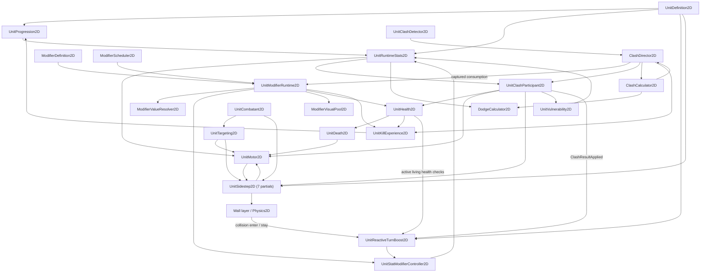

# Unit Combat System Architecture Map


This is a top-down 2D army combat game where many autonomous units from different factions seek enemies, move toward them, and resolve close-range fights through a Clash system based on stats, movement, positioning, level, and temporary effects.

Units can take damage, Dodge incoming Clash damage and new Vulnerable application, be knocked back or made vulnerable, die, gain XP from kills, level up, and have their combat/movement stats modified over time.

Eligible units can also enter a Sidestep locomotion session: they commit to a Wall-cleared, snapshotted half-circle path while continuing to face their live target, then finish or cancel through a unit-wide retry cooldown.

## Scope

This map records the supplied inventory of **37 source files / 31 logical entries**, including the retained Phase 3 XP bridge and the health/level presentation component. Seven `UnitSidestep2D` partial files compile into one component. The previous map covered 28 files / 22 entries; the findings add seven framework files, and the user's inventory additionally includes `UnitClashHandler2D.cs` and `UnitStatsUI2D.cs`. Counts describe this inventory, not inspected attachments or all C# types.

**Evidence and verification scope**

The modifier update reconciles `ModifierFramework-MapUpdateFindings-Chat1(2).md` (nine framework scripts) and `ModifierFramework-MapUpdateFindings-Chat2(1).md` (nine integration scripts). Chat 2 resolves Chat 1's open caller questions: effective acceleration/base damage, protected pair capture, captured one-Clash consumption, factual damage events, XP deferral/finalization and the retained timed-handle reactive exception. These are reported source-inspection findings, not a fresh inspection of those eighteen script bodies in this update.

The available `UnitSidestep2D.Clash(3).cs` and `UnitSidestep2D.Lifecycle(7).cs` were read directly for this update. They confirm active-session cancellation, exact bonus-removal requests, path-invalidation/cooldown delegation and the immediate motor clean-velocity rebuild call. The remaining Sidestep helper bodies retain baseline evidence.

Unrelated formulas, defaults, Dodge helper internals, progression behavior, targeting/faction internals and other baseline mechanics are retained from the previous map. Throughout this document, implementation statements and invariant headings inherit that evidence boundary; they do not imply every script was reverified. No compilation, Unity execution, prefab/asset inspection, project execution-order override inspection or performance test was performed here. No C# code was changed. The subsequently supplied `UnitClashHandler2D.cs` and `UnitStatsUI2D.cs` were read directly. Their implementations establish the legacy XP bridge and health/level UI described below. Handler comments claiming director integration are historical: the findings establish the active director/participant path through `UnitKillExperience2D`. Actual handler attachment and callers outside the inspected evidence remain unknown.

### Filename inventory

```text
ClashCalculator2D.cs
ClashDirector2D.cs
ClashRules2D.cs
CombatDamageTypes2D.cs
CombatModifierTypes2D.cs
CombatTypes2D.cs
DodgeCalculator2D.cs
ModifierApplicationDebug2D.cs
ModifierDefinition2D.cs
ModifierFrameworkTypes2D.cs
ModifierScheduler2D.cs
ModifierValueResolver2D.cs
ModifierVisualPool2D.cs
UnitClashDetector2D.cs
UnitClashHandler2D.cs
UnitClashParticipant2D.cs
UnitCombatant2D.cs
UnitDeath2D.cs
UnitDefinition2D.cs
UnitHealth2D.cs
UnitKillExperience2D.cs
UnitModifierRuntime2D.cs
UnitMotor2D.cs
UnitProgression2D.cs
UnitReactiveTurnBoost2D.cs
UnitRuntimeStats2D.cs
UnitSidestep2D.Clash.cs
UnitSidestep2D.cs
UnitSidestep2D.Eligibility.cs
UnitSidestep2D.Interruptions.cs
UnitSidestep2D.Lifecycle.cs
UnitSidestep2D.Path.cs
UnitSidestep2D.WallClearance.cs
UnitStatModifierController2D.cs
UnitStatsUI2D.cs
UnitTargeting2D.cs
UnitVulnerability2D.cs
```

## 1. System Overview

### Authoritative ownership

| Runtime concern | Authoritative owner |
| --- | --- |
| Faction identity | `UnitCombatant2D` |
| Current health and direct health mutation | `UnitHealth2D` |
| Death lifecycle and cleanup | `UnitDeath2D` |
| Vulnerable expiration | `UnitVulnerability2D` |
| Major movement state | `UnitMotor2D` |
| Physical movement and Knockback | `UnitMotor2D` |
| Applied Sidestep speed-bonus channel and Rigidbody execution | `UnitMotor2D` |
| Current target and target-search timing | `UnitTargeting2D` |
| Sidestep observed-target band history and retry cooldown | `UnitSidestep2D.Eligibility.cs` within the single `UnitSidestep2D` type |
| Sidestep lifecycle and speed-bonus bookkeeping | `UnitSidestep2D.Lifecycle.cs` within the single `UnitSidestep2D` type |
| Sidestep path snapshots, geometry, progress, and movement intent | `UnitSidestep2D.Path.cs` within the single `UnitSidestep2D` type |
| Sidestep Wall-query state and collision classification | `UnitSidestep2D.WallClearance.cs` within the single `UnitSidestep2D` type |
| Current level, XP, XP requirement, and XP bounty | `UnitProgression2D` |
| Reactive Clash-loss and Wall-contact triggers, subscription, Wall-layer cache, and source-specific handles | `UnitReactiveTurnBoost2D` |
| Independent modifier instances, frozen values, lifetime and per-instance visual leases | `UnitModifierRuntime2D` |
| Stat contributions, bundle identities, cached aggregates and legacy timed-entry expiry | `UnitStatModifierController2D` |
| Authored modifier settings | `ModifierDefinition2D` |
| Stateless modifier validation and scaling | `ModifierValueResolver2D` |
| Ordered scheduled work, cancellation handles and global creation sequence | `ModifierScheduler2D` |
| Pooled visual clones and lease generations | `ModifierVisualPool2D` |
| Effective runtime stat calculation | `UnitRuntimeStats2D` |
| Unit-side Clash cooldown, snapshot creation, and result orchestration | `UnitClashParticipant2D` |
| Clash request batching, pair deduplication, protected pair capture sets, consumption and reaction order | `ClashDirector2D` |
| Accepted-Clash pre-snapshot preparation ordering | `ClashDirector2D`, delegated through `UnitClashParticipant2D` to `UnitSidestep2D` |
| Clash numerical calculation | `ClashCalculator2D` |
| Shared Dodge cap and pure probability arithmetic | Static `DodgeCalculator2D` helper |
| Two per-Clash random samples | `ClashDirector2D` |
| Raw level-scaled Base Dodge Chance and its authored settings | `UnitDefinition2D` |
| Per-victim kill-XP attribution, pending award and Clash deferral depth in the current transaction path | `UnitKillExperience2D` |
| Separate legacy Phase 3 pending-award state; current caller unestablished | `UnitClashHandler2D` |
| Health-bar and level-sprite presentation | `UnitStatsUI2D` |
| Base unit configuration | `UnitDefinition2D` |
| Authored Sidestep enablement, chance, distance band, retry cooldown, and turn multiplier | `UnitDefinition2D` |
| Authored Clash-loss and Wall-contact additive turn-speed amounts and durations | `UnitDefinition2D` |
| Shared Clash configuration | `ClashRules2D` |

### High-level component flow



The arrows summarize reported integration reads/calls and retained baseline runtime data flow. They do not imply that the destination transfers ownership back to the caller.

## 2. Runtime Pipelines

### 2.1 Unit initialization and derived stats

1. `UnitProgression2D` initializes its level from `UnitDefinition2D.StartingUnitLevel` and calculates the current XP requirement and XP bounty.
2. `UnitRuntimeStats2D` derives effective values from `UnitDefinition2D`, the current level, Vulnerable state, and active stat modifiers.
3. `UnitHealth2D` initializes current health to the effective maximum health supplied by `UnitRuntimeStats2D`.
4. `UnitMotor2D` initializes forward speed from `UnitDefinition2D.InitialForwardSpeed`, clamped by effective maximum movement speed.
5. `UnitTargeting2D` allocates its reusable query array using `UnitDefinition2D.TargetQueryBufferCapacity`.
6. `UnitSidestep2D` resolves its same-root targeting, motor, and body-collider references; validates Sidestep configuration, collider geometry, and root scale; resolves the exact `Wall` layer; and allocates its reusable Wall-query arrays.
7. `UnitReactiveTurnBoost2D` resolves missing same-root participant, health, and modifier-controller references; caches `LayerMask.NameToLayer("Wall")` once in `Awake`; validates its definition, required references, and Wall layer; and disables itself if initialization fails. After successful initialization it subscribes to participant results while enabled.

8. On framework-equipped units, `UnitModifierRuntime2D` resolves same-root peers, attaches to the stat controller and subscribes to health/death cleanup while enabled. The shared scheduler is created before scene load; the visual pool is created on demand. This list describes responsibilities, not an additional guaranteed cross-component initialization order.

`UnitRuntimeStats2D` calculates values when queried. It does not cache a second authoritative copy of level, Vulnerable, or modifier state.

### 2.2 Target selection and movement

1. `UnitTargeting2D` queries colliders within `UnitDefinition2D.EnemySearchRadius` using its configured layer mask and reusable buffer.
2. Each collider is resolved to a `UnitCombatant2D` directly or through its parent.
3. A candidate must be targetable and an enemy according to `UnitCombatant2D`.
4. The nearest valid candidate becomes `CurrentTarget`.
5. `UnitMotor2D` reads `CurrentTarget` and turns toward its world position. Without consumed Sidestep intent it applies ordinary forward velocity; with Sidestep intent it uses the same live target for facing while applying path-derived velocity.
6. During Knockback, targeting continues, but the motor suppresses normal steering and combines forward velocity with Knockback velocity.

Each moving motor fixed step first clamps clean forward speed to the effective maximum, then advances it toward that maximum using `EffectiveForwardAcceleration × fixedDeltaTime`. A lower limit applies even with zero acceleration; a higher limit does not grant speed immediately. No modifier event drives an immediate velocity update. Snapshot capture separately calls `TryReconcileForwardSpeedLimit()` without advancing momentum.

Target searches are staggered on enable. Normal searches use `ClashRules2D.TargetSearchInterval`; an assigned target becoming invalid causes an immediate replacement search.

#### Sidestep branch inside Seeking movement

1. `UnitTargeting2D` executes before `UnitSidestep2D`, so Sidestep eligibility reconciles the current target after that fixed step's targeting work.
2. `UnitSidestep2D` compares squared target distance against the inclusive squared minimum and maximum configured by `UnitDefinition2D`.
3. A newly observed target starts with outside-band history. One outside-to-inside crossing is consumed before the remaining gates are evaluated; leaving the band rearms that crossing.
4. When Sidestepping is enabled, the unit-wide retry cooldown has expired, the motor is in `Seeking`, the target remains valid, and the chance roll succeeds, `UnitSidestep2D` snapshots the unit start and target endpoint to construct a fixed half-circle.
5. It randomly prefers clockwise or counterclockwise, validates that candidate against the `Wall` layer, and tries the opposite direction when the preferred arc is blocked.
6. Once a path is ready, it reads the motor's clean `ForwardSpeed` and requests a fixed bonus equal to `clean forward speed × 0.5 + 5` through `UnitMotor2D.TryApplySidestepSpeedBonus(...)`.
7. `UnitMotor2D` executes after `UnitSidestep2D`. It rebuilds clean forward momentum, then passes `forwardSpeed + sidestepSpeedBonus` and `Time.fixedDeltaTime` into `TryConsumeSidestepMovementIntent(...)` before ordinary Seeking movement.
8. `UnitSidestep2D` advances normalized progress from that supplied speed and returns path velocity plus the configured turn-rate multiplier.
9. The motor multiplies `UnitRuntimeStats2D.EffectiveTurnSpeed` by the returned multiplier, faces the live `CurrentTarget`, and writes the returned velocity to the Rigidbody.
10. The final nominal path interval is delivered once. Completion or cancellation removes the applied bonus, invalidates path state, and begins the unit-wide retry cooldown.

Reactive additive `TurnSpeed` effects enter `UnitRuntimeStats2D.EffectiveTurnSpeed` through the existing modifier evaluation. `UnitMotor2D` uses that effective turn speed for ordinary turning and multiplies it by the existing returned turn-rate multiplier during Sidestepping.

Runtime movement and turn modifiers reach Sidestepping through `UnitMotor2D`; `UnitSidestep2D` has no direct dependency on `UnitRuntimeStats2D` or `UnitStatModifierController2D`. Path progress is based on the fixed reference arc and supplied speed rather than the Rigidbody's realized position, so physical displacement does not steer the unit back onto the original arc.

### 2.3 Runtime stat modifier evaluation

1. `UnitModifierRuntime2D` resolves a modifier application into frozen values and installs its nonneutral stat entries as an atomic, untimed controller bundle. Instance expiry and exact bundle removal belong to that runtime (§2.7).
2. Legacy callers such as `UnitReactiveTurnBoost2D` can still add individual timed or permanent `UnitStatModifier2D` entries directly to `UnitStatModifierController2D`.
3. Every effective-stat getter reconciles expired contributions through controller `ReconcileForRead()`. Reconciliation may notify ordinary readers; it does not execute owed damage or child work.
4. The controller caches each target's aggregate: `(preModifierValue + sum(adds)) × product(factors)`. Dirty aggregates rebuild from surviving entries, never by division, preserving zero factors.
5. `UnitRuntimeStats2D` applies each stat's final bound. Maximum health has no modifier target. Movement speed includes the Vulnerable multiplier before aggregation; acceleration and base Clash damage now have effective properties.

For `DodgeChance`, raw definition scaling precedes contributions and `DodgeCalculator2D.ClampChance`, giving the baseline `0–0.95` cap with non-finite results becoming zero. A missing definition returns zero; level uses valid `CurrentLevel`, otherwise configured starting level clamped to at least 1. A missing controller passes through pre-modifier values; a present disabled controller is still usable.

Framework contributions and legacy timed entries use `ModifierScheduler2D.ApplicationTime`. Only legacy timed entries need controller `Update`; controller disable is an idle optimization, not cleanup. Ordinary reads can publish `ModifiersChanged`; the settled, protected pair capture in §2.4 is the distinct callback-free read boundary.

#### Reactive turn-speed addition and refresh

1. A qualifying Clash result or Wall callback selects that source's amount, duration, and retained handle.
2. If either amount or duration is zero, the source does not add or refresh an effect. An already-active effect is not removed by this check.
3. The reactive component opens `BeginNotificationScope()`, revalidates after acquisition, then calls `TryRefreshModifierDuration(handle, duration)` first. It retains the refreshed/new handle before closing with `EndNotificationScope(scope)` in cleanup.
4. If refresh succeeds, the existing modifier and handle are retained. If it fails, the component creates a `TurnSpeed` / `Add` modifier, calls `AddModifier(modifier, duration, this)`, and stores the returned handle.
5. Each source therefore maintains at most one active effect through this flow. Repeated triggers from that source refresh duration rather than stack additional entries.
6. The two sources use independent handles and coexist. With defaults, they contribute a combined `+360°/s` to the additive total before any multiplicative modifiers are applied.

Refresh replaces expiration with `ModifierScheduler2D.ApplicationTime + duration`; it does not add time to the old expiration or change the stored amount. The controller processes overdue expirations before looking up an otherwise valid refresh request. A duration-only refresh changes no aggregate contribution and emits no `ModifiersChanged` event; overdue removals processed during that call can emit the event.

#### Wall collision enter/stay

1. `OnCollisionEnter2D` and `OnCollisionStay2D` both delegate to `ApplyWallContactBoost(...)`.
2. Processing requires successful initialization, an active/enabled reactive component, active living health, and a non-null collision.
3. The contacted `collision.collider` must exist and its own GameObject layer must equal the cached exact `Wall` layer index.
4. The component refreshes or replaces its single Wall-contact handle using the Wall amount and duration from `UnitDefinition2D`.

Continued contact, simultaneous Walls, and re-entry use that same Wall handle. There is no collision-exit handler or early removal on exit. After callbacks stop, the effect expires naturally from the last successful addition or refresh, with removal performed by the controller's expiration processing. The Wall path checks active living health, just like the Clash-loss path. It has no contact collection, physics query, or per-callback layer lookup. These reactive sources remain timed controller-handle exceptions, not SO modifier instances.

### 2.4 Clash detection, calculation, and result application

1. `UnitClashDetector2D` receives trigger enter/stay callbacks from its Clash Range collider.
2. It filters by the configured Clash Range layers and resolves another `UnitClashDetector2D`.
3. It obtains both `UnitClashParticipant2D` owners and constructs a canonical `ClashRequest`.
4. `ClashDirector2D.SubmitRequest(...)` stores the request with the currently collecting physics-step ID.
5. At the next batch close, the director swaps its reusable buffers and processes the closed physics-step batch.
6. `ClashPairKey` deduplicates A–B/B–A reports within the batch; the first report determines the pair's request position.
7. Both participants must be distinct enemies, active, targetable, outside global Clash cooldown, and have active kill-XP components. Retain both XP owners; prepare first then second, revalidating after each.
8. `TryCaptureClashPair(...)` reconciles both recipients before acquiring either protected-read barrier, then revalidates. Both barriers must be acquired before either snapshot is read; failed acquisition aborts capture. Both are released afterward.
9. Under protection, each motor reconciles its ordinary speed limit; each participant captures its numerical snapshot and exact eligible one-Clash IDs at `ModifierScheduler2D.GameplayTime`. The director retains the corresponding runtime owners separately from the calculator inputs.
10. After final pair validation, draw two independent samples, first then second (including zero-chance cases), and calculate the complete resolution. Start both cooldowns and freeze both source combatant references before result callbacks.
11. Begin both XP deferrals. Attempt the first result, then the original second result if its receiver still exists; participant entry guards can reject it. Source death does not cancel the second attempt.
12. Consume the captured modifier IDs through `ConsumeCapturedClashPair(...)` after both attempts, while XP remains deferred. The runtime opens callback-free barriers on both controllers; both removal sets commit before removal notifications and visual callbacks are released.
13. End both deferrals, finalize first then second retained victim awards, then dispatch first then second retained `ClashResultApplied` records. Nested `finally` boundaries protect cleanup/finalization; subscriber exceptions are isolated.

Aborting preparation, settlement, capture or final validation produces no samples, cooldowns, results or one-Clash consumption. The pair stays deduplicated for the batch; preparation/reconciliation already performed is not rolled back. Reusable ID lists clear on every exit. Director disable stops subsequent requests, not the current transaction's finalization path. This is a protected read and ordered commit protocol, not general rollback.

`PrepareForAcceptedClash()` delegates to required same-root Sidestep. An active session cancels through its lifecycle: remove the stored bonus, request path invalidation and retry cooldown, then call `RebuildCleanForwardVelocityFromCurrentFacing()`. An inactive session is a no-op. Both preparations precede capture.

#### Clash snapshot contents

`ClashParticipantInput` contains motor position, facing, velocity and clean forward speed; definition weapon rating; effective unit size, **effective base Clash damage**, strength multiplier and Base Dodge Chance; current progression level; and Vulnerable state at the transaction time. It never includes the captured modifier ID lists.

`TryReconcileForwardSpeedLimit()` updates clean speed and matching velocity without advancing momentum or decaying Knockback: facing × (clean speed + stored Sidestep bonus), plus separate Knockback velocity while in Knockback. Accepted Sidestep preparation removes its bonus before this capture path. Both controllers are settled/protected before numerical reads; ordinary getter callback behavior must not be generalized to this interval. Later pairs observe completed effects, consumption and progression changes.

One-Clash capture includes unexpired, unconsumed `RemoveAfterOneClash` instances, including statless effects. Consumption follows captured identities regardless of Dodge, damage success or survival; already-removed IDs are harmless, and callback-created instances do not join the set. Single-snapshot and pair-capture APIs do not themselves perform preparation or consumption.

#### Clash calculation

For each participant:

`Martial Might = (Weapon Rating + Unit Size) × ((Unit Level × 0.5) + 0.5)`

The calculator then:

- projects linear velocity toward the opponent to calculate relative momentum;
- interpolates engagement-angle contribution from facing alignment;
- adds Martial Might, relative momentum, and engagement angle;
- applies the Vulnerable strength multiplier when appropriate;
- applies the participant’s effective Clash strength multiplier;
- compares first strength against second strength;
- normalizes the disparity using the configured minimum reference strength or the average positive Martial Might;
- classifies the first outcome and mirrors it for the second participant.

Each participant's final Dodge chance is `ClampChance(effective base chance × outcome factor × strength factor)`. The outcome factor is `0.5` only for `OverwhelmingLoss`, otherwise `1`. The strength factor is `Clamp01(own TotalStrength / opponent TotalStrength)` when opponent strength is positive, otherwise `1`. These strengths already include Vulnerable and the effective Clash strength multiplier. Non-finite chance or strength inputs produce zero chance.

A finite sample in `[0,1]` succeeds only when `sample < ClampChance(finalDodgeChance)`; equality, non-finite samples and out-of-range samples fail. Both calculators access no random state.

On failed Dodge, requested incoming damage is the opponent's base Clash damage multiplied by the effect settings for the receiver's outcome. Successful Dodge sets it to zero and suppresses new Vulnerable application. Each side's outgoing damage remains independent of its own Dodge result. Outcome, momentum multiplier, Knockback velocity/duration and Vulnerable duration fields are preserved. Knockback points away from the opponent.

#### Participant-side result application

1. Entry rejects missing/inactive/dead health or missing motor without retaining a notification. It does not require a living source or participant enablement.
2. For accepted entry, retain the current listeners before effects, including Dodge and zero-damage results. Successful Dodge skips health damage; otherwise send Clash damage with both permission flags true.
3. Lethal damage or failed survivor guards stops remaining effects but preserves the retained notification. Survivor continuation requires active living health and `motor.CanReadMovement` (enabled, usable dependencies, neither Disabled nor Dead).
4. Apply momentum, then non-dodged new Vulnerable, then Knockback, rechecking continuation between effects. Dodge does not clear existing Vulnerable. Failed/zero damage is not a Dodge and need not prevent survivor effects.
5. The director dispatches retained reactions only after paired consumption and both XP award calls. The standalone compatibility `ApplyClashResult(...)` dispatches its own record immediately and provides neither paired consumption nor the director's XP boundary.

Retained Clash records can dispatch after receiver destruction; subscribers must check liveness. The reactive listener accepts surviving active `Loss`/`OverwhelmingLoss` recipients, including dodged losses, and applies its timed source handle. Health/damage/death events still occur during effects; they are not postponed to this reaction boundary.

### 2.5 Generalized damage and death

1. A producer sends a finalized positive finite amount and metadata in `DamageContext2D`. Health adds no Dodge roll, Vulnerable multiplier or origin-specific formula.
2. Health requires an active component/root, living state and usable combatant/runtime-stats/death dependencies. It freezes the context, refreshes maximum health, rechecks eligibility and computes loss from then-current health.
3. Committed damage mutates health and constructs the authoritative result. A lethal hit orders internal `LethalDamageAccepted` → `HealthChanged` → death lifecycle → `DamageReceived` → source `DamageDealt`. Attribution is captured before public health callbacks can change bounty or disable XP handling.
4. Death commits `HasDied`, asks the motor to enter Dead, emits `Died`, and schedules configured destruction once. Missing motor does not revoke a committed death; `MarkDead()` stops Rigidbody motion before and after its state callbacks.

Damage events report positive actual loss even when `CanTriggerDamageEffects` is false (including modifier DoT). Secondary-effect subscribers must inspect that copied flag. Ordinary disable does not erase an accepted hit. Destroying the target stops further target delivery, but existing source health can still receive `DamageDealt`; source death/disable alone does not exclude it. Event deliveries snapshot subscribers and isolate exceptions; nested delivery remains synchronous.

Maximum-health refresh runs on enable, in health FixedUpdate and before accepted damage. A higher maximum does not heal; a lower maximum clamps health, and a maximum-only change also emits `HealthChanged`. Death from that clamp or `ForceDeath()` is unattributed, not a damage/kill-XP transaction. Runtime stats currently exposes no maximum-health modifier channel.

Motor `StateChanged` cancels Sidestep on Knockback/Disabled/Dead through its baseline subscriber. The modifier runtime separately subscribes to `HealthChanged` (health ≤ 0) and `Died` for cleanup; Sidestep does not subscribe directly to these health/death events.

### 2.6 Kill-XP attribution and mutual-kill handling

`UnitKillExperience2D` subscribes to internal `LethalDamageAccepted` and resolves attribution once per victim, including ineligible lethal attribution. XP permission, victim progression and a different existing enemy source with progression are required. The killer need not be alive/enabled. Killer progression and victim bounty are captured before public health callbacks.

`BeginClashAwardDeferral()` / `EndClashAwardDeferral()` maintain victim-side depth. A finalizer called while deferred leaves pending data untouched; otherwise it clears pending fields before calling `GainExperience(bounty)`. Retained managed victim state can finalize after victim-component destruction, but killer progression must still exist. Mutual-kill award calls are supported; progression's gain/level behavior remains baseline evidence, not a guarantee of XP to a destroyed killer.

The legacy `UnitClashHandler2D` separately implements a Phase 3 pending-award bridge without these deferrals; its current caller/attachment is not established (see its §3 entry).

The director brackets both result attempts and captured consumption, then finalizes both victims before Clash reactions. `UnitModifierRuntime2D` also finalizes its retained victim XP reference in `finally` after every damage tick. A nested DoT finalizer respects that victim's active Clash deferral. Other origin enum values do not establish implemented delivery/finalization systems.

### 2.7 Modifier application, scheduled effects and lifetime

**Application and stacking**

The caller supplies original caster, captured caster level, origin and application time. Convenience context capture first reconciles expiry, then captures recipient level once; missing/wrong-root progression gives zero and resolution rejects it. Explicit valid contexts use their supplied levels. Null/destroyed original caster is allowed with a valid captured level; no caster-liveness gate or delivery-object reference exists.

A recipient needs an active/enabled runtime and active root, same-root combatant, active living health, death with `HasDied == false`, and stat controller. Faction, targetability, motor state and combatant/death/controller enablement are not additional gates. Disabled/Knockback gameplay states alone do not reject applications. Caller selection, delivery Dodge and direct-impact survivor policy remain caller responsibilities; dead/ineligible or mismatched recipients are rejected.

Each accepted application creates a separate owner-scoped identity. Repeated SO applications neither refresh nor replace one another and have no automatic stacking limit. Numeric values and settings freeze for that lifetime; child/prefab references retain identity, not deep copies. `ApplyOrdered` shares one frozen context, applies array order and rechecks eligibility per entry; entries are independent transactions, not an atomic batch. Caller arrays must remain stable through callbacks. `Applied` records commitment even if a synchronous callback immediately removes the instance.

The mapper installs at most six nonneutral entries in an atomic untimed bundle; statless effects need no bundle. Failed installation changes neither contributions nor output slots; successful installation retains ownership/bookkeeping before callbacks. Explicit removal cancels remaining channels, removes its exact bundle and identity, and releases its visual. Removing a bundle handles already-removed subordinate entries without touching another owner's data.

**Time and scheduled work**

The scaled fixed clock is `Time.fixedTimeAsDouble`. `GameplayTime` is fixed time; `ApplicationTime` is the executing event's scheduled time during catch-up, otherwise fixed time. Supplied timestamps must be finite, nonnegative, not future, and not earlier than the currently executing event. Scheduling cannot insert behind the executing order. This clock is modifier-specific; Vulnerable movement still uses `Time.time`, and Clash Vulnerable snapshots use transaction time.

The shared scheduler orders **timestamp → global instance creation sequence → kind**, with Damage before ChildEmission before Expiration only within the same instance/time. Due work catches up to the fixed-step horizon without a work cap and retains scheduled cadence. Successors queue before callbacks so removal can cancel them. No work runs while paused.

- Damage starts at application + 0.5 seconds and repeats every 0.5 seconds, including a tick exactly at expiry; no immediate or fractional final tick.
- Child emission starts after its fixed interval and repeats strictly before parent expiry. Each child keeps original caster, captured caster level and origin, captures recipient level anew and resolves from the then-current child asset at scheduled emission time. Committed children survive parent removal. Enabled chains are revalidated, including the frozen parent edge against later asset edits; rejection does not remove the parent.
- At most one damage and one child channel exist per instance; public scheduling rejects duplicate channels. Authored channels reserve their slots when due work exists.

Reconciliation removes contributions at `ExpiresAt <= ApplicationTime` without executing periodic work. Identity, values, schedules and visual remain until scheduled expiry, so `Contains`, `TryGetInstance` and `ActiveInstanceCount` can include expired instances awaiting owed work. Explicit removal cancels that work. Catch-up reconciliation follows event time to preserve historically valid lifetimes.

Damage ticks send frozen damage with origin `DamageOverTime`, original caster, `canTriggerDamageEffects: false` and `canAwardKillExperience: true`; no runtime Dodge or Vulnerable multiplier applies. Health event and XP behavior follow §§2.5–2.6.

**Cleanup and visuals**

`ClearAll` removes runtime-owned instances only and rejects new applications during cleanup. Runtime disable/destruction, health ≤ 0 and `Died` clean up; scheduled work clears ineligible recipients. Dependency loss is checked at application/visual/scheduled boundaries, with no polling guarantee of immediate detection. Scheduler destruction clears queued owners.

After gameplay commit and notification completion, an optional prefab receives one independent lease under the recipient root at its authored local transform, inheriting unit transforms. Pool reuse resets hierarchy/transforms, rendering/sprite state, particles and trails. Custom scripts must reset private state on enable/disable, avoid scheduled Destroy and avoid shared-material mutation. Stale leases cannot release reused clones. Missing/failed visuals do not reject gameplay. ClearAll and paired consumption defer visual callbacks until their removal set is complete. Pool shutdown retires all clones without cancelling modifiers; neither runtime nor pool has a recurring update loop.

## 3. Script-by-Script Architecture

### `UnitDefinition2D`

**Role**

Shared `ScriptableObject` containing base unit configuration and level-scaling formulas.

**Owns**

- Base weapon rating and unit size.
- Starting unit level.
- Base maximum health and base Clash damage.
- Base XP bounty and XP-bounty scaling.
- Base XP requirement and requirement scaling.
- Maximum-health and maximum-movement-speed level scaling.
- Raw Base Dodge Chance and additive per-level Dodge chance scaling.
- Initial speed, acceleration, maximum speed, turn speed, and Knockback decay configuration.
- Clash-loss and Wall-contact additive turn-speed amounts and durations.
- Sidestep enablement, chance, minimum/maximum distance, retry cooldown, and turn-rate multiplier.
- Enemy search radius and query-buffer capacity.

**Important inputs**

- Inspector-authored configuration.
- Level arguments supplied to its scaling functions.

**Important outputs / API**

- `GetExperienceBountyForLevel(int)`
- `GetExperienceRequirementForLevel(int)`
- `GetMaximumHealthForLevel(int)`
- `GetMaximumMovementSpeedForLevel(int)`
- `GetBaseDodgeChanceForLevel(int)`
- `SidesteppingEnabled`
- `SidestepChance`
- `MinimumSidestepDistance`
- `MaximumSidestepDistance`
- `SidestepRetryCooldown`
- `SidestepTurnRateMultiplier`
- Read-only base-value properties.

**Dodge configuration**

| Serialized field | Meaning | Default |
| --- | --- | --- |
| `baseDodgechance` | Raw chance at level 1 | `0.1f` (10%) |
| `dodgeChanceScaling` | Additive chance per level above 1 | `0.1f` (10 percentage points) |

Both fields have `[SerializeField, Min(0f)]`; neither has a separate public getter. `GetBaseDodgeChanceForLevel(int level)` clamps level to at least 1 and returns `baseDodgechance + ((level - 1) * dodgeChanceScaling)`. This raw value is not capped; modifiers precede capping in runtime stats. `OnValidate()` converts negative or non-finite values in either field to zero. Declared defaults do not establish the values saved in existing definition assets.

**Reactive Turn Boosts configuration**

| Serialized field | Read-only public property | Default |
| --- | --- | --- |
| `clashLossAdditiveTurnSpeedDegreesPerSecond` | `ClashLossAdditiveTurnSpeedDegreesPerSecond` | `180f` degrees/second |
| `clashLossTurnSpeedBoostDurationSeconds` | `ClashLossTurnSpeedBoostDurationSeconds` | `0.5f` seconds |
| `wallContactAdditiveTurnSpeedDegreesPerSecond` | `WallContactAdditiveTurnSpeedDegreesPerSecond` | `180f` degrees/second |
| `wallContactTurnSpeedBoostDurationSeconds` | `WallContactTurnSpeedBoostDurationSeconds` | `0.5f` seconds |

All four fields use `[SerializeField, Min(0f)]` under the `Reactive Turn Boosts` Inspector header. Zero in either setting for a source prevents subsequent additions and refreshes from that source; it does not immediately remove an already-active modifier.

**Read by**

- `UnitProgression2D`
- `UnitRuntimeStats2D`
- `UnitMotor2D`
- `UnitTargeting2D`
- `UnitClashParticipant2D`
- `UnitSidestep2D`
- `UnitReactiveTurnBoost2D`

**Implementation invariants**

- Starting level is at least 1.
- XP requirement is at least `0.01`.
- Initial forward speed is clamped between zero and configured maximum forward speed.
- `OnValidate()` applies `ClampNonNegativeFinite(...)` to all four reactive settings: negative values, NaN, and either infinity become zero; finite non-negative values are preserved.
- Sidestep chance is clamped from zero to one.
- Sidestep minimum distance and retry cooldown are non-negative.
- Sidestep maximum distance cannot be below the minimum.
- Sidestep turn-rate multiplier is non-negative.
- Target query capacity is at least 1.
- Per-level scaling treats levels below 1 as having zero levels above the base.

**Does not own**

- Runtime level or XP.
- Current health.
- Effective runtime stats.
- Movement state or execution.
- Runtime Sidestep eligibility, lifecycle, path, cooldown expiration, or applied motor bonus.
- Reactive modifier handles, active entries, or expiration timestamps.
- Clash transaction state.

### `ClashRules2D`

**Role**

Shared `ScriptableObject` containing targeting timing, Clash timing, calculation parameters, Vulnerable multipliers, and per-outcome effects.

**Owns**

- Target-search interval.
- Global Clash cooldown duration.
- Momentum and engagement-angle calculation parameters.
- Outcome ratio thresholds and minimum reference strength.
- Vulnerable Clash-strength and movement-speed multipliers.
- Effect settings for all five `ClashOutcome` values.

**Important outputs / API**

- `TargetSearchInterval`
- `GlobalClashCooldown`
- `VulnerableMovementSpeedMultiplier`
- `CreateCalculationSettings()`

**Read by**

- `UnitTargeting2D`
- `UnitRuntimeStats2D`
- `ClashDirector2D`

**Shared contracts**

- Stores `ClashOutcomeEffectSettings`.
- Produces `ClashCalculationSettings`.

**Implementation invariants**

- Target interval and calculation denominators remain positive.
- Cooldown and positive momentum contributions are non-negative.
- Negative momentum contribution is non-positive.
- Maximum engagement contribution cannot be below the minimum.
- Overwhelming threshold cannot be below the normal victory threshold.
- Vulnerable multipliers are clamped from zero to one.

**Does not own**

- Any unit’s current cooldown or Vulnerable expiration.
- Target selection.
- Clash request processing or result calculation.

### `CombatTypes2D`

**Role**

Defines general faction, movement-state, and Clash communication contracts.

**Defines**

- `FactionId`
- `UnitMajorState`
- `ClashOutcome`
- `ClashPairKey`
- `ClashRequest`
- `ClashOutcomeEffectSettings`
- `ClashCalculationSettings`
- `ClashParticipantInput`
- `ClashStrengthBreakdown`
- `ClashParticipantResult`
- `ClashResolution`

**Important contract flow**

- `UnitCombatant2D` stores `FactionId`.
- `UnitMotor2D` owns `UnitMajorState`; `UnitCombatant2D`, `UnitTargeting2D`, and `UnitSidestep2D` read it.
- Sidestepping is subordinate locomotion state internal to `UnitSidestep2D`; it is not a `UnitMajorState` value.
- `UnitClashDetector2D` produces `ClashRequest`; `ClashDirector2D` consumes it.
- `ClashRules2D` produces `ClashCalculationSettings`; `ClashCalculator2D` consumes it.
- `UnitClashParticipant2D` produces `ClashParticipantInput` and consumes `ClashParticipantResult`.
- `ClashCalculator2D` produces `ClashResolution`; `ClashDirector2D` routes its results.
- `UnitReactiveTurnBoost2D` consumes `ClashParticipantResult.Outcome` through `UnitClashParticipant2D.ClashResultApplied` and accepts `Loss` or `OverwhelmingLoss`.

**Implementation invariants**

- `ClashPairKey` sorts two instance IDs into a stable lower/higher order.
- `ClashRequest` sorts its two participants using instance IDs.
- A request is valid only when both participants exist and differ.
- `ClashCalculationSettings` clamps critical calculation boundaries in its constructor.
- `ClashParticipantInput` is immutable and adds mandatory `float effectiveBaseDodgeChance` after mandatory `float clashStrengthMultiplier` in its constructor, storing `EffectiveBaseDodgeChance` without clamping.
- `ClashParticipantResult` is immutable and adds mandatory `float finalDodgeChance, bool dodged` after `vulnerabilityDuration`. No temporary constructor defaults remain in these signatures.
- Result `Damage` is requested incoming damage, not authoritative health loss. `FinalDodgeChance` is stored as supplied; `Dodged` is supplied explicitly, never inferred from damage acceptance.
- The result constructor enforces `Damage = 0` and `ApplyVulnerability = false` when dodged, preserving outcome, movement fields and Vulnerable duration. Calculator-produced probabilities are capped by the helper; the constructor does not independently clamp the stored chance.

**Does not own**

- Runtime component state or processing.

### `CombatDamageTypes2D`

**Role**

Defines the generalized health-damage request and result contracts.

**Defines**

- `DamageOrigin2D`
- `DamageContext2D`
- `DamageResult2D`

**`DamageContext2D` carries**

- Final requested health damage.
- Optional source `UnitCombatant2D`.
- Broad damage origin.
- Permission to trigger damage effects.
- Permission to award kill XP.

**`DamageResult2D` carries**

- Requested and actual health damage.
- Previous and remaining health.
- Whether this application caused death.
- Source and target combatants.
- Origin and the two permission flags copied from the context.

**Contract flow**

- Created for Clash by `UnitClashParticipant2D` and for periodic DamageOverTime by `UnitModifierRuntime2D`.
- Origins are Clash, Projectile, Ability, DamageOverTime and Summon; enum support does not establish every delivery system.
- `CanTriggerDamageEffects` is subscriber permission, not suppression of factual damage events; `CanAwardKillExperience` gates attribution.
- Consumed and converted into an authoritative result by `UnitHealth2D`.
- Lethal results are consumed by `UnitKillExperience2D`.
- Successful results are exposed through health events.

**Does not own**

- Damage calculation, health mutation, death, or attribution processing.

### `CombatModifierTypes2D`

**Role**

Defines value types used to communicate runtime stat changes.

**Defines**

- `UnitStatTarget2D`: MaximumMovementSpeed, TurnSpeed, UnitSize, ClashStrengthMultiplier, DodgeChance, ForwardAcceleration and BaseClashDamage (seven targets).
- `UnitStatModifierOperation2D`: additive or multiplicative.
- `UnitStatModifier2D`: target, operation, and value.
- `UnitStatModifierHandle2D`: controller-scoped modifier identity plus optional source ID.
- `UnitStatModifierAggregate2D`: combined additive and multiplicative totals.
- Controller-scoped bundle identity and `UnitStatModifierNotificationScope2D`.
- `ModifierStatBundleMapper2D.TryWrite(...)`: maps resolved Dodge Add, acceleration Multiply, speed Multiply, turn Add/Multiply and base Clash damage Add; at most six nonneutral entries. This helper lives in this file, not a separate source file.

**Contract flow**

- `UnitStatModifierController2D` consumes stat entries and produces handles, bundles, scopes and aggregates. `UnitModifierRuntime2D` uses the mapper and bundle contracts; UnitSize and ClashStrengthMultiplier remain controller targets but are not modifier-SO fields.
- `UnitRuntimeStats2D` selects targets when requesting effective values.
- `UnitReactiveTurnBoost2D` creates timed `TurnSpeed` / `Add` modifiers and retains two controller-issued handles for refresh and exact removal.

**Implementation invariants**

- A valid handle identifies both its creating controller and a nonzero modifier ID.
- Handle equality uses controller ID plus modifier ID.
- Aggregate evaluation always applies addition before multiplication.

**Does not own**

- Active modifiers, expiration, or effective stat calculation.

### `UnitCombatant2D`

**Role**

General unit identity and targetability facade.

**Owns**

- `FactionId` for the unit.

**Reads / depends on**

- `UnitMotor2D` for world position and `UnitMajorState`.
- `UnitHealth2D` for health availability and dead state.

**Important inputs**

- Another `UnitCombatant2D` passed to `IsEnemyOf(...)`.

**Important outputs / API**

- `Faction`
- `Health`
- `WorldPosition`
- `MajorState`
- `CanBeTargeted`
- `IsEnemyOf(UnitCombatant2D)`

**Consumers**

- `UnitTargeting2D`
- `UnitMotor2D` through the selected target.
- `UnitClashParticipant2D`
- `UnitSidestep2D`
- `UnitHealth2D`
- `UnitKillExperience2D`
- `DamageContext2D`, `DamageResult2D` and modifier application contexts.
- Modifier runtime/debug harness and director source capture.

**Implementation invariants**

- A unit is its own faction authority.
- Enemy status requires a different, non-null combatant with a different faction.
- Targetability requires an active object, active identity, active health, a living unit, active motor, and a motor state other than Disabled or Dead.

**Does not own**

- Health values or mutation.
- Movement state or movement execution.
- Target selection.
- Sidestep eligibility, lifecycle, path, or retry cooldown.
- Clash-specific state.
- Progression.

### `UnitTargeting2D`

**Role**

Selects and maintains the nearest valid enemy target.

**Owns**

- Current `UnitCombatant2D` target.
- Whether a target is currently assigned.
- Next target-search timestamp.
- Reusable collider query buffer and search filter.

**Reads / depends on**

- `UnitCombatant2D` for owner position/state, faction checks, and candidate targetability.
- `UnitDefinition2D` for search radius and buffer capacity.
- `ClashRules2D` for search interval.
- Configured enemy physics layer mask.

**Important inputs**

- Physics overlap results.
- Owner `UnitMajorState`.
- Current target validity.

**Important outputs / API**

- `CurrentTarget`
- `NextSearchTime`

**Consumers**

- `UnitMotor2D`
- `UnitSidestep2D`

**Implementation invariants**

- Dead or Disabled owners have no target.
- Knockback does not stop target maintenance.
- An assigned target becoming invalid triggers an immediate search.
- Normal searches are interval-based and staggered on enable.
- Only candidates passing `CanBeTargeted` and `owner.IsEnemyOf(candidate)` are accepted.
- Selection is based on the nearest squared distance among returned candidates.

**Does not own**

- Faction identity.
- Movement execution.
- Sidestep band history, lifecycle, path, and cooldown state.
- Clash detection or damage.

### `UnitMotor2D`

**Role**

Owns major movement state and performs Rigidbody2D movement, steering, momentum rebuilding, Knockback, and physical execution of Sidestep movement intent.

**Owns**

- Current `UnitMajorState`.
- Current forward speed.
- Applied Sidestep speed bonus, stored separately from clean forward speed.
- Knockback velocity and expiration time.
- Rigidbody velocity and rotation updates performed by this component.

**Reads / depends on**

- `UnitTargeting2D.CurrentTarget`.
- `UnitRuntimeStats2D.EffectiveMaximumMovementSpeed` and `EffectiveForwardAcceleration`.
- `UnitRuntimeStats2D.EffectiveTurnSpeed`.
- `UnitDefinition2D` movement and Knockback configuration.
- `UnitSidestep2D` for optional per-fixed-step movement intent and turn-rate multiplier.
- `Rigidbody2D` physical state.

**Important inputs / API**

- `BeginKnockback(Vector2, float)`
- `MultiplyForwardSpeed(float)`
- `SetForwardSpeed(float)`
- `TryApplySidestepSpeedBonus(float)`
- `RemoveSidestepSpeedBonus(float)`
- `RebuildCleanForwardVelocityFromCurrentFacing()`
- `bool TryReconcileForwardSpeedLimit()`
- `SetDisabled(bool)`
- `MarkDead()`

**Important outputs / events**

- Position, velocity, facing, forward speed, Knockback velocity, and expiration properties.
- `CurrentState` and `CanReadMovement`
- `StateChanged(previousState, currentState)`

**Consumers**

- `UnitCombatant2D` reads position and major state.
- `UnitClashParticipant2D` reads movement snapshot values and sends result effects.
- `UnitSidestep2D` reads clean forward speed, position, and major state; subscribes to `StateChanged`; and uses the Sidestep bonus and clean-velocity APIs.
- `UnitDeath2D` calls `MarkDead()`.

**Implementation invariants**

- Dead state cannot be exited by `SetDisabled(...)`.
- Disabled and Dead states stop Rigidbody motion.
- Normal steering is suppressed while Knockback remains active.
- Forward momentum rebuilds during Knockback; each moving step clamps to the effective limit before applying effective acceleration. Pre-snapshot reconciliation clamps without advancing momentum or decaying separate Knockback velocity.
- `CanReadMovement` requires an enabled motor, usable dependencies and a state other than Disabled/Dead.
- `MarkDead()` stops Rigidbody motion before and after state callbacks.
- Forward speed is clamped by effective maximum movement speed whenever explicitly set or multiplied.
- The public `ForwardSpeed` remains clean speed and does not include the separate Sidestep bonus.
- Applied movement speed is clean forward speed plus the stored Sidestep bonus.
- Sidestep intent is requested after forward-momentum rebuilding and Knockback handling but before ordinary Seeking movement.
- When Sidestep intent is returned, the motor applies path velocity and multiplies effective turn speed by the returned turn-rate multiplier while facing the live target.
- Disabling the motor, entering Disabled, or entering Dead clears the motor-owned Sidestep bonus.
- Knockback expiration returns the motor to Seeking.

**Does not own**

- Target selection.
- Effective stat calculation.
- Sidestep eligibility, chance, retry cooldown, lifecycle, or path state.
- Clash calculation, health, Vulnerable, death lifecycle, or progression.

### `UnitSidestep2D`

**Role**

Owns the complete Sidestep locomotion session while exposing path movement as intent for `UnitMotor2D` to execute. It is one attachable Unity component compiled from seven partial source files, not seven components.

Only `UnitSidestep2D.cs` declares `MonoBehaviour` inheritance, `[DisallowMultipleComponent]`, and `[DefaultExecutionOrder(-150)]`. All Unity message entry points remain in that file. The other six files are partial extensions of the same C# type and are not independently attachable behaviours.

**Partial-file responsibilities and state-mutation ownership**

| Source file | Responsibility | State declared and mutated in that file |
| --- | --- | --- |
| `UnitSidestep2D.cs` | Resolves references, initializes and validates the component, centralizes `Reset`, `Awake`, `OnEnable`, `OnDisable`, `FixedUpdate`, `OnCollisionEnter2D`, and `OnCollisionStay2D`, coordinates fixed-step work, and exposes movement intent. | Serialized `UnitDefinition2D`, `UnitTargeting2D`, `UnitMotor2D`, and root `CircleCollider2D` references. Detailed eligibility, lifecycle, Wall, and path state is not stored here. |
| `UnitSidestep2D.Eligibility.cs` | Reconciles the observed target, evaluates the inclusive distance band, consumes and rearms crossings, evaluates enablement/cooldown/state/target gates and chance, and begins retry cooldowns. | `observedTarget`, prior inside-band state, crossing-armed state, and the unit-wide retry-cooldown expiration. |
| `UnitSidestep2D.Lifecycle.cs` | Starts a session only after path and Wall validation and speed-bonus application; centralizes completion, cancellation, reentrancy protection, bonus cleanup, path invalidation, end reason, and cooldown start. | Start-pending, active, and ending flags; stored speed-bonus value; bonus-applied flag; last end reason. Lifecycle fields are directly mutated only through methods in this partial. |
| `UnitSidestep2D.Path.cs` | Builds fixed half-circle geometry, owns preferred and selected direction, calculates reference points and tangent/chord movement, advances normalized progress, delivers at most one intent per fixed step, detects final delivery, and invalidates the path. | Start and target snapshots, center, radius, starting angle, directions, progress, path state, cached movement intent, and per-step/final-delivery flags. Path fields are mutated only through methods implemented in this partial. |
| `UnitSidestep2D.WallClearance.cs` | Resolves the exact Wall layer, calculates full-body world clearance, owns reusable physics-query data, preflights the preferred and opposite arcs, and classifies live collisions. | Wall layer index/mask, contact filter, overlap-result array, and cast-result array. It requests lifecycle cancellation but does not directly mutate lifecycle fields. |
| `UnitSidestep2D.Interruptions.cs` | Subscribes to motor state changes while enabled and validates target identity, target usability, targeting enablement, motor enablement, and `Seeking` state during an active session. | Motor-event subscription flag. It requests lifecycle cancellation rather than directly mutating lifecycle or path fields. |
| `UnitSidestep2D.Clash.cs` | Exposes accepted-Clash preparation, routes an active Sidestep through normal cancellation, and asks the motor to rebuild clean forward velocity before snapshots. | No persistent state. |

All fields above are private members of the same compiled `UnitSidestep2D` type. The file-level ownership identifies the partial in which mutation is implemented; it is not a component boundary.

**Reads / depends on**

- `UnitDefinition2D` for `SidesteppingEnabled`, `SidestepChance`, `MinimumSidestepDistance`, `MaximumSidestepDistance`, `SidestepRetryCooldown`, and `SidestepTurnRateMultiplier`.
- `UnitTargeting2D.CurrentTarget` and targeting component enablement.
- `UnitCombatant2D.WorldPosition` and `CanBeTargeted` for the observed target.
- `UnitMotor2D.CurrentPosition`, clean `ForwardSpeed`, `CurrentState`, component enablement, `StateChanged`, Sidestep bonus APIs, and clean-velocity rebuild API.
- `UnitMajorState` from `CombatTypes2D`.
- Same-root `CircleCollider2D`, root `Transform.lossyScale`, the exact `Wall` layer, `Physics2D.OverlapCircle`, `Physics2D.CircleCast`, and Unity collision callbacks.

There is no direct dependency on `UnitRuntimeStats2D` or `UnitStatModifierController2D`. Effective movement and turn values reach Sidestep execution through `UnitMotor2D`.

**Important inputs / public API**

- `TryConsumeSidestepMovementIntent(appliedMovementSpeed, fixedDeltaTime, out movementVelocity, out turnRateMultiplier)`
- `PrepareForAcceptedClash()`

These are the only public methods introduced by `UnitSidestep2D`. The motor calls the first; `UnitClashParticipant2D` calls the second.

**Important outputs / cross-component calls**

- Returns path-derived movement velocity and the configured Sidestep turn-rate multiplier to `UnitMotor2D`.
- Calls `UnitMotor2D.TryApplySidestepSpeedBonus(...)` only after a Wall-cleared path is ready.
- Calls `UnitMotor2D.RemoveSidestepSpeedBonus(...)` during completion or cancellation when its stored bonus was applied.
- Calls `UnitMotor2D.RebuildCleanForwardVelocityFromCurrentFacing()` during active accepted-Clash preparation.
- Subscribes to and unsubscribes from `UnitMotor2D.StateChanged` while enabled.
- Declares no custom event.

**Fixed-step coordinator order**

1. Validate non-Clash interruptions.
2. Complete a previously delivered final path interval.
3. Reconcile the current target and distance-band history.
4. Consume at most one band crossing and possibly begin a session.
5. Reset per-fixed-step path-intent delivery state before the later `UnitMotor2D` execution.

**Eligibility and cooldown invariants visible in code**

- Target distance uses squared comparisons and includes both configured band boundaries.
- Losing or replacing the target discards the old target's band history.
- A newly observed target starts with outside history and can therefore produce one immediate crossing when already inside the band.
- Leaving the band rearms the crossing; remaining inside does not reroll.
- Crossing consumption happens before every later eligibility gate, so a rejected crossing is not queued.
- A chance failure starts retry cooldown.
- The retry cooldown is unit-wide and survives target changes.
- Every completed or cancelled started lifecycle, including path-generation and speed-bonus-application failure, starts retry cooldown through centralized cleanup.

**Path, movement, and Wall invariants visible in code**

- Start position and target endpoint are snapshotted once; the target snapshot is the opposite endpoint of a fixed 180-degree arc.
- The center is the midpoint and the radius is half the snapshot separation.
- Non-finite geometry and an unusable radius are rejected.
- Clockwise or counterclockwise is randomly preferred; the opposite direction is tried when the preferred arc is blocked.
- Wall preflight uses a start overlap test and 18 conservative circle-cast chord sweeps with body radius, sagitta, and numeric padding.
- Wall queries exclude triggers and use reusable result arrays of capacity one.
- The body-clearance radius is the root `CircleCollider2D.radius` multiplied by uniform absolute world scale.
- The selected path never follows later target movement; live target data continues to feed eligibility reconciliation, interruption validation, and the motor's facing logic without rebuilding the path.
- Path progress advances from supplied applied speed and fixed delta time rather than actual Rigidbody displacement.
- One movement interval can be delivered per fixed step, and the final interval is delivered exactly once.
- Live collision enter/stay with a collider on the cached Wall layer cancels an active ready path.

**Lifecycle and interruption invariants visible in code**

- A session becomes active only after path creation, Wall direction selection, and speed-bonus application all succeed.
- The stored speed bonus is calculated once as `clean forward speed × 0.5 + 5`.
- Completion and cancellation are guarded against reentrant cleanup.
- Cleanup marks the session inactive, removes the exact stored bonus when applied, invalidates all path state, records the end reason, and starts cooldown.
- `Knockback`, `Disabled`, and `Dead` motor transitions request cancellation through `StateChanged`.
- An active session is also cancelled when targeting or motor becomes unavailable/disabled, the target is lost/replaced/untargetable, the motor leaves `Seeking`, the path becomes invalid, the component is disabled, or live Wall contact occurs.
- `OnDisable` unsubscribes from motor state changes, requests cancellation, and discards observed-target band history.

**Does not own**

- Current target selection or search timing.
- `UnitMajorState`, clean forward speed, the applied motor bonus channel, Rigidbody velocity, or Rigidbody rotation.
- Effective runtime-stat calculation or active modifiers.
- Faction identity, targetability, health, death, Vulnerable, progression, or Clash numerical calculation.
- Accepted-Clash transaction ordering; `ClashDirector2D` owns that ordering.

### `UnitProgression2D`

**Role**

Owns level and experience progression for one unit.

**Owns**

- Current level.
- Current XP within the current level.
- Current XP requirement.
- Current XP bounty.
- Multi-level advancement processing.

**Reads / depends on**

- `UnitDefinition2D` for starting level, XP requirement, and bounty calculations.

**Important input / API**

- `GainExperience(float)`

**Important outputs / events**

- `CurrentLevel`
- `CurrentExperience`
- `ExperienceRequiredForNextLevel`
- `CurrentExperienceBounty`
- `OnLevelChanged(previousLevel, currentLevel)`
- `OnExperienceChanged(previousExperience, currentExperience)`

**Consumers**

- `UnitRuntimeStats2D` reads level.
- `UnitClashParticipant2D` reads level for snapshots.
- `UnitKillExperience2D` reads victim bounty and applies XP to the killer.
- `UnitModifierRuntime2D` captures recipient level; the debug harness reads caster/recipient progression for manual application.
- `UnitStatsUI2D` reads level and subscribes to level changes; the legacy handler independently captures bounty and can call GainExperience.

**Implementation invariants**

- Level begins at a minimum of 1.
- Non-positive, NaN, and infinite XP gains are rejected.
- One gain can process multiple level-ups.
- Requirement and bounty are recalculated after every level increase.
- Level-change events are emitted once per gained level.

**Does not own**

- Damage, health, death, kill attribution, or effective stat calculation.

### `UnitVulnerability2D`

**Role**

Owns the unit’s Vulnerable timer.

**Owns**

- Vulnerability expiration timestamp.

**Important inputs / API**

- `ApplyOrExtendVulnerability(currentTime, duration)`
- `IsVulnerableAt(currentTime)`
- `GetRemainingVulnerability(currentTime)`

**Important outputs / events**

- `VulnerabilityExpiration`
- `IsVulnerable`
- `RemainingVulnerability`
- `VulnerabilityRefreshed(newExpiration)`

**Consumers**

- `UnitRuntimeStats2D` reads current Vulnerable state for movement-speed calculation.
- `UnitClashParticipant2D` reads state for snapshots and applies result-driven vulnerability.

**Implementation invariants**

- Non-positive durations are ignored.
- Existing expiration can only be extended, not shortened by this API.
- The event is emitted only when expiration is advanced.

**Does not own**

- The gameplay consequences of Vulnerable.
- Movement speed or Clash strength.
- Clash outcome processing.

### `UnitStatModifierController2D`

**Role / owns**

Stores stat contributions, scoped entry/bundle identities, optional source IDs, cached aggregates, legacy timed expirations and notification/protected-read state. Framework instance lifetime is owned by `UnitModifierRuntime2D`.

**Important inputs / API**

- `AddModifier(modifier, durationSeconds, source)`, `AddPermanentModifier(modifier, source)`, `RemoveModifier(handle)`.
- `bool TryRefreshModifierDuration(UnitStatModifierHandle2D handle, float duration)`.
- `GetCombinedModifier(target)`, `ApplyModifiers(target, preModifierValue)`, `ReconcileForRead()`.
- `BeginNotificationScope()` / `EndNotificationScope(scope)`.
- `TryAddPermanentBundle(scope, modifiers, offset, count, handles, handleOffset, out bundle, source = null)` / `TryRemovePermanentBundle(scope, bundle)`; require a live notification scope.
- Internal `TryBeginProtectedRead(out UnitStatModifierNotificationScope2D scope)` / `EndProtectedRead(scope)`.

**Outputs / consumers**

Handles, bundle identities, aggregates, `ActiveModifierCount` and `ModifiersChanged`; used by runtime stats, modifier runtime, participant capture and the legacy reactive boost. Direct dependencies include modifier contracts, runtime reconciliation and scheduler time.

**Invariants and notifications**

- Finite entries; positive finite timed durations; foreign/stale identities cannot alter another owner's contributions. Exact bundle operations and aggregation follow §§2.3/2.7.
- Refresh is timed-only. Invalid/foreign handles or invalid durations fail; valid requests process overdue entries before lookup. Refresh preserves identity, source, amount, target and operation, replacing expiry with `ApplicationTime + duration` and updating earliest-expiry tracking.
- `ModifiersChanged` signals completed stat changes, not each entry/application. Statless effects need not notify; duration-only refresh is silent except for overdue removals processed by that call.
- Scopes nest; final close drains pending notifications. Subscriber mutations queue a later pass instead of recursive delivery. Each pass snapshots subscribers and isolates exceptions.
- Scope acquisition may publish overdue legacy expiry before returning; callers revalidate and close in `finally`.
- Protected acquisition is callback-free only after settlement. Pending/dispatching notifications, open scopes, overdue contributions or an existing protected read block acquisition; mutation during protection throws.
- Update is enabled only for legacy timed entries. Idle disable is not cleanup; queries also reconcile expiry. Permanent framework bundles do not add per-unit timer loops.

**Does not own**

Base/final effective stats, framework instance lifetime, scheduled damage/children, visuals, level, health or Clash ordering.

### `UnitReactiveTurnBoost2D`

**Role**

Converts surviving Clash losses and exact-Wall collision contact into independently configured timed additive turn-speed effects. `UnitReactiveTurnBoost2D.cs` declares one sealed attachable `MonoBehaviour` with `[DisallowMultipleComponent]`.

**Owns**

- Serialized configuration/reference fields: `unitDefinition`, `clashParticipant`, `unitHealth`, and `modifierController`.
- Cached exact Wall layer index, `wallLayerIndex`, initialized to `-1`.
- Initialization state, `isInitialized`.
- Clash-result subscription state, `isClashResultSubscribed`.
- Independent source handles, `clashLossModifierHandle` and `wallContactModifierHandle`.
- Trigger filtering, refresh-or-replace decisions, and cleanup requests for those handles.

**Reads / depends on**

- `UnitDefinition2D` for the four reactive amount/duration properties.
- Same-root `UnitClashParticipant2D` for `ClashResultApplied`.
- Same-root active living `UnitHealth2D` for both Clash-loss and Wall filtering.
- Same-root `UnitStatModifierController2D` for timed addition, refresh, and removal.
- `ClashParticipantResult` and `ClashOutcome` from `CombatTypes2D`.
- `UnitStatModifier2D`, `UnitStatModifierHandle2D`, `UnitStatTarget2D.TurnSpeed`, and `UnitStatModifierOperation2D.Add` from `CombatModifierTypes2D`.
- The project layer named exactly `Wall`, `Collision2D`, and the contacted `Collider2D`'s GameObject layer.

There is no direct dependency on `UnitSidestep2D`, `UnitMotor2D`, `UnitRuntimeStats2D`, or `UnitTargeting2D`. Effects reach turning through the existing controller → runtime stats → motor path.

**Important inputs / callbacks**

- `ClashResultApplied(ClashParticipantResult)` delegates to the private `HandleClashResultApplied(...)` handler.
- `OnCollisionEnter2D` and `OnCollisionStay2D` delegate to the same private Wall-contact handler.
- `Reset`, `Awake`, `OnEnable`, `OnDisable`, and `OnDestroy` provide reference setup and lifecycle handling.

**Important outputs / cross-component calls**

- `TryRefreshModifierDuration(handle, duration)` first attempts to retain an existing timed effect.
- `AddModifier(modifier, duration, this)` creates a replacement when refresh fails and returns the retained source handle.
- `RemoveModifier(handle)` removes owned effects during component destruction when the controller remains available.
- Opens/closes a controller notification scope around refresh/add, revalidating after acquisition and retaining the handle before delivery.
- Uses the legacy timed-handle exception, with no `ModifierDefinition2D` instance dependency.
- Declares no custom event or public method.

**Initialization and placement invariants**

- The component belongs on the physical unit root. Its participant, health, and controller references must be on the same GameObject.
- `Reset` assigns those three peer references. `Awake` resolves missing peer references; the definition must be assigned separately.
- `Awake` caches `LayerMask.NameToLayer("Wall")` once, then validates all required references and the layer. Invalid initialization disables the whole component.
- Dependency validation checks presence and same-root placement, not component enablement. An idle-disabled modifier controller is accepted.

**Trigger and modifier invariants visible in code**

- Both trigger paths require successful initialization, an active/enabled reactive component and active living health, revalidated after notification-scope acquisition.
- Only `Loss` and `OverwhelmingLoss` pass the Clash outcome filter; retained notifications after death/inactivity/destruction cannot add or refresh effects. Director reactions occur after captured consumption and both XP finalizations.
- Wall enter/stay requires a non-null collision and contacted collider on the cached exact Wall layer. This path also requires active living health.
- Either a non-positive amount or duration prevents the source from adding or refreshing. Existing active effects are not removed by that guard.
- Each source owns one handle; repeated same-source triggers refresh rather than stack. The independent sources coexist and contribute `+360°/s` to the additive total with defaults.
- A successful refresh retains the stored amount and modifier identity. If the handle has expired or otherwise cannot refresh, a new timed effect is added using current source settings.
- Simultaneous Wall contacts, continued contact, and re-entry share the Wall handle. There is no exit handler; the effect expires naturally after the last successful addition or refresh.

**Subscription and lifecycle invariants visible in code**

- `OnEnable` subscribes only after successful initialization and only when not already subscribed.
- `OnDisable` unsubscribes symmetrically and retains both handles. It does not remove active modifiers or restart their durations.
- Re-enabling restores the subscription without adding effects. The next qualifying trigger refreshes a retained active handle or replaces an expired one.
- `OnDestroy` unsubscribes, attempts removal of each valid owned handle if the controller still exists, and clears both handles. Expiration remains controller-owned.
- There is no `Update`, `FixedUpdate`, recurring polling, physics query, contact collection, collision-exit callback, or per-callback layer lookup.
- The component declares no execution-order attribute and adds no `UnitMajorState` value.

**Does not own**

- Active modifier storage, aggregation, expiration timestamps, or expiration processing.
- Effective runtime stats or base configuration.
- Rigidbody velocity/rotation, movement, Knockback, or Sidestep state.
- Clash classification, accepted-Clash transaction order, or participant result ordering.
- Health mutation, death lifecycle, Vulnerable, or progression.

### `UnitRuntimeStats2D`

**Role**

Calculates effective runtime stats from configuration and current state.

**Calculates**

- Effective maximum health.
- Effective maximum movement speed, forward acceleration and base Clash damage.
- Effective turn speed.
- Effective unit size.
- Effective Clash strength multiplier.
- Effective Base Dodge Chance, evaluated on demand and capped through `DodgeCalculator2D`.

**Reads / depends on**

- `UnitDefinition2D` base values and level-scaling functions.
- `UnitProgression2D.CurrentLevel`.
- `UnitVulnerability2D` current state.
- `ClashRules2D.VulnerableMovementSpeedMultiplier`.
- `UnitStatModifierController2D.ApplyModifiers(...)`.
- `DodgeCalculator2D.ClampChance(...)`.

**Important outputs / API**

- `EffectiveMaximumHealth`
- `EffectiveMaximumMovementSpeed`
- `EffectiveForwardAcceleration`
- `EffectiveBaseClashDamage`
- `EffectiveTurnSpeed`
- `EffectiveUnitSize`
- `EffectiveClashStrengthMultiplier`
- `EffectiveBaseDodgeChance`

**Consumers**

- `UnitHealth2D` reads effective maximum health.
- `UnitMotor2D` reads movement speed, acceleration and turn speed.
- `UnitClashParticipant2D` reads unit size, base Clash damage, Clash strength multiplier and effective Base Dodge Chance; internal `StatModifierController` exposes the controller for protected capture.
- `UnitSidestep2D` has no direct reference; movement and turn values affect Sidestepping through `UnitMotor2D`.

**Implementation invariants**

- Every getter first calls internal `ReconcileModifiersForRead()` → controller `ReconcileForRead()`; ordinary reads may notify expiry.
- Effective outputs are nonnegative; maximum health uses level-scaled definition health without a modifier target.
- Forward acceleration and base Clash damage start from their definition values, then apply corresponding contributions and a nonnegative clamp. Turn/size use definition values; Clash strength multiplier starts at 1.
- Vulnerable movement checks use `Time.time`, not a blanket conversion to the modifier clock.
- Maximum health, movement speed and Base Dodge Chance use current level when at least 1, otherwise configured starting level clamped to at least 1.
- Base Dodge Chance is zero without a definition. Raw scaling precedes runtime modifiers and the shared cap. A missing controller passes through raw values; a present disabled controller is still called.
- `DodgeCalculator2D.ClampChance` supplies the Dodge-specific non-finite handling and `0–0.95` cap. No recurring Dodge update loop or separate mutable Dodge state is added.
- Vulnerable directly modifies maximum movement speed before runtime modifiers are applied.
- Modifier stacking itself remains delegated to `UnitStatModifierController2D`.

**Does not own**

- Current level.
- Vulnerable expiration.
- Active modifier lifetime or identity.
- Current health.
- Movement or Clash calculation.
- Sidestep eligibility, path, lifecycle, or cooldown state.

### `UnitHealth2D`

**Role**

Authoritative health component and generalized health-damage processor.

**Owns**

- Current health.
- Observed maximum-health value used to detect changes.
- All direct mutation of current health.
- Validation and application of generalized health damage.
- Construction of authoritative `DamageResult2D`.

**Reads / depends on**

- `UnitRuntimeStats2D.EffectiveMaximumHealth`.
- `UnitCombatant2D` for target identity.
- `UnitDeath2D` for death state and lifecycle execution.
- Source `UnitCombatant2D.Health` for damage-dealt notification.

**Important inputs / API**

- `ApplyDamage(in DamageContext2D)`
- Internal `SetHealthToZeroForForcedDeath()` called by `UnitDeath2D`.

**Important outputs / events**

- `CurrentHealth`
- `MaximumHealth`
- `IsDead`
- `DamageReceived(DamageResult2D)`
- `DamageDealt(DamageResult2D)` on the attributed source’s health component.
- `HealthChanged(previousHealth, currentHealth, maximumHealth)`
- Internal `LethalDamageAccepted(DamageResult2D)`
- Return value from `ApplyDamage(...)`.

**Implementation invariants**

- Only positive, finite damage is accepted.
- Damage cannot be processed after health or death state is already dead.
- Current health is clamped between zero and effective maximum health.
- `CausedDeath` is true only for a transition from positive health to zero.
- Lethal attribution runs before public `HealthChanged`, then death lifecycle and factual damage events (§2.5).
- Context is frozen before maximum-health reconciliation; acceptance is rechecked afterward. Health adds no origin formula, Dodge or Vulnerable multiplier.
- `CanTriggerDamageEffects == false` does not suppress damage events; subscribers enforce the permission for secondary effects.
- Normal damage notifications run after death execution for a lethal hit.
- Successful damage notifications require actual health loss above zero.
- Damage-dealt notification does not require the source to remain alive or enabled.
- Maximum-health clamping is not attributed damage; maximum-only changes notify, increased maximum does not heal.
- Disable does not revoke a committed hit; destruction stops remaining target delivery, while an existing source can still receive its event.

**Does not own**

- Death cleanup or the one-time death lifecycle.
- Kill-XP attribution or progression.
- Clash-specific effects.
- Effective maximum-health calculation.

### `UnitDeath2D`

**Role**

Executes the one-time unit death lifecycle and optional object cleanup.

**Owns**

- Whether death has executed.
- Whether cleanup has been scheduled.
- Destroy-on-death setting and delay.
- `Died` event.

**Reads / depends on**

- `UnitHealth2D` for current health and forced-death health mutation.
- `UnitMotor2D` for entering Dead movement state.

**Important inputs / API**

- `ForceDeath()`
- Internal `ExecuteDeathFromHealth()` called by `UnitHealth2D`.

**Important outputs / events**

- `HasDied`
- `Died`
- Optional delayed destruction of the unit GameObject.

**Implementation invariants**

- Death transition executes at most once.
- Health-driven death requires current health to be zero.
- Forced death asks `UnitHealth2D` to perform the health mutation.
- `HasDied` commits before asking the motor to enter Dead and emitting `Died`; missing motor does not revoke committed death.
- Cleanup is scheduled at most once.

**Does not own**

- Current health or general damage application.
- The Dead movement state itself.
- Killer attribution or XP.

### `UnitKillExperience2D`

**Role**

Owns kill-XP attribution state for one victim and defers the prepared award until its transaction owner finalizes it.

**Owns**

- Whether this victim’s lethal attribution has been resolved.
- Whether a pending award exists.
- Captured killer progression reference.
- Captured victim XP bounty.
- Clash award-deferral depth.
- Subscription state for the health lethal event.

**Reads / depends on**

- `UnitHealth2D.LethalDamageAccepted`.
- `DamageResult2D` lethal source, target, death, and XP-permission fields.
- `UnitCombatant2D` identity and enemy relationship.
- Victim `UnitProgression2D.CurrentExperienceBounty`.
- Killer `UnitProgression2D` resolved with `GetComponent`.

**Important input / API**

- `FinalizePendingKillExperienceAward()`
- Internal `BeginClashAwardDeferral()` / `EndClashAwardDeferral()`

**Important outputs**

- Calls `UnitProgression2D.GainExperience(...)` on a valid captured killer.

**Implementation invariants**

- A victim’s death attribution resolves once, including ineligible or unattributed deaths.
- A later request cannot replace the established lethal source.
- Self-kills, friendly kills, missing killers, and disallowed awards do not prepare XP.
- The killer is not required to remain alive after lethal attribution is established.
- Victim bounty is captured before deferred award finalization.
- During deferral, finalization leaves pending data untouched; otherwise it clears pending fields before `GainExperience(...)`.
- Retained managed victim state can finalize after destruction, but the killer progression must still exist. Director and modifier DoT runtime are established finalizer callers.

**Does not own**

- Current XP, level, bounty calculation, health, damage, or death lifecycle.
- Clash result ordering; the director controls finalization timing for Clash transactions.

### `UnitClashDetector2D`

**Role**

Converts Clash Range overlaps into canonical Clash requests.

**Owns**

- Reference to its owning `UnitClashParticipant2D`.
- Reference to the scene `ClashDirector2D`.
- Clash Range collider and opposing Clash Range layer mask configuration.

**Reads / depends on**

- Trigger enter/stay callbacks.
- Another `UnitClashDetector2D` found on the overlapping collider.
- The other detector’s participant owner.

**Important output**

- Creates `ClashRequest` and calls `ClashDirector2D.SubmitRequest(...)`.

**Implementation invariants**

- The own collider, excluded layers, non-detector colliders, self-detector, and same-owner cases are ignored.
- The Clash Range collider must be a trigger.
- A director, owner, collider, and nonempty opposing-layer mask are required.

**Does not own**

- Faction validation.
- Pair deduplication.
- Clash eligibility, cooldown, calculation, or effects.

### `ClashDirector2D`

**Role**

Scene-level coordinator for batching, validating, deduplicating, preparing accepted participants, calculating, applying, and finalizing Clash transactions.

**Owns**

- Singleton scene instance.
- Write and processing request buffers.
- Physics-step IDs attached to queued requests.
- Per-batch processed pair keys.
- `ClashCalculator2D` instance and calculation-settings snapshot.
- Clash transaction processing order and both independent `UnityEngine.Random.value` samples.
- Ordering of accepted-participant preparation before either fresh snapshot.
- Reusable per-side modifier ID lists and retained runtime owners; paired consumption, XP deferral/finalization and delayed Clash reaction boundary.
- Stop-after-current-request behavior when disabled during processing.

**Reads / depends on**

- `ClashRules2D` for calculation settings and global cooldown.
- `ClashRequest` and `ClashPairKey`.
- `UnitClashParticipant2D` eligibility, accepted-Clash preparation, snapshots, cooldown API, and result API.
- `ClashCalculator2D.Calculate(...)`.
- `UnitKillExperience2D` availability, deferral and finalization APIs; `UnitModifierRuntime2D` paired consumption; framework instance IDs and frozen `UnitCombatant2D` source references.

**Important input / API**

- `SubmitRequest(in ClashRequest)`

**Important outputs**

- Calls `PrepareForAcceptedClash()` for both participants after pair acceptance and before capturing either snapshot.
- Calls `BeginGlobalClashCooldown(...)` for both participants.
- Applies the first result and attempts the retained second receiver if it still exists; participant entry guards can reject processing.
- Consumes captured one-Clash IDs under XP deferral, finalizes retained victims even after their Unity destruction, then dispatches retained reaction records (§2.4).
- Exposes `PendingRequestCount` and static `Instance`.

**Implementation invariants**

- Only one enabled singleton instance is accepted.
- Physics 2D simulation mode must be Fixed Update.
- Each queued request belongs to one recorded physics-step batch.
- One canonical participant pair is processed at most once per batch.
- Eligibility is rechecked immediately before calculation.
- Both participants complete accepted-Clash preparation before the first fresh snapshot is captured.
- Both recipients settle before both protected-read barriers are acquired; both barriers precede either numerical snapshot.
- Both cooldowns begin before either result is applied.
- Both result attempts precede captured consumption, both XP finalizations and retained reactions; destroyed receivers or entry guards can skip result processing.
- Pair eligibility is rechecked after each preparation, settlement and final capture; capture/protection failure aborts before sampling, cooldowns or results.
- Settlement may notify, but protected numerical reads reject mutation. Aborted preparation/reconciliation is not rolled back. Capture sets are cleared on all exits.
- Both samples and the complete resolution precede cooldowns and damage.
- Director disable stops subsequent requests; nested finally boundaries preserve the current cleanup/finalization path, with subscriber exceptions isolated.

**Does not own**

- Unit-side Clash cooldown timestamps.
- Snapshot values or participant effects.
- Sidestep lifecycle, path, retry cooldown, speed bonus, or movement state.
- Numerical Clash formulas.
- Health, death, Vulnerable, movement, or progression state.
- Kill-XP attribution state.

### `ClashCalculator2D`

**Role**

Stateless numerical Clash calculator.

**Owns**

- No persistent runtime state.
- The formulas that convert two participant snapshots and calculation settings into a resolution.

**Important input / API**

- `ClashResolution Calculate(in ClashParticipantInput first, in ClashParticipantInput second, in ClashCalculationSettings settings, float firstDodgeRoll, float secondDodgeRoll)`

**Important output**

- `ClashResolution` containing two strength breakdowns, raw and normalized disparity, and two participant results.

**Reads**

- Values supplied through `ClashParticipantInput`, `ClashCalculationSettings` and the two explicit Dodge samples; pure arithmetic from `DodgeCalculator2D`.

**Implementation invariants**

- Both participant strengths are calculated before classification.
- The second outcome mirrors the first.
- Draw is used below the configured victory ratio.
- Overwhelming outcomes require the configured overwhelming threshold.
- Zero-distance direction uses the first participant’s facing direction, then `Vector2.up` as fallback.
- Non-dodged result damage comes from the opponent’s snapshot, independent of that opponent’s Dodge.
- Both Dodge decisions use fully modified strengths and supplied samples before either result is applied; no random state is accessed.

**Does not own**

- Component references, current unit state, physics queries, cooldowns, damage application, or result effects.

### `DodgeCalculator2D`

**Role**

Static non-component helper for shared pure Dodge probability arithmetic.

**Owns**

- `public const float MaximumDodgeChance = 0.95f`.
- Shared capping, Clash-specific chance arithmetic and sample comparison; no mutable runtime state or randomness.

**Important inputs / API**

- `float ClampChance(float chance)` — non-finite and negative inputs become zero; finite values above the cap become `0.95f`.
- `float CalculateClashDodgeChance(float effectiveBaseDodgeChance, ClashOutcome outcome, float ownFinalStrength, float opponentFinalStrength)` — non-finite inputs return zero; OverwhelmingLoss uses `0.5`, other outcomes `1`; positive opponent strength uses `Mathf.Clamp01(ownFinalStrength / opponentFinalStrength)`, otherwise factor `1`; the final product passes through `ClampChance`.
- `bool DoesDodgeSucceed(float finalDodgeChance, float sample)` — rejects non-finite samples or samples outside `[0,1]`; otherwise returns strict `sample < ClampChance(finalDodgeChance)`.

All three methods are public static methods. Strength inputs already contain Vulnerable and Clash-strength modifiers; the helper does not read unit state or apply those effects again.

**Reads / dependencies**

- `ClashOutcome` from `CombatTypes2D`.
- `UnityEngine.Mathf.Clamp01` and float finite-value checks.

**Consumers**

- `UnitRuntimeStats2D` for effective chance capping.
- `ClashCalculator2D` for final Clash chance and supplied-sample evaluation.

**Does not own**

- Authored configuration, level, active modifiers, random sampling, snapshots, damage, component references, events or execution order.

### `UnitClashParticipant2D`

**Role**

Owns unit-side Clash state, delegates accepted-Clash Sidestep preparation, creates fresh numerical snapshots, and orchestrates Clash-specific result effects through their authoritative components.

**Owns**

- Global Clash cooldown expiration for the unit.
- Unit-side Clash eligibility API.
- Unit-side delegation point for accepted-Clash preparation.
- Snapshot construction, protected controller access and capture of exact one-Clash IDs with retained runtime owners.
- Transaction-local retained `PendingClashResultNotification` records (nested managed type, not a source file).
- Ordering of damage and surviving Clash effects for one participant result.
- `ClashResultApplied` event.

**Reads / depends on**

- `UnitCombatant2D` for targetability, faction comparison, and source identity.
- `UnitMotor2D` for movement snapshot values and result effects.
- Required same-root `UnitSidestep2D` for accepted-Clash preparation.
- `UnitProgression2D` for current level.
- `UnitRuntimeStats2D` for effective unit size, base Clash damage, strength multiplier and Base Dodge Chance; controller/runtime/scheduler for protected capture and one-Clash identities.
- `UnitVulnerability2D` for snapshot state and result effects.
- `UnitDefinition2D` for weapon rating; base Clash damage is read through runtime stats.
- `UnitHealth2D` for damage application and death result.
- `UnitKillExperience2D`, exposed to the director.

**Important inputs / API**

- `IsEnemyOf(UnitClashParticipant2D)`
- `CanClashAt(currentTime)`
- `GetRemainingClashCooldown(currentTime)`
- `BeginGlobalClashCooldown(currentTime, duration)`
- `PrepareForAcceptedClash()`
- `bool TryCaptureClashSnapshot(float currentTime, out ClashParticipantInput input)`; public overload accepts caller-owned ID storage.
- Public static `bool TryCaptureClashPair(UnitClashParticipant2D first, UnitClashParticipant2D second, float currentTime, List<ModifierInstanceId2D> firstIds, List<ModifierInstanceId2D> secondIds, out ClashParticipantInput firstInput, out ClashParticipantInput secondInput)`; lists must be distinct. Internal overload also returns runtime owners.
- Internal `ApplyClashResultDeferredFromSource(in ClashParticipantResult result, float currentTime, UnitCombatant2D sourceCombatant)` returns `PendingClashResultNotification`.
- `ApplyClashResult(in result, currentTime, damageSource)`

**Important outputs / events**

- `ClashParticipantInput`
- Generalized `DamageContext2D`
- `GlobalClashCooldownExpiration`
- `KillExperience`
- `ClashResultApplied(ClashParticipantResult)`, consumed by enabled `UnitReactiveTurnBoost2D` for outcome and post-result death filtering.

**Implementation invariants**

- Clash eligibility requires the participant and combatant to be active, the combatant to be targetable, and cooldown to have expired.
- Cooldown expiration can only move later through `BeginGlobalClashCooldown(...)`.
- Snapshot values are read fresh when the director asks for them.
- `PrepareForAcceptedClash()` delegates to `UnitSidestep2D.PrepareForAcceptedClash()` before snapshot capture.
- The `UnitSidestep2D` reference is required and must be on the same unit root.
- Non-dodged damage is attempted before momentum, Vulnerable and Knockback effects. Successful Dodge bypasses damage and new Vulnerable, preserving existing Vulnerable and movement rules.
- A participant killed by the damage does not receive surviving movement or Vulnerable effects.
- Accepted entry retains listeners before effects. Lethal/aborted-survivor paths retain one record; rejected entry retains none. Director delivery is deferred; standalone compatibility delivery is immediate (§2.4).
- Capture uses settled protected reads and motor limit reconciliation. Survivor guards require active living health and `motor.CanReadMovement`; retained reactions can outlive the receiver, so listeners check liveness.

**Does not own**

- Faction identity.
- Movement or Knockback state.
- Sidestep eligibility, lifecycle, path, retry cooldown, or speed-bonus state.
- Level, XP, or modifier state.
- Vulnerable expiration.
- Current health, death lifecycle, or kill-XP attribution.
- Clash pair batching or numerical calculation.

### `ModifierDefinition2D`

**Role / owns**

Shared authored modifier SO and serializable magnitude/direction value structs; no per-recipient state. Each scaled value contains `BaseMagnitude`, `ScalingMode` and `ScalingAmount`; directed values apply their sign after magnitude resolution.

**Authored values**

| Property | Meaning | Supported scaling modes |
| --- | --- | --- |
| `Duration` | Positive seconds | None, CasterLevel, LevelDifference |
| `DamagePerTick` | Nonnegative damage per 0.5 seconds | None, LevelDifference |
| `DodgeChanceChange` | Signed additive probability points | None, LevelDifference |
| `ForwardAccelerationChange` | Percentage converted to factor | None, CasterLevel, LevelDifference |
| `MaximumForwardSpeedChange` | Percentage converted to factor | None, CasterLevel, LevelDifference |
| `TurnRateChange`, `TurnRateMode` | Signed flat degrees/second or percentage factor | None, CasterLevel |
| `BaseClashDamageChange` | Signed flat damage | None, CasterLevel |

Other settings: `RemoveAfterOneClash`, `AdditionalModifierEnabled`, `AdditionalModifier`, `AdditionalModifierIntervalSeconds` and optional `ActiveEffectPrefab`. Child intervals do not scale. No SO field modifies unit size, Clash strength multiplier, maximum health, regeneration, Vulnerable duration or radius.

**Validation / consumers**

`OnValidate` checks child-chain settings via the resolver; full value validation occurs at resolution. Enabled links require a child and positive finite interval; enabled chains must be acyclic, without an authored depth cap. Non-finite intervals are rejected even for disabled links. Resolver/runtime/debug harness consume these assets; runtime captures resolved settings without placing recipient state on the SO.

### `ModifierFrameworkTypes2D`

**Role / defines**

Scaling and direction modes; immutable application context and resolved values; validation/application results; owner-scoped instance identity, schedule identity and scheduled-work payload.

**Important contracts**

- `ModifierApplicationContext2D`: original caster and recipient identities, their captured levels, delivery origin and application timestamp.
- `ModifierApplicationResult2D`: NotProcessed, Applied or Rejected plus validation reason/field and the committed identity when applicable.
- `ModifierInstanceId2D`: identifies one runtime-owned instance, distinct from controller contribution handles and scheduler cancellation identities.
- Resolved numeric values/settings and scheduled work pass among resolver, runtime, scheduler, pool and integration callers.

**Dependencies / boundary**

References `UnitCombatant2D`, `CombatDamageTypes2D` and `ModifierDefinition2D`. These are contracts, not components or authoritative runtime state. Delivery-origin support is not proof of implemented projectile/ability/summon systems. `Applied` is commitment, not guaranteed continued presence after callbacks.

### `ModifierValueResolver2D`

**Role / owns**

Stateless validation and scaling of a definition against a supplied context, including enabled child chains. It queries no live level, health or targetability, applies no effects and allocates no runtime instance IDs.

**Resolution contract**

Magnitude is `max(0, base + amount × term)`, where term is 0 for None, `capturedCasterLevel − 1` for CasterLevel, or `capturedCasterLevel − capturedRecipientLevel` for LevelDifference. Direction is applied afterward, so scaling cannot invert buff/debuff sign. Non-finite or unrepresentable arithmetic is rejected; supported per-field modes are listed in the definition entry.

Percentage `0.20` means 20%: increase gives `1 + magnitude`, reduction gives `1 − min(1, magnitude)`. Dodge `0.20` means 20 percentage points; the consumer applies the final probability cap.

**Invariants / consumers**

- Valid captured levels and positive resolved duration are required.
- Damage, a nonneutral stat or enabled children makes an effect meaningful even when the duration is shorter than its first scheduled action.
- Visual/removal policy alone is inert and does not constitute an effect.
- Enabled-chain and interval validation follow the definition contract; callers cannot infer deep-copied child assets.
- Runtime uses resolved frozen values; definition validation also calls the resolver. Direct dependencies are definition, framework types and damage-origin contracts.

### `UnitModifierRuntime2D`

**Role / owns**

One recipient's independent modifier instances: frozen context/values, expiry, exact stat bundle, scheduled channels and visual lease. Reuses instance storage and coordinates application, reconciliation, removal, child emission and DoT; gameplay rules are centralized in §2.7.

**Important inputs / API**

- `ModifierApplicationResult2D Apply(ModifierDefinition2D definition, in ModifierApplicationContext2D context)`.
- Convenience `Apply(definition, originalCaster, capturedCasterLevel, deliveryOrigin)` and explicit-`double applicationTimestamp` overloads; default time is scheduler `ApplicationTime`.
- `ModifierApplicationContext2D CaptureApplicationContext(UnitCombatant2D originalCaster, int capturedCasterLevel, DamageOrigin2D deliveryOrigin, double applicationTimestamp)`.
- `void ApplyOrdered(ModifierDefinition2D[] definitions, int offset, int count, in ModifierApplicationContext2D context, ModifierApplicationResult2D[] results, int resultOffset = 0)`; another overload captures caster/origin/time inputs.
- `Contains(id)`, `TryGetInstance(id, out context, out values, out double expiresAt)`, `bool Remove(ModifierInstanceId2D id)`, `ClearAll()`, `ReconcileExpiredStats()`.
- `TrySchedulePeriodicWork(id, kind, firstDue, interval, handler)`.
- `CopyEligibleOneClashIds(double now, List<ModifierInstanceId2D> destination)` and paired `ConsumeCapturedClashPair(first, firstIds, second, secondIds)`.

**Outputs / integration**

`CanReceiveModifiers`, `ActiveInstanceCount`, application results and owner-scoped identities. Runtime attaches to its controller and subscribes to `HealthChanged`/`Died` while enabled, unsubscribing on disable/destruction. Participant/director capture and consume instance IDs; the debug harness applies/removes instances. Damage ticks call health and finalize retained victim XP in `finally`.

**Dependencies / boundary**

Definition/framework/resolver, controller/stat contracts, scheduler/pool, same-root combatant/health/death/progression/kill-XP peers and damage contracts. Progression is needed by captured-context convenience calls, not basic eligibility. Missing dependencies are checked at operation boundaries, not by a recurring loop. Runtime owns neither final stat bounds nor delivery selection/Dodge, movement, health mutation, death or progression.

### `ModifierScheduler2D`

**Role / owns**

Shared persistent scheduling singleton: ordered pending work, cancellation handles and global instance creation sequence. Auto-created before scene load, with `[DefaultExecutionOrder(-11000)]` FixedUpdate processing.

**Important clock / work contracts**

- `GameplayTime`: scaled fixed time.
- `ApplicationTime`: executing scheduled timestamp during catch-up, otherwise fixed time.
- Work routes to runtime owners through framework scheduling identities and payloads.
- Timestamp/sequence/kind ordering, cadence, inclusive damage expiry and exclusive child expiry follow §2.7.

**Invariants / boundary**

No work while paused; no per-frame catch-up cap; no insertion behind the current order. Successors are scheduled before callbacks and can be cancelled by removal. Destruction clears queued owners. The scheduler owns work ordering, not instances, stat aggregation, health or rendering, and is not a per-unit component.

### `ModifierVisualPool2D`

**Role / owns**

Shared persistent, lazily created prefab-keyed pool of clones and lease generations. Each runtime instance owns its lease; gameplay commitment is independent of visual success.

**Inputs / outputs**

Prefab, recipient root and runtime/instance identity produce one leased clone parented at authored local transform. Release returns/retire clones without permitting stale lease reuse. Runtime coordinates delayed acquisition and cleanup callbacks.

**Invariants / boundary**

Reuse resets transforms/hierarchy, rendering and sprite state, particles and trails; custom-script reset obligations and shutdown behavior are in §2.7. No recurring Update/FixedUpdate. Pool shutdown removes visuals without cancelling modifier instances. Direct project dependencies are runtime and framework instance identity; the pool owns no gameplay lifetime or stat state.

### `ModifierApplicationDebug2D`

**Role / owns**

Optional manual Play Mode application/removal harness with stable result-record history. Implementation exists only in Editor/development builds; the release component is empty.

**Inputs / integration**

Configured caster, recipient, modifier definitions and supported origin. Uses runtime application/removal and scheduler time, with combatant/progression/health/death validation. Living/initialized caster requirements are stricter than the general runtime API.

**Outputs / boundary**

Manual result/history inspection is diagnostic, not an ability system or production delivery owner. It does not change general stacking, lifetime or eligibility rules and adds no required unit component.

### `UnitClashHandler2D`

**Role / owns**

Retained Phase 3 kill-XP bridge, distinct from `UnitClashParticipant2D`. Owns its own once-only lethal-attribution flag, pending killer progression/bounty and health subscription. It does not implement Clash snapshots, movement or damage application.

**Inputs / API / dependencies**

- Resolves combatant, health and progression with same-object GetComponent in Reset/Awake when references are absent; validation checks presence, not same-root placement of assigned references.
- Subscribes to internal `UnitHealth2D.LethalDamageAccepted` on enable; unsubscribes on disable/destruction.
- Accepts a lethal result only for its configured combatant. Attribution resolves once, even for an ineligible hit; awards require XP permission and a different existing enemy with progression. The killer need not be alive.
- Captures victim bounty and killer progression. Public `FinalizePendingKillExperienceAward()` clears pending fields before calling an existing killer's `GainExperience`; it has no Clash deferral-depth mechanism.
- Direct dependencies: `UnitCombatant2D`, `UnitHealth2D`, `UnitProgression2D`, `CombatDamageTypes2D`.

**Integration boundary**

Its comment describing director → participant → handler finalization predates the current findings-backed path, which uses `UnitKillExperience2D`. No current caller of this handler's finalizer is established. Its state is independent of the newer XP component: attaching both can prepare two separate awards, and finalizing both could award twice. Actual attachment and external callers are uninspected; duplicate awards are a conditional risk, not an observed defect. `[DisallowMultipleComponent]` prevents duplicate handlers, not coexistence with the different XP component. No events or recurring update loop are declared.

### `UnitStatsUI2D`

**Role / owns**

Event-driven health-bar and level-sprite presentation. Owns display references, X/Y fill-axis choice (default X), fill scale captured in Awake and a level-sprite array initially sized to ten. Owns no gameplay stats.

**Inputs / dependencies**

- `UnitHealth2D.CurrentHealth`, `MaximumHealth`, `HealthChanged`.
- `UnitProgression2D.CurrentLevel`, `OnLevelChanged`.
- Optional fill Transform, level SpriteRenderer and assigned sprites.

Reset and OnEnable resolve missing health/progression via `GetComponentInParent`, allowing placement on the unit root or a child. Assigned references are not constrained to that hierarchy. Missing either gameplay reference logs an error and disables the component. OnEnable subscribes; OnDisable unsubscribes. Start performs the initial full refresh. Re-enable only restores subscriptions, so changes missed while disabled are not refreshed until an applicable event arrives.

**Display behavior / boundary**

Health fill is zero for nonpositive maximum health, otherwise `Clamp01(current / maximum)` times the Awake-captured scale on the selected axis; the other axes use their initial values. Missing fill skips that update. Level directly indexes the sprite array after clamping to its bounds, so levels beyond the array use its last entry rather than composing multiple digits. Missing renderer/array or an empty array skips updating; a null selected sprite leaves the existing sprite unchanged. No public API, custom event, XP subscription, modifier subscription or recurring update loop is declared. `[DisallowMultipleComponent]` applies; visual assignments were not inspected.

## 4. Shared Communication Contracts

| Contract | Producer / owner | Consumer(s) |
| --- | --- | --- |
| `FactionId` | Stored by `UnitCombatant2D`; type defined in `CombatTypes2D` | Enemy checks in `UnitCombatant2D` and callers using that API |
| `UnitMajorState` | Owned and emitted by `UnitMotor2D` | `UnitCombatant2D`, `UnitTargeting2D`, `UnitSidestep2D` |
| Sidestep movement intent (`Vector2` velocity and turn-rate multiplier) | Produced by `UnitSidestep2D.TryConsumeSidestepMovementIntent(...)` | `UnitMotor2D` |
| Sidestep speed-bonus channel | Owned by `UnitMotor2D`; application/removal requested by `UnitSidestep2D` | `UnitMotor2D` movement calculation and accepted-Clash cleanup |
| Accepted-Clash preparation call | Ordered by `ClashDirector2D`, delegated by `UnitClashParticipant2D` | `UnitSidestep2D`, then `UnitMotor2D` clean-velocity rebuild when active |
| `ClashRequest` | `UnitClashDetector2D` | `ClashDirector2D` |
| `ClashPairKey` | Constructed inside `ClashRequest` | `ClashDirector2D` |
| `ClashCalculationSettings` | `ClashRules2D` | `ClashDirector2D`, `ClashCalculator2D` |
| `ClashParticipantInput` (includes explicit effective Base Dodge Chance) | `UnitClashParticipant2D` | `ClashDirector2D`, `ClashCalculator2D` |
| `ClashStrengthBreakdown` | `ClashCalculator2D` | Stored in `ClashResolution` |
| `ClashParticipantResult` (requested damage, final chance and explicit `Dodged`) | `ClashCalculator2D` | `ClashDirector2D`, `UnitClashParticipant2D`, `UnitReactiveTurnBoost2D` through `ClashResultApplied` |
| `ClashResolution` | `ClashCalculator2D` | `ClashDirector2D` |
| Two explicit Dodge samples (`float`) | `ClashDirector2D` | `ClashCalculator2D`, then pure `DodgeCalculator2D` comparison |
| `DamageContext2D` | `UnitClashParticipant2D` and modifier-runtime DoT | `UnitHealth2D` |
| `DamageResult2D` | `UnitHealth2D` | `UnitClashParticipant2D`, `UnitKillExperience2D`, health event listeners |
| `UnitStatModifier2D` | Reactive timed effects; `ModifierStatBundleMapper2D` maps frozen framework stats | `UnitStatModifierController2D` |
| `UnitStatModifierHandle2D` | `UnitStatModifierController2D` | `UnitReactiveTurnBoost2D` retains source handles for duration refresh and exact removal; other callers can remove a specific modifier |
| `UnitStatModifierAggregate2D` | `UnitStatModifierController2D` | Runtime stats and direct API callers |
| Modifier context / resolved values / application result | Caller/runtime capture → resolver → runtime commit | Runtime, ordered callers and debug harness |
| `ModifierInstanceId2D` and captured ID lists | Runtime owns identities; participant captures; director retains lists | Exact removal and paired one-Clash consumption |
| Schedule identity / work payload | Shared scheduler and runtime | Scheduled damage, child emission, expiration and cancellation |
| Controller bundle identity / notification scope | Stat controller | Runtime atomic install/removal; reactive handle retention; protected participant capture |
| `PendingClashResultNotification` | Nested participant record retained at accepted result entry | Director dispatch after consumption/XP; standalone path dispatches immediately |
| Visual lease / generation | Shared visual pool | Per-instance runtime acquisition and safe release |
| XP deferral calls | Director | Victim `UnitKillExperience2D`; nested finalizers leave pending data intact |

`UnitSidestep2D` does not add a shared enum, struct, or custom event. Its arc direction, path state, lifecycle end reason, and all session fields are private to the single partial type. Sidestepping is not added to `UnitMajorState`.

## 5. Event Map

| Event | Emitter | Established subscriber | Timing / payload |
| --- | --- | --- | --- |
| `LethalDamageAccepted` | `UnitHealth2D` | `UnitKillExperience2D`; legacy handler if enabled/attached | Lethal `DamageResult2D` before public health callbacks and death |
| `HealthChanged` | `UnitHealth2D` | `UnitModifierRuntime2D`, enabled `UnitStatsUI2D` | Previous/current/maximum health; runtime clears at current ≤ 0; lethal order in §2.5 |
| `Died` | `UnitDeath2D` | `UnitModifierRuntime2D` | After committed death and motor-death request; runtime cleanup |
| `DamageReceived` | Target health | None established | Positive actual loss, including DoT; false effect permission does not suppress delivery |
| `DamageDealt` | Source health | None established | Same result; existing source health may receive after target destruction |
| `StateChanged` | `UnitMotor2D` | Enabled `UnitSidestep2D` (baseline) | Previous/current state; Knockback/Disabled/Dead cancel Sidestep |
| `ClashResultApplied` | Participant retained record | Initialized/enabled reactive boost | One record per accepted result, including lethal/Dodge/zero damage; director dispatches after consumption and both XP finalizations; standalone path immediate; subscribers check liveness |
| `VulnerabilityRefreshed` | `UnitVulnerability2D` | None established | New expiration timestamp (baseline) |
| `ModifiersChanged` | Stat controller | None established | Completed stat changes; scopes coalesce; nested mutations queue another pass; ordinary reads may notify; settled protected capture does not |
| `OnLevelChanged` | `UnitProgression2D` | Enabled `UnitStatsUI2D` | Previous/current level (baseline) |
| `OnExperienceChanged` | `UnitProgression2D` | None established | Previous/current within-level XP (baseline) |

Health, death and motor event deliveries isolate subscriber exceptions and stop remaining emitter delivery after destruction. Retained Clash records deliberately can survive receiver destruction. Controller notifications snapshot per pass and avoid recursive mutation delivery (§3). No framework/integration script inspected in the findings subscribes to modifier or progression events. The subsequently inspected UI adds the level subscription above; other unseen subscribers remain unverified.

## 6. Dependency Reference

| Script | Direct project dependencies (within the evidence scope) |
| --- | --- |
| `UnitDefinition2D` | None |
| `ClashRules2D` | Contracts from `CombatTypes2D` |
| `CombatTypes2D` | `UnitClashParticipant2D` references inside `ClashRequest` |
| `CombatDamageTypes2D` | `UnitCombatant2D` references inside damage contracts |
| `CombatModifierTypes2D` | Framework resolved-stat type used by embedded mapper |
| `UnitCombatant2D` | `UnitMotor2D`, `UnitHealth2D`, `CombatTypes2D` |
| `UnitTargeting2D` | `UnitDefinition2D`, `ClashRules2D`, `UnitCombatant2D`, `CombatTypes2D` |
| `UnitMotor2D` | `UnitDefinition2D`, `UnitTargeting2D`, `UnitRuntimeStats2D`, `UnitCombatant2D`, `CombatTypes2D`, `UnitSidestep2D` |
| `UnitSidestep2D` (all seven partial source files) | `UnitDefinition2D`, `UnitTargeting2D`, `UnitMotor2D`, `UnitCombatant2D`, `CombatTypes2D` |
| `UnitProgression2D` | `UnitDefinition2D` |
| `UnitVulnerability2D` | None |
| `UnitStatModifierController2D` | `CombatModifierTypes2D`, `UnitModifierRuntime2D`, `ModifierScheduler2D` |
| `UnitReactiveTurnBoost2D` | `UnitDefinition2D`, `UnitClashParticipant2D`, `UnitHealth2D`, `UnitStatModifierController2D`, `CombatTypes2D`, `CombatModifierTypes2D` |
| `UnitRuntimeStats2D` | `UnitDefinition2D`, `ClashRules2D`, `UnitProgression2D`, `UnitVulnerability2D`, `UnitStatModifierController2D`, `CombatModifierTypes2D`, `DodgeCalculator2D` |
| `UnitHealth2D` | `UnitCombatant2D`, `UnitRuntimeStats2D`, `UnitDeath2D`, `CombatDamageTypes2D` |
| `UnitDeath2D` | `UnitHealth2D`, `UnitMotor2D` |
| `UnitKillExperience2D` | `UnitCombatant2D`, `UnitHealth2D`, `UnitProgression2D`, `CombatDamageTypes2D` |
| `UnitClashDetector2D` | `UnitClashParticipant2D`, `ClashDirector2D`, `CombatTypes2D` |
| `ClashDirector2D` | `ClashRules2D`, `ClashCalculator2D`, `UnitClashParticipant2D`, `UnitKillExperience2D`, `UnitModifierRuntime2D`, `UnitCombatant2D`, `CombatTypes2D`, `ModifierFrameworkTypes2D` |
| `ClashCalculator2D` | Contracts from `CombatTypes2D`, `DodgeCalculator2D` |
| `DodgeCalculator2D` | `ClashOutcome` from `CombatTypes2D`; engine `Mathf.Clamp01` |
| `UnitClashParticipant2D` | `UnitDefinition2D`, `UnitCombatant2D`, `UnitMotor2D`, `UnitSidestep2D`, `UnitProgression2D`, `UnitRuntimeStats2D`, `UnitVulnerability2D`, `UnitHealth2D`, `UnitKillExperience2D`, `UnitStatModifierController2D`, `UnitModifierRuntime2D`, `ModifierScheduler2D`, `CombatTypes2D`, `CombatDamageTypes2D`, `CombatModifierTypes2D`, `ModifierFrameworkTypes2D` |
| `ModifierDefinition2D` | `ModifierFrameworkTypes2D`, `ModifierValueResolver2D` validation |
| `ModifierFrameworkTypes2D` | `UnitCombatant2D`, `CombatDamageTypes2D`, `ModifierDefinition2D` |
| `ModifierValueResolver2D` | `ModifierDefinition2D`, `ModifierFrameworkTypes2D`, `CombatDamageTypes2D` |
| `UnitModifierRuntime2D` | Definition/framework/resolver, controller/stat contracts, scheduler/pool, `UnitCombatant2D`, `UnitHealth2D`, `UnitDeath2D`, `UnitProgression2D`, `UnitKillExperience2D`, `CombatDamageTypes2D` |
| `ModifierScheduler2D` | `UnitModifierRuntime2D`, `ModifierFrameworkTypes2D` |
| `ModifierVisualPool2D` | `UnitModifierRuntime2D`, framework instance identity |
| `ModifierApplicationDebug2D` | Runtime, definition/framework, scheduler, combatant, progression, health, death, damage-origin contract |
| `UnitClashHandler2D` | `UnitCombatant2D`, `UnitHealth2D`, `UnitProgression2D`, `CombatDamageTypes2D` |
| `UnitStatsUI2D` | `UnitHealth2D`, `UnitProgression2D`; engine Transform, SpriteRenderer and Sprite |

The `UnitSidestep2D` row represents these seven source files: `UnitSidestep2D.cs`, `UnitSidestep2D.Eligibility.cs`, `UnitSidestep2D.Lifecycle.cs`, `UnitSidestep2D.Path.cs`, `UnitSidestep2D.WallClearance.cs`, `UnitSidestep2D.Interruptions.cs`, and `UnitSidestep2D.Clash.cs`. They compile into one dependency-bearing type.

Its additional engine/project dependencies are a same-root `CircleCollider2D`, the unit root's `Transform`, the exact `Wall` layer, `Physics2D` overlap/cast queries, and Unity collision callbacks.

`UnitReactiveTurnBoost2D` separately depends on the exact `Wall` layer and Unity collision callbacks carrying `Collision2D` / `Collider2D` data. It performs no physics queries and does not depend on `UnitSidestep2D`.

## 7. Subsystem Bridges

| Bridge script | Connected areas |
| --- | --- |
| `UnitClashParticipant2D` | Accepted-Clash Sidestep preparation, protected stat/movement snapshots, one-Clash ID capture, effective base damage/Dodge, health effects and retained reactions |
| `UnitCombatant2D` | Faction identity, targetability, targeting, Sidestep target observation, movement, health, damage attribution |
| `UnitTargeting2D` | Combatant selection, ordinary motor facing, Sidestep eligibility, target continuity, and live-target facing |
| `UnitReactiveTurnBoost2D` | Authored reactive configuration, Clash-result notifications, post-XP active living health filtering, Wall contact, legacy timed stat handles |
| `UnitRuntimeStats2D` | Definition/progression/Vulnerable, reconciled stat contributions, health, effective acceleration/speed/turn, motor-mediated Sidestep input, effective base damage/Dodge and protected capture access |
| `UnitHealth2D` | Damage contracts, combatant identity, maximum health, death, notifications, kill attribution |
| `UnitMotor2D` | Targeting, effective stats, Sidestep speed and movement intent, physical movement, Clash effects, death state |
| `UnitSidestep2D` | Authored Sidestep configuration, target observation, fixed path, Wall clearance, motor execution, state interruptions, accepted-Clash cleanup |
| `ClashDirector2D` | Detection requests, pair batching, accepted-participant preparation, protected pair snapshots and modifier ID sets, Dodge sampling, pre-damage calculation, result attempts, paired consumption, retained victim XP finalization and delayed reactions |
| `UnitKillExperience2D` | Lethal damage event, combatant attribution, victim bounty, killer progression, Clash deferral and director/DoT finalization |
| `UnitDefinition2D` | Progression, effective stats, movement, targeting, Sidestep configuration, reactive turn-boost configuration, raw Dodge scaling, Clash snapshots |
| `ClashRules2D` | Target timing, Vulnerable movement scaling, Clash cooldown, numerical calculation settings |
| `UnitModifierRuntime2D` | Authored definitions, frozen scaling, stat bundles, scheduler, DoT health/XP, children, exact one-Clash consumption and visual leases |
| `UnitStatModifierController2D` | Contribution aggregation, ordinary read reconciliation, notification scopes, protected capture and legacy timed effects |
| `ModifierScheduler2D` | Scaled fixed time, ordered periodic work and runtime lifetime boundaries |
| `ModifierVisualPool2D` | Optional instance presentation, reusable prefab clones and recipient transforms |
| `UnitStatsUI2D` | Health/level events and visual display; no gameplay ownership |
| `UnitClashHandler2D` | Legacy lethal attribution and separate pending XP; current finalizer caller unestablished |

## 8. Component Placement Visible From the Code

The following components are resolved with same-GameObject `GetComponent` calls and therefore participate as peer components on the unit root in the supplied implementation:

- `UnitCombatant2D`
- `UnitTargeting2D`
- `UnitMotor2D`
- `UnitSidestep2D`
- `UnitProgression2D`
- `UnitRuntimeStats2D`
- `UnitVulnerability2D`
- `UnitStatModifierController2D`
- `UnitModifierRuntime2D` (framework-equipped units)
- `UnitReactiveTurnBoost2D`
- `UnitHealth2D`
- `UnitDeath2D`
- `UnitKillExperience2D`
- `UnitClashParticipant2D`

`UnitSidestep2D` is represented by seven source files but contributes only the single peer component listed above. Only `UnitSidestep2D.cs` declares `MonoBehaviour` inheritance and Unity component/execution-order attributes. Its six named partial extensions compile into that same type and are not added separately to a prefab.

`UnitSidestep2D` resolves `UnitTargeting2D`, `UnitMotor2D`, and its physical `CircleCollider2D` with same-GameObject `GetComponent` calls. `UnitClashParticipant2D` also resolves `UnitSidestep2D` on the same GameObject and explicitly validates that the reference is on the same unit root.

The Sidestep body collider must be the solid, centered `CircleCollider2D` on that root, with zero offset and a positive finite world-space radius. The root's effective X/Y scale must be approximately uniform. The project layer name `Wall` must exist exactly; Sidestep preflight filters out triggers and runtime collision callbacks compare the contacted collider's layer with the cached Wall layer.

`UnitReactiveTurnBoost2D` is one component on the physical unit root, alongside its required `UnitClashParticipant2D`, `UnitHealth2D`, and `UnitStatModifierController2D`. Its serialized component references must point to that same GameObject; its `unitDefinition` asset must be assigned separately. `Reset` assigns the three peer references and `Awake` resolves any missing peer references.

Reactive Wall contact uses solid collision enter/stay callbacks and checks the contacted collider's own GameObject layer against the cached exact `Wall` layer. Wall collider placement and the Physics 2D collision matrix must allow those callbacks. The reactive component does not validate collider solidity, the collision matrix, or body geometry itself; Sidestep's existing body-collider requirements remain separate.

`UnitClashDetector2D` is designed to sit on the Clash Range object because it resolves its `CircleCollider2D` locally and its `UnitClashParticipant2D` through `GetComponentInParent(...)`.

`ClashDirector2D` is a scene-level singleton rather than a unit peer component. `UnitClashDetector2D` uses its serialized director reference or falls back to `ClashDirector2D.Instance`.

`UnitDefinition2D`, `ClashRules2D` and `ModifierDefinition2D` are shared `ScriptableObject` assets.

`UnitModifierRuntime2D` resolves same-root peers in Reset/Awake/OnEnable; no RequireComponent attributes install them. It attaches to the controller while enabled. `ModifierScheduler2D` is a persistent auto-created singleton before scene load; `ModifierVisualPool2D` is a persistent singleton created on demand. Neither belongs on each unit. Visual clones are children of recipient roots. The optional debug harness has configured references rather than required unit placement. Resolver and contract types are not components. The legacy handler defaults to same-object peers but does not enforce assigned-reference placement. UI resolves health/progression in its parent hierarchy and can sit on a root or child. Neither actual attachment nor assigned display assets was inspected.

`ClashCalculator2D` is constructed as a plain C# object by `ClashDirector2D` and is not a Unity component.

`DodgeCalculator2D` is a static helper and is neither instantiated nor attached to any GameObject. It adds one source file and one logical script entry, with no additional attachable component, serialized reference, event subscription or Inspector component setup.

## 9. Configuration Validation and Required References

| Script | Required configuration / references within the evidence scope |
| --- | --- |
| `UnitCombatant2D` | `UnitMotor2D`, `UnitHealth2D` |
| `UnitTargeting2D` | `UnitDefinition2D`, `ClashRules2D`, owner `UnitCombatant2D` |
| `UnitMotor2D` | `UnitDefinition2D`, `Rigidbody2D`, `UnitTargeting2D`, `UnitRuntimeStats2D` |
| `UnitProgression2D` | `UnitDefinition2D` |
| `UnitReactiveTurnBoost2D` | `UnitDefinition2D`; same-root `UnitClashParticipant2D`, `UnitHealth2D`, and `UnitStatModifierController2D`; exact project layer `Wall` |
| `UnitRuntimeStats2D` | `UnitDefinition2D`, `ClashRules2D`, `UnitProgression2D`, `UnitVulnerability2D` |
| `UnitHealth2D` | `UnitCombatant2D`, `UnitRuntimeStats2D`, `UnitDeath2D` |
| `UnitDeath2D` | `UnitHealth2D`, `UnitMotor2D` |
| `UnitKillExperience2D` | `UnitCombatant2D`, `UnitHealth2D`, `UnitProgression2D` |
| `UnitClashParticipant2D` | `UnitDefinition2D`, `UnitCombatant2D`, `UnitMotor2D`, same-root `UnitSidestep2D`, `UnitProgression2D`, `UnitRuntimeStats2D`, `UnitVulnerability2D`, `UnitHealth2D`, `UnitKillExperience2D` |
| `UnitSidestep2D` | `UnitDefinition2D`; same-root `UnitTargeting2D`, `UnitMotor2D`, and solid centered `CircleCollider2D`; approximately uniform root X/Y scale; positive finite body-clearance radius; exact project layer `Wall`; valid Sidestep chance, distances, cooldown, and turn multiplier |
| `UnitClashDetector2D` | Parent participant, local trigger `CircleCollider2D`, director, nonempty enemy Clash Range mask |
| `ClashDirector2D` | One singleton instance, `ClashRules2D`, Physics 2D simulation in Fixed Update mode |
| `UnitModifierRuntime2D` | Same-root combatant, active living health, death and controller for receipt; progression for convenience context capture; kill-XP peer for damage attribution/finalization integration (§2.7) |
| `ModifierDefinition2D` | Valid supported scaling/values, positive resolved duration, meaningful effect and valid enabled child chain; optional visual prefab (§3) |
| `ModifierApplicationDebug2D` | Configured caster/recipient/definitions and supported origin; living initialized caster checks |
| `ModifierScheduler2D` / `ModifierVisualPool2D` | Shared auto-created hosts; no per-unit assignment |
| `UnitClashHandler2D` | Combatant, health and progression must exist; missing references disable in Awake; no enforced same-root check for assignments |
| `UnitStatsUI2D` | Health/progression required on enable; fill Transform, SpriteRenderer and sprite array control optional display updates; initial fill scale captured in Awake |

`UnitStatModifierController2D` has no required serialized dependency. `UnitRuntimeStats2D` attempts to resolve it, but its validation does not require it; effective values fall back to their pre-modifier values when no controller is present, followed by each stat’s final clamping (including the shared Dodge cap). A present controller is called without an enablement check.

`UnitReactiveTurnBoost2D` requires that controller and validates all three peer references against its own GameObject. It accepts an idle-disabled controller because validation checks component presence and placement rather than enablement. Missing references, an unassigned definition, or a missing exact `Wall` layer cause initialization to fail and disable the reactive component.

The four reactive settings on `UnitDefinition2D` are finite and non-negative after `OnValidate()`; negative and non-finite values become zero. Either zero amount or zero duration disables subsequent additions and refreshes for that source without removing an existing active effect. Serialized values on the assigned definition determine behavior; the declared defaults are `180f` and `0.5f` for each source.

The two Dodge settings on `UnitDefinition2D` are serialized finite non-negative values after `OnValidate()`; negative/non-finite inputs become zero. They use declared defaults of `0.1f` each and are editable on the assigned definition asset. Raw scaling is uncapped; effective chance is capped after modifiers. No new component references or placement changes are required for Dodge; actual asset values and Unity configuration were not inspected.

`UnitMotor2D` resolves `UnitSidestep2D` when the serialized reference is absent, but `UnitMotor2D.ValidateReferences()` does not require that reference. `UnitClashParticipant2D` does require the same-root Sidestep component and disables itself when the reference is absent or points to another GameObject.

`UnitSidestep2D` disables itself during initialization when its configuration, required references, body collider, root scale, body-clearance radius, or Wall-layer setup is invalid. `UnitDefinition2D.OnValidate()` clamps Sidestep chance, distance ordering, retry cooldown, and turn-rate multiplier to their supported ranges.

The framework scripts establish no new layer or physics-matrix requirement. Serialized assets/prefabs and their actual assignments were not inspected.

## 10. Execution Order

Lower `DefaultExecutionOrder` values execute earlier.

| Component | Declared order | Role in the ordered flow |
| --- | ---: | --- |
| `ModifierScheduler2D` | `-11000` | Processes due modifier work to the scaled fixed-step horizon before director batching. |
| `ClashDirector2D` | `-10000` | Closes and processes the previous request batch. For an accepted pair, it synchronously prepares both participants before capturing either snapshot. |
| `UnitCombatant2D` | `-300` | Exposes motor-backed position/state and health-backed targetability used later by targeting and Sidestep reads. |
| `UnitDeath2D` | `-250` | Death lifecycle callbacks; this attribute does not add a fixed-step loop. |
| `UnitKillExperience2D` | `-225` | Lethal attribution/deferral callbacks; no fixed-step loop implied. |
| `UnitHealth2D` | `-200` | Refreshes effective maximum health in FixedUpdate. |
| `UnitTargeting2D` | `-200` | Updates or clears `CurrentTarget` before Sidestep eligibility reconciliation. |
| `UnitSidestep2D` | `-150` | Validates interruptions, completes prior final delivery, reconciles eligibility, consumes a crossing, and resets per-step intent state before motor execution. |
| `UnitMotor2D` | `-100` | Rebuilds clean forward momentum, handles active Knockback, consumes Sidestep intent when available, and otherwise performs ordinary Seeking movement. |

The movement-side fixed-step order is therefore `UnitTargeting2D` → `UnitSidestep2D` → `UnitMotor2D`.

Within `UnitSidestep2D.FixedUpdate`, `UnitSidestep2D.cs` delegates in this exact order:

1. `ValidateNonClashInterruptionsFixedStep()`
2. `CompleteDeliveredSidestepPathIfNeeded()`
3. `ReconcileSidestepEligibilityFixedStep()`
4. `ConsumeSidestepBandCrossingFixedStep(...)`
5. `BeginSidestepPathFixedStep()`

`BeginSidestepPathFixedStep()` resets the per-step path-intent delivery flag and cached intent values so the later `UnitMotor2D.FixedUpdate` can consume at most one movement interval.

`UnitClashParticipant2D`, `UnitClashDetector2D`, `UnitReactiveTurnBoost2D`, and the six non-core `UnitSidestep2D` partial files declare no separate execution-order attribute. Accepted-Clash preparation is ordered by synchronous method calls inside `ClashDirector2D.ProcessRequest(...)`, not by a separate participant or partial-file execution order.

`UnitReactiveTurnBoost2D` is driven by participant events and collision callbacks, with no `Update` or `FixedUpdate` of its own and no new execution-order requirement. Clash filtering runs at the director's delayed post-consumption/post-XP reaction boundary, or immediately for standalone result application. Legacy timed-entry expiration uses scheduler `ApplicationTime` through controller processing; framework work uses the shared scheduler. No relative callback order between reactive Wall handling and Sidestep Wall cancellation is specified.

The legacy handler and stats UI declare no execution-order attribute or recurring Update/FixedUpdate; they use lifecycle/event callbacks, with UI initial refresh in Start.

Dodge adds no execution-order attribute or per-frame processor. The complete synchronous director sequence is centralized in §2.4. Scheduler `-11000` and director/death/XP/health/motor orders are established by the findings; combatant/targeting/Sidestep orders retain baseline evidence. Equal-order health and targeting have no established relative order. Project overrides were not inspected. Neither modifier runtime nor visual pool has a recurring Update/FixedUpdate; the controller updates only legacy timed entries.

## 11. Remaining Evidence Gaps

- Legacy `UnitClashHandler2D` attachment and any external finalizer callers are uninspected. Its supplied code is now documented; current director/participant findings establish the newer `UnitKillExperience2D` route, not the handler comment's historical route. UI code is documented, but display assignments are uninspected.
- The directly read Sidestep Clash/lifecycle files resolve the reported cancellation/bonus-removal delegation question for those available versions. Path invalidation, retry-cooldown helper internals and the rest of Sidestep remain baseline evidence.
- Unrelated baseline code, actual prefab/asset assignments and execution-order overrides were not reverified. Findings-based framework/integration statements are distinguished from direct script inspection in Scope. No unresolved contradiction between the two findings documents remains; unresolved evidence is not treated as verified behavior.
